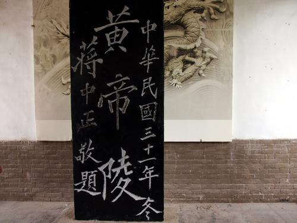

# 中华文明信仰体系第二

## 信仰

信仰是指对某事物信服、崇拜并奉为言行准则和指南的观念，简而言之就是每个人都有的对于自身之人生观、价值观和世界观等的选择与持有，而非只有低劣的宗教信仰才算信仰。信仰与所信仰的对象是否客观存在没有必然联系。宗教本身并非信仰对象，而是信仰的表现形式，表现之形式不宜作为信仰对象。

从最初对自然的畏惧而产生的图腾崇拜，逐渐演化为原始的宗教信仰。在这个过程中，信仰塑造了人性，催生了人类善恶观念的萌芽。和其他原生文明信仰体系一样，而中华文明信仰体系也由自然崇拜开始。

数千年来的“祭天祭祖祭孔”仪式明确表现出来中华文明的信仰体系即包括自然崇拜、祖先崇拜和圣贤崇拜。由于宗教能带来的作用如凝聚人心形成团体、劝人向善等，我们中华文明的信仰体系都提供了，宗教当然只能靠边站了。这点也可从基督教视角看出，比如晚明时期耶稣会传教士利玛窦容许中国教徒继续之後却被罗马教会疯狂反对的祭天、祭祖、祭孔的习俗。

随着东汉时期佛教传入，儒学和道家学说也开始宗教化，到宋明时期三教合流。

## 自然崇拜

人类社会最原始的宗教信仰----自然崇拜是对自然界中事物的崇敬而产生的崇拜活动，不同的原始部族因应不同生活环境而崇拜不同的对象，把对象视为神来崇拜。原始人类相信万物有灵，认为天地万物──动物、植物、环境、天气，乃至言词、画像、建筑或其他人工产物──都是有灵魂、能够思考和获取经验的主体，并且能够操纵或影响其他自然现象乃至人类社会，统统可以被皆崇拜。

自然崇拜的神祇来源可归纳三大类，就是天体、自然力和自然物。

* 对天体崇拜产生的，包括日月星辰等神祇，比如太阳神羲和和金乌、月神望舒和嫦娥、二十八宿星君、福星、禄星、寿星等；
* 对自然力崇拜产生的，包括对风雨雷电等神祇和祭天活动，比如上帝、东海龙王、风伯、雨师、雷公、电母等；
* 对自然物的崇拜，则直接见于自然物体本身的神祇，比如后土、山神如泰山石敢当、河伯、土地公公、土地婆婆等。

由于中华文明自然崇拜信仰体系的顺遂发展，使我们文明的神祇出其得多，从而让我们文明的普通人精神生活异常丰富，比如《山海经》《博物志》等经典书籍给我们带来不一样的精神体验。我们中华文明的层次远高于只能信奉一神教的文明的层次比如对待不同信仰的人的宽容度。

中国先民崇拜五岳，特别是东岳泰山，这种行为在其他文明中也多见，比如古希腊人崇拜奥林匹斯山，而且他们的神居住在奥林匹斯山上，喜马拉雅山周围的民族都有对喜马拉雅山的崇拜。由泰山崇拜抽象出更高级的天地崇拜，构成了我们文明数千年来绵延不绝的郊天、祀地及封禅等仪式。商朝时把人间生活投射到天上更是产生了对天上的皇帝——上帝的崇拜，由于周初周公的道德行为决定天命转移的理念产生的圣贤崇拜加上祖先崇拜，人间最高统治者被称为天子即上帝元子，配套措施是嫡长子继承制。这也促进了我们中华文明天人合一观念的发展。而我们先民对天汉的崇拜也使得我们民族和天汉永远地联系在一起了，汉成为了我们民族永恒的代表！

天坛

地坛

性崇拜或生殖崇拜是人类的原始宗教——自然崇拜的一部分，是指膜拜生殖器官、生殖和性交等的崇拜活动。最早可以追溯到人类的原始社会，即使在现今的不同文化和宗教中仍可见一斑。

### 中国人对上帝的信仰

回到公知、五毛和共匪共同唾弃的四书五经和《史记》等古典书籍，我们可以很明显地发现华夏先民自三皇五帝以来就信仰上帝。在中国，上帝，殷商甲骨文卜辞和周朝金文中又称“帝”、“天”，儒教传世经典中或称天帝、昊天上帝等，是古代中国信仰中，主宰天地宇宙的神。儒家的上帝，又称帝、天帝、昊天上帝，亦称天神、天皇大帝、皇天上帝、皇皇帝天等，具有拟人化的神的概念。昊天上帝脱胎于儒家的天命观，是华夏先民所信奉的“天”的人格化。《周礼·春官·大宗伯》：以禋祀祀昊天上帝，以实柴祀日、月、星、辰，以槱燎祀司中、司命、风师、雨师。郑司农云：“昊天，天也。上帝，玄天也。”

在中华地区传统文化中上帝、天帝或昊天上帝也俗称上天、天神、天主等，一方面认为昊天上帝居处北辰，昊天上帝谓天皇大帝，北辰之星。另一方面，将天与帝区分开，认为昊天为全天，《毛诗传》：“元气昊大，则称昊天。远视苍苍，则称苍天。此则天以苍昊为体，不入星辰之列。”，昊天上帝，更自然化则称为昊天、皇天、天，部分文献又称“太一”等，而“天”是最通俗的说法。《说文解字》：“神：引出万物者也”。“帝”后来又用来指天子、帝王、君主。一方面认为昊天上帝居处北辰，“昊天上帝谓天皇大帝，北辰之星。”另一方面，将天与帝区分开，认为昊天为全天，《毛诗传》：“元气昊大，则称昊天。远视苍苍，则称苍天。此则天以苍昊为体，不入星辰之列。”昊天上帝，更自然化则称为昊天、皇天、天，部分文献又称“太一”等，“天”是最通常的说法，又称苍天、上天、上苍、老天、老天爷等，如“苍天在上”、“老天有眼”、“奉天”、“天谴”、“天生我材必有用”、“我的天啊”中的“天”。关于“天”与“帝”的关系，《宋史》记载宋朝理学家朱熹对此有过清楚解释：“或问：郊祀后稷以配天，宗祀文王以配上帝，帝即是天，天即是帝，却分祭，何也？曰：为坛而祭，故谓之天，祭于屋下而以神祇祭之，故谓之帝。”春秋战国之时，思想进步，人文理性精神勃发，季梁曰：“夫民，神之主也，是以圣王先成民，而后致力于神。”神为人造，民为神主，则上古神秘观念渐消，“上帝”之概念渐由自然之“天”取代，天为道德民意之化身，这构成了后世中国文化信仰的一个基础，而“敬天崇祖”是中国文化中最基本的信仰要素。

杜佑在《通典·礼典》说道:“所谓昊天上帝者，盖元气广大则称昊天，远视苍苍即称苍天。人之所尊，莫过于帝，讬之于天，故称上帝。”杜佑这里所说的“上帝”正是儒家所信仰的最高神——昊天上帝。《通典》记载，周礼设六官，其中以六辂祭祀昊天上帝和东、南、西、北、中五方上帝：一曰苍辂，以祀昊天上帝。二曰青辂，以祀东方上帝。三曰朱辂，以祀南方上帝及朝日。四曰黄辂，以祭地祇、中央上帝。五曰白辂，以祀西方上帝及夕月。六曰玄辂，以祀北方上帝及感帝、神州。东方青帝太昊（伏羲氏），南方炎帝（神农氏），中央黄帝（轩辕氏），西方白帝（少昊），北方黑帝（颛顼），为人格化的五位上帝。

昊天上帝是中国神话中天的尊号。周朝正式出现昊天上帝的尊称

天，含有表示整个大自然、天然宇宙整体的意思，代表天的天公、老天、老天爷等叫法更加拟人化，不过同样表示自然神。上帝和天相比，具有一定的人格化的意味。郑玄曰：“上帝者，天之别名也”；另一方面，有时又作了区分，如《汉书》：“四年春，郊祀高祖以配天，宗祀孝文皇帝以配上帝”，其中又将天和上帝区分开来，上帝地位低于天。以郑玄为代表的神学体系认为上帝为天之别名，总共有六天、六上帝。六天上帝即昊天上帝与五方上帝。昊天上帝为全天之帝；五方天帝各为一方天帝，分别为中央土德黄帝含枢纽、东方木德青帝灵威仰、南方火德赤帝赤熛弩、西方金德白帝白招拒、北方水德玄帝汁光纪。以王肃为代表的宗教系统认为五行人帝可称为上帝，但不可称为天；昊天上帝则可称为天，祭祀昊天上帝即代表祭天。周朝以后的儒教继承了周以前的中华宗教信仰传统，因而历代祭天延绵不绝。

史书上屡有祀上帝於郊的记载，如《史记·五帝本纪》记载：

> 舜乃在璿玑玉衡，以齐七政。遂类于上帝，禋于六宗，望于山川，辩于群神。揖五瑞， 择吉月日，见四岳诸牧，班瑞。

《史记·孝武本纪》记载：

> 乃令越巫立越祝祠，安台无坛，亦祠天神上帝百鬼，而以鸡卜。上信之，越祠鸡卜始用焉。

《史记封禅书》记载：

> 周公既相成王，郊祀后稷以配天，宗祀文王於明堂以配上帝。
>
> 唯雍四畤上帝為尊，其光景動人民唯陳寶。
>
> 古者天子夏親郊，祀上帝於郊，故曰郊
>
> 其明年冬，天子郊雍，議曰：「今上帝朕親郊，而後土無祀，則禮不答也。」

人之所尊，莫过于帝，托之于天，故称上帝。上帝在人间的代理人就是天子。自周成王开始，祀上帝於郊为有天子。西周确立了天子直接向上帝祭祀的祭天礼仪。其他人则通过祖先祭祀上帝，上帝降福给有德行的人。《说苑》一书中说：“天子祀上帝，公侯祀百神，自卿以下不过其族。”上帝崇拜或者称之为天崇拜，是有文字记载以来的中国君王朝廷的宗教传统，在政治上属于中国最高的宗教，也是中国宗教传统中最具公共宗教性的宗教。天子垄断了上帝（天）崇拜，其他宗教皆没有取得与上帝崇拜同等重要的政治地位。除了祭天，上帝通常不接受祭祀，而是赐福给有德行的人。汉代以后，与上帝沟通的方式从巫筮转变为星象观测，并产生了北极星崇拜。北辰名耀魄宝，即为天帝，一名“太一”，是“天神之最尊贵者”。天坛是祭祀上帝的场所。

上帝虽然是最高神，但并不是全知全能的。上帝为地上人间帝王的投影，而儒家主张中的帝王如舜般端己南面即可，况且华夏先民眼中上帝并不开天辟地、并不造人、没有禁止其他崇拜，而只是奖善惩恶。和西方所谓一神教的主完全不同。天人合一，把人当人，把神当人，同时也把人当神。上天只要保佑风调雨顺，人们便可安居乐业。

根据孟子的理解，人类的君和师是上帝指派、感应产生的，让他们来教化、治理上帝的子民,因此中国皇帝也叫天子，祖先是生者与上帝交流的媒介。自然产生的人权也由中国人的信仰——天来体现，即所谓天赋人权。英语“Oh, my god!"会被翻译成”哦，我的老天爷！”

道教中的玉皇大约是东汉时期出现的概念，由儒教中的昊天上帝转化而来，但更人格化了。庄子认为，万事万物本于道，天由道而生。墨子把上帝鬼神看作人类之外的另一种生灵。宋真宗封玉皇号曰“太上开天执符御历含真体道玉皇大天帝”，宋徽宗再加封玉皇大帝为“太上开天执符御历含真体道昊天玉皇上帝”，玉皇和昊天合一，从而大大提高了玉皇在民间的威望，令玉皇信仰流行开来。玉皇上帝、昊天上帝，名称有异，而所指相同，实指一体，只是不同的场合使用不同的概念。儒教、中国传统官方祭祀中一般称昊天上帝，民间、道教中多称玉皇大帝。

上帝信仰被“祖述尧舜，宪章文武”的儒家继承，出现于儒家经典——五经，这五部经书都提到了该词，其中最早的是《尚书》的“虞书·舜典”。除此之外，四书等其他的儒家经典以及各史书中也提到了上帝，有时也称昊天上帝、皇天上帝，在古代中国的原初神话和宗教体系中，指的是至上神，字面意思就是“在上的帝王”，意味着“最高的主宰”，也称为“帝”，或者“天”，“太一”。“礼莫大于敬天，仪莫大于郊祀”，中国历代皆设祭天之所——天坛，如北京天坛祈年殿即为明清皇帝祭祀上帝之处，内供奉有皇天上帝之神位。根据周礼，天子于孟春、秋分、冬至以最高礼仪用碧玉、禋祀、太牢祭上帝于天坛。北京天坛即上帝天坛。

五经中的上帝

| 经书 | 出现次数 |
| :--- | :--- |
| 尚书 | 32次 |
| 诗经 | 24次 |
| 礼记 | 20次 |
| 春秋 | 8次 |
| 易经 | 2次 |

如

> 《大雅·荡》：“荡荡上帝，下民之辟。疾威上帝，其命多辟。天生烝民，其命匪谌。靡不有初，鲜克有终。”
>
> 《尚书·召诰》：“皇天上帝改厥元子兹大国殷之命。”
>
> 《诗经·大雅》：“维此文王，小心翼翼。昭事上帝，聿怀多福。厥德不回，以受方国。”
>
> 《诗经·鲁颂》：“赫赫姜嫄，其德不回，上帝是依，无灾无害。”
>
> 《尚书·周书》：“惟时上帝，集厥命于文王。”
>
> 《礼记·王制》：“天子将出，类乎上帝。”
>
> 《礼记·礼运》：“圣有作，然后修火之利，范金合土以为台榭宫室牖户，以炮，以燔，以亨，以炙，以为醴酪，治其麻丝，以为布帛，以养生送死，以事鬼神上帝，皆从其朔。” 孟子曰：“虽有恶人，斋戒沐浴，则可以祀上帝。”

近代以来外来宗教挤占本地信仰，导致中国人被认为是无信仰的或是信仰金钱的，殊为可恨！如：

上帝本指中国人信仰的最高神，和一神教的邪恶透顶杀人无数的全知全能神不同，上帝和人皇如帝尧帝舜般“無爲而治”即“恭己正南面而已矣”（《論語·衛靈公》）。到了宋代上帝转变为众所周知的玉皇大帝，透过太上老君等管理整个天庭，而非像邪神耶和华之类的独裁专断动辄就搞种族灭绝！！！

圣经本指六经，因为名义上六经皆为大成至圣先师孔子所编纂，所以称《诗》《书》《礼》《乐》《易》《春秋》为圣经，而非那本胡编乱造充满对异教徒仇视的Bible！！！

圣母指的是皇太后，因为皇上就叫圣上，当然也有沉香之母、二郎神杨戬的妹妹那样的受人景仰的神女被称为“三圣母”，但是怎么也算不上现在用来骂人的话！！

清真本是道教词汇，南北朝的著名文人刘义庆在《世说新语》中对“清真”一词进行了解读，他认为，清真意纯净朴洁，无尘无染;可谓“清真寡欲，万物不可移也”。刘义庆之后，文人墨客则把“清真”一词写入诗中，唐代大诗人李白有“圣代复元古，乘衣贵清真”，“韩生信英彦，裴子含清真”;宋代的文学大家陆游在咏梅中有“阅尽千葩万花春，此花风味独清真”;宋代著名诗人周邦彦著有《清真词》一书，自号“清真居士”;伪清薛雪的《一瓢诗话》中有“文贵清真，诗贵平淡”一语。中国古代文人骚客笔下的“清真”多指文章要真实，出于自然。或形容清廉高洁的品格和清雅幽静的环境。学界普遍认为，明代时期，清真寺才称为回教堂，今天居然在後清统治时代成为禁忌了，勿忘国耻！！！！

## 祖先崇拜

祖先崇拜，是指一种怀念祖先、纪念祖先的信仰，逐渐产生类似宗教仪式的习俗。由于生活范围的扩大，自然崇拜凝聚生活在不同环境中的人的人心的能力下降和历史观念的产生，在亲缘意识中萌生、衍化出对本族始祖先人的敬拜思想。最初始于原始人类对同族死者的某种追思和怀念。通过将具有本族认同性和异族排斥性的本族祖先神化为自然人格神并对之崇拜祭祀，相信其祖先神灵具有神奇超凡的威力，会庇佑后代族人并与之沟通互感来凝聚人心并明确族群范围，从而更好地繁衍生息。先秦时期男子称氏，便是为了在扩大生存范围的同时保持宗族凝聚力。

有关中国祖先崇拜的信仰，起源极早。考古学的研究显示，在山顶洞人时代\(距今约一万八、九千年前\)，就有埋葬仪式，学者相信这是基于某一特殊的『死后信仰』的行为。到了龙山文化时期，已有象征祖先崇拜的陶祖塑像，可称之为中国祖先崇拜的雏形。纪年所记：『黄帝崩，其臣左彻取衣冠几杖而庙祀之』被认为是祖先崇拜的滥觞。从此以后，就有了祖宗的祭祀，如《国语 鲁语上》和《礼记 祭法》中记载：『有虞氏禘黄帝而祖颛顼，郊尧而宗舜；夏后氏禘黄帝而祖颛顼，郊鲧而宗禹；商人禘舜而祖契，郊冥而宗汤；周人禘喾而郊稷，祖文王而宗武王』。殷商时期，从殷墟发掘出的甲骨残片，绝大部份是祭祀祖先的资料，这表示殷人对祖先祭祀的发达，祖灵所扮演的角色，已与人世之事息息相关了，祖先崇拜与天神崇拜已逐渐接近，殷人认为可以通过祭祀过世的祖先其精灵和上帝沟通并获得上帝赐福避祸。 周人则不仅深信祖先的灵魂有降祸赐福的能力，且可配乎天。祖宗神取得形式上同等于天的确定地位，在实质上成为祭祀的主体了。，“天命无常”即《尚书 康诰》中说的“惟命不于常”，上天的旨意难捉摸，唯先王的典型美德可以遵行的感受，所以产生了以“敬德”为主的祭祀理论。期望藉勉励祭祖来纪念并效法先人的德性，并透过有血统关系的先祖代为请命，得天福佑。祖先崇拜之原始本质仍与敬畏上天有关，其宗教意义和伦理意义同样存在。

中国人对祖先的信仰，并不仅仅是希望祈求一些好处，更是表达亲情或者对先人的尊敬。在儒家的观念中，祖先信仰主要讲究慎终追远，表达对祖先的感念之情，也是相信祖先的在天之灵会继续保佑自己的后代。“孝”是最重要的的美德之一，由孝引发忠、信、仁、义等道德。即使对已经去世的先人，也要像他们依然活着时一样的尊敬，在节日、忌日要供奉、祭祀，对祖先的崇拜是一种类或准宗教信仰。祖先祭祀的方式通常有家祭、墓祭、祠祭。在儒家社会，祖先信仰具有特殊的意义，占有重要的地位。在这一信仰影响下，“上无愧祖先，下不负子孙”成为人们生命中的重要信念，并形成了对家庭的重视和家文化的发达。

中国的祖先崇拜中，宗族会修建祭祀祖先的祠堂，其中供奉着历代祖先的牌位，并且每年要定期举行扫墓与祭拜等宗教仪式，一般在除夕、清明节、重阳节、中元节四节及先人的忌日必会祭拜。其他如端午、中秋、冬至等中国传统节日，一家团聚的时刻，也是祭拜祖先、缅怀先人功业的好时机。

凭新石器时代到夏朝已出土的许多陪葬日用陶器中出现食物遗存痕迹这一件事，及殷墟卜辞和周人重祭祖甚于祭天的记载，配合在长沙马王堆出土的墓中帛画所表现的汉人死后世界观，及其它汉墓殉葬物的存在，可以肯定的说“灵魂不减”的观念一直深具在中国人的宇宙观里。人是有灵魂的，一旦死亡，肉体归于土，灵魂到称为“阴间”的另一个世界去，住在阴界的亡魂仍过着与人世相同的生活，还是有食衣住行等日常生活需求，而这必须由阳世子孙来供奉。他们相信祖先可以保佑自己的子孙，但若得不到适当的供养也会降祸惩罚子孙。再加上圣贤的理论如：“事死如事生，事亡如事存，孝之至也”\(《中庸十九章》\)，“丧礼无他焉，明死生之义，送以哀敬，而终周藏也，……事生饰始也，送死饰终也，终始具而孝子之事毕，圣人之道备矣”\(《荀子礼论》\)等，无形中也给平民带来“人死为鬼，鬼与生人的世界相似雷同，并且可以互相沟通”的观念，而更加强了既有的鬼魂信仰。儒教的大传统虽仍是民间祖先崇拜的核心，但如余英时教授所说的，任何哲学或学术思想至终均走向世俗化，而民间信仰正表现了这种特征。所以民间的祭祖观至今仍以古时供养亡灵，求亡灵庇荫以至繁荣子孙为本。

中国国家最重要的祖先祭祀就是祭祀炎帝陵和黄帝陵。

国父孙中山的《祭黄帝陵文》：

> 中华开国五千年，神州轩辕自古传。创造指南针，平定蚩尤乱。世界文明，惟有我先。

## 圣贤崇拜

圣贤崇拜来源于祖先崇拜，通过表彰有德行或有大功劳的祖先凝聚人心、劝人向善等。

由于商朝时鬼神信仰太重，不把人当人，周公在东征胜利以後开始用文王的道德解释天命转移并强调以人为本、以德治国，开创了圣贤崇拜的传统。而周公作为中国史学的开创者（参考自钱穆先生代表作《中国史学名著 》），其所开创的圣贤崇拜使得中华文明历史开始宗教化。周公制礼作乐是中国轴心时代的开始，孔子继承周公发扬光大儒学是中国轴心时代的巅峰。雅思贝尔斯（德语：Karl Theodor Jaspers）关于中国的说法是错的。

周公以商朝灭亡和“三监”等武装反叛活动为鉴，特别重视贵族及其子弟的政治道德教育、治术教育和勤政教育，要求“敬德保民”“明德配天”“明德慎刑”“有孝有德”“力农无逸”等，主张充分发挥“颂”“诰”对平民的教育作用，并提出以治绩考察、选任官吏的原则。

在文化上周公提出了“明德慎罚”的道德规范，制定了完整的礼仪仪式，此外周公曾提出“敬德保民”，制礼作乐，建立典章制度。其言论见于《尚书》诸篇，如《金縢》《无逸》等。周公受孔子推崇，被儒家尊为圣王。周公思想对儒家思想的形成起了奠基性的作用，汉代儒家将周公、孔子并称。

**孔子用春秋笔法对人物进行臧否从而实现了历史的宗教化，从此对中国人而言能立身行道成为圣贤留名青史就相当于上天堂，而作恶多端留下千古骂名就相当于下地狱了。**

此后孔子精神被太史公司马迁继续发扬光大，使得两千年来，修史都是我们文明中极为重要的一件事。

周公对召公奭说：“天不可信，我道惟宁王德延，天不庸释于文王受命。”（《尚书·君奭》）就是说，天命靠不住，靠得住的只有我们自己。我们能做的，就是谦虚谨慎，兢兢业业，把文王的美德继承下去。否则“天命靡常”\(《诗·大雅·文王》\)，後果不堪设想！天命无常，靠得住的就只有德；天不可信，信得过的就只有人。当然，天命还在，天意还有，但“天视自我民视，天听自我民听”（《孟子》及《尚书·泰誓中》），说到底，还是看人的表现。

周公及其後胤，采取了一种高明的策略：神还要敬，命还要讲，皇天上帝也还要拜，但对于天、神、命，以及它们与人的关系，必须重新解释，重新定位。

一、人与天的关系，被重新定位为“皇天无亲，惟德是辅（《春秋左氏传·僖公五年》引《周书》及《尚书 周书 蔡仲之命》）”。就是说，皇天上帝并不一定认准了只保佑某个民族、某个政权。谁有德，就保佑谁。

二、人与神的关系，被重新定位为“神聪明正直而壹者也，依人而行（《春秋左氏传·庄公三十二年》）”。就是说，鬼神明察秋毫，人做好事他们就赐福，人做坏事他们就降灾。

三、人与命的关系，被重新定位为“祸福无门，惟人所召（《春秋左氏传·襄公二十三年》） ”。就是说，命运本身无所谓好坏，全看人们自己的选择。你选择好，就是福；你选择坏，就是祸。是福是祸，自己看着办。

这样一来，人与天、人与神、人与命的关系就全都变了，越来越不把天、神、命当回事。说天“惟德是辅”，还多少承认上天选择的主动权；说神“依人而行”，这种主动权就打了折扣；而当他们说命运“惟人所召”时，主动权就完全在人手里了。

于是，以神为本，就变成了以人为本；神的祭坛，也就变成了人的舞台。从周公以后，神都是人封的，这也是为什么后世小说《封神演义》把商周战争描绘成封神之战，而从此中国文明摆脱了商朝特别流行的鬼神崇拜，这也深深影响了後来的圣贤如季梁、子产等，特别是最崇拜周公的孔子。随着不断对人的重视和对鬼神的边缘化，春秋晚期就有了对鬼神持不可知论的孔子的“敬鬼神而远之（《论语·雍也》）”。就是说，鬼神还是要祭祀的，但主要为了表达心意和敬意。祭神祀祖的时候，权当他们存在好了。这就是所谓“祭如在，祭神如神在（《论语·八佾》）”。

周公孔子把人当人，体现人道主义；把神当人，体现理智态度；把人当神，则体现了道德精神。强调敬天法祖，但是不再讨论鬼神的有无，这是一种理性态度，也是一种人文精神。其核心思想，就是认为现实的人和人生，比搞不清也说不清的鬼神重要。（参考自易中天的代表作《先秦诸子百家争鸣》）

虽然没做到根绝了中国人的迷信，至少在主流儒学思想中，阻挡了鬼神和宗教的观念的渗透。对照比孔子晚几百年、几千年，乃至直到今天许多国家、种族被鬼神宗教观念困住而无法自拔，就明白孔子当时这么鲜明的人本和理性思想有多宝贵了。

随着历史发展，民间信仰将历史上的圣王贤臣神化、奉为神灵并加以崇拜。这一类信仰形态在民间的广泛传播、发展与儒家为政以德的社会政治理想、神道设教的价值取向有紧密的关系。历代王朝政权往往将通过审核的神灵纳入正祀、赐予封号、建庙祭祀，以使民众明德行善，实现规范和疏导作用。而在演变过程中，圣贤崇拜又表现出民间信仰独立的发展规律与情感特征。在他们身上，体现了儒家政治伦理秩序、王朝权威与民间信仰本身三者之间丰富的互动。于是孔子、孟子及后世的陈元光、岳武穆、朱子、文天祥、朱成功等人都成为了中国民间信仰常见神祇。

曲阜孔庙大成殿

位于台湾台北市内湖区碧山路24号碧山之尖峰的碧山岩开漳圣王庙，庙内主祀被视为漳州人守护神，并被尊称为“开漳圣王”的唐代民族英雄陈元光

祭祀台湾光复者大明延平郡王——朱成功的延平郡王祠

## 由儒学承载的中国民间信仰形成的儒教

此上自然崇拜、祖先崇拜和圣贤崇拜的民间信仰通过三皇五帝及夏商周以来代代传承的儒学核心五教即父义母慈兄友弟恭子孝和祭祀礼仪等形成了儒教。

“所谓儒教，非指儒学或儒家之整体，而是指殷周以来绵延三千年的中国原生宗教，即以天帝信仰为核心，包括‘上帝’观念、‘天命’体验、祭祀活动和相应制度，以儒生为社会中坚，以儒学中相关内容为理论表现的那么一种宗教体系。”————何光沪《中国文化的根与花——谈儒学的“返本”与“开新”》

### 基本教义

“圣人以神道设教，而天下服矣。（《周易·观·彖》）”儒教的意思是借助神祇进行教育教化，民众比较容易接受和顺服。

敬天，奉祖，孝亲，忠信，仁义，崇礼，性善，弘毅，见贤思齐。

“三纲”：明明德、亲民、止于至善。（《礼记·大学》）

“八目”：格物、致知、诚意、正心、修身、齐家、治国、平天下。（《礼记·大学》）

“三达德”：智、仁、勇。（《论语》）

“博学之，审问之，慎思之，明辨之，笃行之。”（《礼记·中庸》）

“立身行道，扬名于后世，以显父母，孝之终也。 夫孝，始于事亲，中于事君，终于立身。” （《孝经》）

“与天地合其德，与日月合其明，与四时合其序，与鬼神合其吉凶。先天而天弗违，后天而奉天时。”（《 周易·文言 乾》）

“吾日三省吾身；为人谋而不忠乎？与朋友交而不信乎？传不习乎？”（《论语·学而》曾子）

“人皆可以为尧舜”“持志养气”、“养浩然之气”（《孟子》）

“知止而后有定，定而后能静，静而后能安，安而后能虑，虑而后能得。物有本末，事有终始，知所先后，则近道矣。”（《礼记·大学》）

“三希修炼”：士希贤，贤希圣，圣希天。（周敦颐著《通书·志学第十》）

“为天地立心，为生民立命，为往圣继绝学，为万世开太平。”（《近思录》张载）

#### 天命观

孔子提出君子要“知天命”，“不知天命无以为君子”。知天命是儒家思想特点，也是中国传统文化的特点。天命就是自觉有一种使命感，“知天命”，即领悟自己负有使命，必须设法去完成。这种使命的来源是天，所以称为天命。

儒教最高的追求为天人合一，人以德合天，修身合乎道而不逾矩所以孔子设礼，为“德”的最高表现。

#### 泛灵论

儒教信奉的最高神，是天/上帝。 天神称祀，地祇称祭，宗庙称享。 天，地，君，亲，师。表示敬天法祖、孝亲顺长、仁政下强调忠君爱国、支持用武力推翻暴政、尊师重教。

#### 生死观

儒教并不关注死后世界，虽然略有提及死后去处，但并没有具体记载死后世界的景象。

《礼记·郊特牲》：魂气归于天，形魄归于地，故祭，求诸阳阴之义。 《礼记·礼运》：天望而地藏，体魄则降，知气在上。 《礼记·祭义》：骨肉毙于下阴为野土，其气发扬于上为昭明，焄蒿凄怆，此百物之精也，神之着也。 《孔子家语》：孔子曰：众生必死，死必归土，此谓鬼；魂气归天，此谓神。

儒教经典中，提及的死后世界大致有两种，即天上的天界（所谓“昭明”世界）、地下的黄泉。也就是中国人口头常说的“在天之灵”，“泉下有知”。 《左传·隐公元年》 太上有立德，其次有立功，其次有立言，虽久不废，此之谓不朽。 《礼记·祭法》 法施于民，则祀之；以死勤事，则祀之；以劳定国，则祀之；能御大菑，则祀之；能捍大患，则祀之。

一般认为圣贤君子有明德，成为光明的灵魂（神），死而升天；小人言行思虑多物欲，与身体一同下降进入地下，死而下黄泉。

天界

《诗经·大雅·文王》：文王在上，于昭于天。……文王陟降，在帝左右。

黄泉

《左传·隐公元年》：（郑庄公）不及黄泉，无相见也。

“君子曰终，小人曰死。”《礼记·檀弓》，“未能事人，焉能事鬼？”《论语·先进》，“务民之义，敬鬼神而远之。”《论语·雍也》，“生，事之以礼；死，葬之以礼，祭之以礼。”《论语·为政》 但儒教并没有像其他宗教一样，建构一个具体的死后灵魂世界，在生死观上表示生死一体，都应该实现生命中的种种价值。“朝闻道，夕死可矣。”《论语·里仁》

### 儒教经典

儒教经典指的是孔子所“治《诗》《书》《礼》《乐》《易》《春秋》”六经。“自孔子在时，方脩明圣经以绌缪异。”“故书者、政事之纪也；诗者、中声之所止也；礼者、法之大兮，类之纲纪也。故学至乎礼而止矣。夫是之谓道德之极。礼之敬文也，乐之中和也，诗书之博也，春秋之微也，在天地之间者毕矣。”秦始皇"焚书坑儒"，据说经秦火一炬，《乐经》从此失传。诠释五经，完备礼制的经学是汉晋隋唐的主流。著名的经学家有郑玄、王肃、孔安国、赵岐、何休、王弼、韩康伯、范宁、何晏、郭璞、孔颖达、贾公彦、徐彦、邢昺、孙奭等。

南宋时朱熹将《大学》、《论语》、《孟子》、《中庸》合为“四书”，“学问须以《大学》为先，次《论语》，次《孟子》，次《中庸》”，朱熹认为古礼不可考，倡导道统之说，自创《朱子家礼》。南宋以来的科举考试重心也转向四书，标志理学成为主流。著名的理学家有周敦颐、程颢、程颐、朱熹、陆九渊、张载、王阳明等。

### 儒教礼仪

儒教礼仪包括吉礼、凶礼、宾礼、军礼、嘉礼。“以吉礼事邦国之鬼神示，以凶礼哀邦国之忧，以宾礼亲邦国，以军礼同邦国，以嘉礼亲万民”。吉礼是五礼之冠，主要是对天神、地祇、人鬼的祭祀典礼，以就是“皇天、上帝、社稷、寝庙、山林、名川之祀”。《礼记·祭统》说：“礼有五经，莫重于祭。”按照《周礼·春官·大宗伯》的说法，嘉礼包括饮食之礼，婚冠之礼，宾射之礼，飨燕之礼，脤膰之礼，贺庆之礼。华夏王朝秉承《尚书》华夷之辨之旨，《后汉书》、《晋书》、《宋书》、《南齐书》、《隋书》、《旧唐书》、《新唐书》、《宋史》、《明史》均有礼仪志或祭祀志，以示继承周礼。

| 周礼 | 分类 | 礼名 |
| :--- | :--- | :--- |
| 吉礼 | 天神 | 郊祀、大雩、朝日、夕月、祓禊 |
| 吉礼 | 地祇 | 祀皇地祇、神州、社稷、五岳四渎四镇、海、祀社稷山川、五祀 |
| 吉礼 | 人鬼 | 享宗庙、祭孔 |
| 嘉礼 | 饮食之礼，婚冠之礼，宾射之礼，飨燕之礼，脤膰之礼，贺庆之礼 | 冠礼、笄礼、聘礼、婚礼、节令（立春、立夏、大暑、立秋、立冬）、视朔、冬至朝贺、除夕、元旦、乡饮酒、乡射礼 |
| 宾礼 | 接见、宴请外宾 | 相见礼、燕礼、公食大夫礼、觐礼 |
| 军礼 | 射礼、大傩、讲武、告齐太公庙 | 大射 |
| 凶礼 | 丧礼、葬礼、致奠、探病 | 既夕礼、虞礼 |

| 其余礼名 | 描述 |
| :--- | :--- |
| 禅让礼 | 为朝代更迭名正言顺，前朝帝王主动设受禅台将天子的地位让出。 |
| 登基礼 | 天子的就职典礼。 |
| 封禅礼 | 封禅大多在泰山举行，封是祭天，禅是祭地，封禅以强调帝王君权天授的天子身份。 |
| 郊祀礼 | 天子祭天地，诸侯祭社稷，大夫祭五祀，为天下祈福。冬至祭天于圜丘，夏至祭地于方丘，二者分别位于国都南郊和北郊，郊谓大祀，祀为群祀，故称为郊祀。 |
| 祀祖礼 | 祭祖 |
| 怀子礼 | 即“胎教礼”。母亲怀子后，目不视恶色，耳不听淫声，口不出敖言，身不行恶事，心不起恶念，能以胎教。 |
| 出生礼 | 诞生 孩子出生后，如果是男孩就给他玉璋并在门左悬挂木弓，如果是女孩就给她瓦器并在门右悬挂佩巾，即弄璋、弄瓦、悬弓、悬帨礼。三朝是孩子出生第三天再抱出来，如果是男孩，就行射礼。满月有满月酒。百日是孩子出生第三个月末，要选择吉日为孩子剃胎发。但不能把胎发全剪掉，男的留个“角”，女的留个“羁”，或者男的留左边，女的留右边。由母亲带领去拜见父亲与祖父，父亲为孩子取名。周岁要占卜前途，即抓周。 |
| 进学礼 | 学生与老师初见面，先奉上礼物以表尊敬，即束脩礼。 |
| 成人礼 | 冠礼、及笄礼 |
| 婚礼 | 中式婚礼和三书六礼。婚礼是儒教非常重要且神圣的礼仪。定为婚礼，别男女，立夫妇之义，使男女各守其道，各循其义，各成其德，各正其位。 |
| 丧礼 | 儒教非常重视丧礼，《礼记》中丧礼的篇目有《丧服小记》、《丧大记》、《奔丧》、《问丧》、《丧服四制》、《服问》、《间传》、《三年问》、《檀弓上》、《檀弓下》、《杂记上》、《杂记下》等十余篇。儒教丧礼制度非常复杂，对于人的行为、态度、饮食、丧服、敛日及丧礼的等级、程序都有详细规定。对不同亲疏关系和社会等级又有不同规定。 |
| 立社礼 | 王为群姓立社，曰大社。王自为立社，曰王社。诸侯为百姓立社，曰国社。诸侯自为立社，曰侯社。大夫以下成群立社，曰置社 |
| 奠基礼 | 起源远古时期猎头祭祀习俗，在破土动工前祭祀本土的生灵祈神保佑。 |

### 神职系统

#### 神职人员

儒教是民族宗教和国家宗教，传统上国家组织、家庭组织、教育机构、宗族组织即为教团组织，神职工作内容主要为祭祀、讲学。

天子为国家主祭并由太常辅助，太常主管国家的祭祀礼仪与庙祠陵园，太常属官太乐、太祝、太宰、太史、太卜、太医等。

国子监由祭酒主祭，书院、私塾由山长及塾师主祭。

宗族、家族由家长、族长负责宗祠祭祀的主持。

国家为特定人物建立的专祠，位于都城的由太常寺官员负责祭祀，其他各省由当地官员负责。

祭祀典礼中的礼生，也担任著祭祀的辅助工作。

#### 祭祀场所

皇室祭祀在九坛八庙，贵族阶级都有宗庙，民间家庭则在祠堂、堂屋祭祀。公共祭祀场所有武庙、文庙、书院、城隍庙、土地庙、海神妈祖庙、山神庙等百神庙，还有功臣贤人的专祠包括忠烈节义之士的忠烈祠。

#### 神祇信仰

分为天神、地祇、人神。

大祀三十：正月上辛祈谷，孟夏雩祀，季秋大享明堂，冬至圜丘祭昊天上帝，正月上辛又祀感生帝，四立及土王日祀五方帝，春分朝日，秋分夕月，东西太一，腊日大蜡祭百神，夏至祭皇地祇，孟冬祭神州地祇，四孟、季冬荐享太庙、后庙，春秋二仲及腊日祭太社、太稷，二仲九宫贵神。

中祀九：仲春祭五龙，立春后丑日祀风师、亥日享先农，季春巳日享先蚕，立夏后申日祀雨师，春秋二仲上丁释奠文宣王、上戊释奠武成王

小祀九：仲春祀马祖，仲夏享先牧，仲秋祭马社，仲冬祭马步，季夏土王日祀中霤，立秋后辰日祀灵星，秋分享寿星，立冬后亥日祠司中、司命、司人、司禄，孟冬祭司寒

**自然神祇**

天或称昊天上帝或皇天上帝或天皇大帝、皇地祇、社、稷。

司中、司命、司人、司禄、司寒、风师、雨师、雷师、云师、帝社、先蚕、司令、泰厉、灵星、山林、川泽、马祖、先牧、马社、马步

七祀：

司命、中霤、国行、泰厉、门、户、灶

五方上帝：

中央黄帝含枢纽（配帝轩辕氏，从祀后土、镇星、中宿、日、北辰、北斗）

东方青帝灵威仰（配帝伏羲氏，从祀勾芒、岁星、东宿、雷公、风伯）

南方赤帝赤熛弩（配帝神农氏，从祀祝融、荧惑星、南宿）

西方白帝白招拒（配帝少昊氏，从祀蓐收、太白星、西宿）

北方黑帝汁光纪（配帝颛顼氏，从祀玄冥、辰星、北宿、月、雨师）

九宫贵神：

西北曰青龙、正北曰太一、东北曰太阴、

正西曰咸池、中央曰天符、正东曰轩辕、

西南曰摄提、正南曰天一、东南曰招摇。

五龙：

青龙神广仁王、赤龙神嘉泽王、黄龙神孚应王、白龙神义济王、黑龙神灵泽王（宋徽宗封）

**人格神祇**

儒教传统的祖先信仰和君主崇拜相互影响，除了人人都供奉祖先外，天子拥有“封神”的权利，太庙内也不仅供奉皇帝的祖先还供奉了已故的功臣名将，历代帝王庙也供奉了188位中国历朝帝王和79位历代贤相名将。民间祠堂除了祭祀先祖和灶神也为历代圣贤建庙立祠。

**先医**

三皇：伏羲、神农、黄帝

四配：句芒、风后、祝融、力牧

东庑：僦贷季、岐伯、伯高、少师、雷公、伊尹、淳于意、华陀、皇甫谧、巢元方、韦慈藏、钱乙、刘完素、李杲

西庑：鬼臾区、俞跗、少俞、桐君、马师皇、扁鹊、张机、王叔和、葛洪、孙思邈、王冰、朱肱、张元素、朱彦修

**宋代文宣王陪祀**

配享：复圣颜子、宗圣曾子、述圣子思子、亚圣孟子

十哲：费公闵损、薛公冉雍、黎公端木赐、卫公仲由、魏公卜商、郓公冉耕、齐公宰予、徐公冉求、吴公言偃、陈公颛孙师，为从祀；

东庑：金乡侯澹台灭明、任城侯原宪、汝阳侯南宫适、莱芜侯曾点、须昌侯商瞿、平舆侯漆雕开、睢阳侯司马耕、平阴侯有若、东阿侯巫马施、阳谷侯颜幸、上蔡侯曹恤、枝江侯公孙龙、冯翊侯秦祖、雷泽侯颜高、上邽侯壤驷赤、成邑侯石作蜀、钜平侯公夏首、胶东侯后处、济阳侯奚容箴、富阳侯颜祖、滏阳侯句井疆、鄄城侯秦商、即墨侯公祖句兹、武城侯县成、汧源侯燕伋、宛句侯颜之仆、建成侯乐欬、堂邑侯颜何、林虑侯狄黑、郓城侯孔忠、徐城侯公西葴、临濮侯施之常、华亭侯秦非、文登侯申枨、济阴侯颜哙、泗水侯孔鲤、兰陵伯荀况、睢陵伯穀梁赤、莱芜伯高堂生、乐寿伯毛苌、彭城伯刘向、中矣伯郑众、缑氏伯杜子春、良乡伯卢植、荥阳伯服虔、司空王肃、司徒杜预、昌黎伯韩愈、河南伯程颢、新安伯邵雍、温国公司马光、华阳伯张栻。

西庑：单父侯宓不齐、高密侯公冶长、北海侯公皙哀、曲阜侯颜无繇、共城侯高柴、寿张侯公伯寮、益都侯樊须、钜野侯公西赤、千乘侯梁鳣、临沂侯冉孺、沐阳侯伯虔、诸城侯冉季、濮阳侯漆雕哆、高苑侯漆雕徒父、邹平侯商泽、当阳侯任不齐、牟平侯公良孺、新息侯秦冉、梁父侯公肩定、聊城侯鄡单、祁乡侯罕父黑、淄川侯申党、厌次侯荣旗、南华侯左人郢、朐山侯郑国、乐平侯原亢、胙城侯廉絜、博平侯叔仲会、高堂侯邽巽、临朐侯公西舆如、内黄侯蘧瑗、长山侯林放、南顿侯陈亢、阳平侯琴张、博昌侯步叔乘、中都伯左丘明、临淄伯公羊高、乘氏伯伏胜、考城伯戴圣、曲阜伯孔安国、成都伯扬雄、歧阳伯贾逵、扶风伯马融、高密伯郑玄、任城伯何休、偃师伯王弼、新野伯范宁、汝南伯周敦颐、伊阳伯程颐、郿伯张载、徽国公朱熹、开封伯吕祖谦。

**宋代武成王陪祀**

配享：张良

十哲：管仲、孙武、乐毅、诸葛亮、李𚟝、田穰苴、范蠡、韩信、李靖、郭子仪。

东庑：白起、孙膑、廉颇、李牧、曹参、周勃、李广、霍去病、邓禹、冯异、吴汉、马援、皇甫嵩、邓艾、张飞、吕蒙、陆抗、杜预、陶侃、慕容恪、宇文宪、韦孝宽、杨素、贺若弼、李孝恭、苏定方、王孝杰、王晙、李光弼；

西庑：吴起、田单、赵奢、王翦、彭越、周亚夫、卫青、赵充国、寇恂、贾复、耿弇、段颎、张辽、关羽、周瑜、陆逊、羊祜、王濬、谢玄、王猛、王镇恶、斛律光、王僧辩、于谨、吴明彻、韩擒虎、史万岁、尉迟敬德、裴行俭、张仁亶、郭元振、李晟。

### 儒教标志

儒教没有正式通行的标志，以下为较常出现的象征物。

孔子像：最为普遍的标志物，古代学堂都有孔子画像，近代教育场所也常有孔子塑像。

木铎：出自《论语》“天将以夫子为木铎”，为古代宣布政教法令时，振鸣以引起众人注意，召集群众所用，比喻为宣扬上天教化的人。

麒麟：古代传说中的神兽，王道、仁政、圣人、祥瑞的象征，据说孔子出生及去世前曾出现。

其他：周子太极图、八卦等。

### 儒教服饰

孔子曰：“行夏之时，乘殷之辂，服周之冕”。因此历代华夏王朝的史书都有继承周礼的舆服制。儒教服饰体现了“象天法地”“绝地天通”的信仰，“周之王也，制礼上物，不过十二，以为天之大数也”，通过《周礼》中的天子六服和王后六服等级化而来。天子六服象征天，有三辰昭其明；王后六服象征地，而有五行相生。

### 儒教历法

儒教历法来自《礼记·月令》。冬至祀昊天上帝，夏至祀皇地祇，孟春祈谷祀昊天上帝，孟冬祀神州，孟夏雩祀昊天上帝，季秋大享明堂祀昊天上帝。除夕送寒气而有大傩之礼。

## 东汉以降佛教传入

东汉以降逮乎大一统政府逐渐腐败，此亦因儒家思想未能发挥尽致，而自有其病痛。人生当下现实的理想与寄托毁灭，群体失其涵育，私的期求奋兴，礼乐衰而方术盛。当此时期的社会，则自然舍儒而归道。其时的政府（或为政府打算的学者），往往想应用法家的手段来牢笼，而终于牢笼不住。光武、明、章虽粉饰礼乐於朝廷，而社会上则方术思想日盛一日。只观王充《论衡》所批斥，即可考见其一斑。东汉一方面是王纲之解纽，即大—统政府之瓦解。又一方面则是古人一种积极的全体观念即天的信仰之消失。初期佛教输入，亦与此种社会情态相适协，而渐渐占有其地位。

佛教入中国，远在东汉初年，或尚在其前。汉明帝永平中，遣使往西域求法，其事始见於牟子理惑论及四十二章经序等书，是为我国向所公认佛教最先之传入。或其事尚可前溯，然要之於中国社会未见影响。惟佛法之流布，则直到汉末三国时代而盛。其时则多为小乘佛法之传译，高僧多属外籍。

原佛学流行，固由於当时时代之变动，而尚有其内在之条件。

第一佛法主依自力，不依他力。

世界诸大宗教，率本天帝神力，惟佛教尊释迦，则同属人类。此与中国儒家，尊崇人文历史、敬仰古先圣哲之教义大同。亦复与道家彻底破坏天神迷信之理论不相违背。释迦之可尊，在其“法”，故佛家有“依法不依人”之教。当知得此大法者不止释迦一人，故佛书屡言“诸佛”，又言“人皆有佛性”，则尽人皆有可以成佛之理，此与儒家“人皆可以为尧舜”义又相似。 第二佛法主救世，不主出世。

诸教率向往尘俗以外之天国，故其精神率主出世，而又同时亦兼带一种浓重的个人主义。佛法虽亦主有一“涅盘”境界，但同时主张“三世因果轮回报应”。人生宿业，纤微必报，故主於当身修行，勇猛精进。又佛义主张“无我”，一切以因缘和合为法，故“众生不成佛，我亦不成佛”。又曰：“生死即涅盘，烦恼即菩提。”如是则成为一积极的救世主义者。此与诸教主张个人出世、以大国为乐园者自别，亦复与中国庄老道家一派有厌世、玩世意味者迥异；此又与儒家侧重大群主义之人文教相似。

故佛教在其消极方面，既可与中国道家思想相接近，在其积极方面，亦可与中国儒家思想相会通。

其时名德高僧如慧远、僧肇之徒，皆精研庄老义，而释道安二教论【广弘明集卷八】乃抑老於儒下。此後竺道生“一阐提亦具佛性”与“顿悟成佛”之说，更为与儒义相近。谢灵运和之，其与诸道人辨宗论【广弘明集卷十八】以孔、释两家相拟立论。而孙绰喻道论乃谓牟尼为“大孝”，“周、孔即佛，佛即周、孔”。是其时名士僧人，又俱黜老崇孔。故其先兼通老、释，至是乃并拟儒、佛。此种界线，大体相当於晋、宋之际，可以僧肇与生公时代为划分。

而当时佛法之所以盛行，尚有一积极的正因，则由其时中国实有不少第一流人物具有一种诚心求法、宏济时艰之热忱是也。

盖以当时中国政教衰息，聪明志气无所归向，遂不期而凑於斯途。此皆悲天悯人，苦心孤谐，发宏愿，具大力，上欲穷究宇宙真理，下以探寻人生正道，不与一般安於乱世、没於污俗，惟务个人私期求者为类。故使佛教光辉，得以照耀千古。若仅谓佛讲出世，与一时名士清谈气味相投；而社会民众，亦以身丁荼毒，佛讲未来，堪资慰藉；并出家可以逃役，即获现实福益。凡此种种，固亦当时佛法盛行之世缘，然论其主要原因，则固在彼不在此。

故当时之第一流高僧，若论其精神意气，实与两汉儒统貌异神是，乃同样求为人文大群积极有所贡献。惟儒家著眼於社会实际政教方面者多，而当时之佛学高僧，则转从人类内心隐微处为之解纷导滞，使陷此黑暗混乱中之人生得宁定与光明，则正与儒家致力政教之用心，异途同归也。惟此等高僧，亦多兴起于北方，南方则受其波及而已。

佛教来中国，最先乃依附於庄老道家而生长。但南渡后的学者，已渐渐由庄老义转向佛教。其著者，如当时名士群从支道林逍遥游义，而不从向、郭旧义，即其一证。详见世说新语。其後则道教又模仿佛教，亦盛造经典仪范，而逐渐完成为一种新道教。为此工作之尤著者，为宋代之陆修静。

於是道、佛两教遂开始互相竞长，而至於冲突。但在南方，一辈名士世族，本在一个不安宁的大世界中过著他们私人安宁的小世界生活。他们所需要者，乃为一种学理上之自己麻醉、自己慰藉。彼辈在其内心，本无更强的冲动力，所以南方佛学多属“居士式”。其高僧亦与隐士相类，如慧远、生公之类是也。

隋、唐盛运复兴，其时则佛学亦有新蜕变。教养精神，逐渐中国化；而佛法重心，亦逐步南移。

南北朝佛学，北尚禅行，南重义解，周武毁法，北方禅宗亦避而至南。所谓“佛学中国化”运动，亦至是始成熟。其後禅学崛兴，则全以南方为策源地。

今若以魏晋南北朝佛学为“传译吸收期”，则隋唐佛学应为“融通蜕化期”。

而尤以禅宗之奋起，为能一新佛门法义，尽泯世、出世之别，而佛教精神乃以大变。

禅宗自称“教外别传”，不著言语，不立文字，直指本心，见性成佛。而其後推演愈深，乃至无佛可成，无法可得，无烦恼可除，无涅盘可住；无真无俗，本分为人，呵佛駡祖，得大解脱；如是则世、出世之界划尽泯，佛氏“慈悲”乃与儒家之“仁”，同以一心为应世之宗师。故论绾合佛义於中国传统之大群心教者，其功必归於禅宗也。

盖当隋、唐盛世，政教既复轨辙，群体亦日向荣，人心因而转趋，私人之修行解脱，渐退为第二义，大群之人文集业，又转为第一义。杰气雄心，不彼之趋而此之归，则佛门广大，乃仅为人生倦退者逋逃之一境。唐贤多信佛，而意味与东晋、南北朝名士大异。东晋以下必以佛义自安於静退；唐贤则功业煊赫之余，乃转依佛法求归宿也。

继此而开宋儒重明古人身、家、国、天下全体合一之教，一意为大群谋现实，不为个己营虚求。人生理想，惟在斯世，而山林佛寺，则与义庄、社仓同为社会上调节经济、赈赡贫乏之一机关。

北宋以下，义庄、社仓等社会事业逐次发达，佛寺亦不为惟一的贫穷藏身之所，佛寺之收容量亦减，而国家毁法之事亦益少见矣。

此下佛、道两教事迹，乃不复足以转动整个政治社会之趋向。

（参考自钱穆先生代表作《国史大纲》）

## 东汉以来道教的发展

道教（Taoism）是中国的本土宗教，道教思想源于黄帝（黄帝学派托言），道教体系最早创始人是五斗米教（天师道）的张道陵，崇拜道家老子为道祖。其科仪与祭祀最早可追溯于原始社会时期的崇拜天地、自然与鬼神，从最早的与鬼神沟通的卜筮等多种方式，原始宗教逐渐演变成商周时期的祭祀上天和祖先。至春秋战国时期吸收神仙方术产生了方仙道，后融合道家、阴阳家的“五行”、“阴阳”等思想合并形成黄帝学派，在汉代中后期形成黄老道，至东汉末年，张道陵在西南蜀地益州（在今成都）称得太上老君（老子）“授以三天正法，命为天师”，从而创立了正一道（又称天师道、五斗米道）。在中原，张角创立了太平道，宣称“苍天已死，黄天当立”，组织民众起事反抗东汉王朝（史称黄巾之乱或黄巾起义）。正一道和太平道的出现，标志着道教开始成为有严密思想体系和组织制度的教团。在这种社会背景下，订定道教经书的主要创始人物张道陵综合传统的鬼神崇拜、神仙思想、阴阳术数、卜筮巫术，并与汉代所崇尚黄老道思潮逐渐融合。道教教派也于此时形成，道教的宗教形态初具。至南北朝经过宗教改革，逐渐演变成现在的道教。

道教是一个崇拜诸多神明的多神教，主要宗旨是追求长生不死、得道成仙、济世救人。在古中国传统文化中占有重要地位，在现代世界也积极发展。道教以“道”为最高信仰，认为“道”是化生中原万物的本原。道教（包括道家、术士等）与儒学和佛教合称“三教”，为中华传统文化的主要构成部分，是在其中占据着主导地位的理论学说和寻求有关实践练登圣的方法。

现在学术界所说的道教，是指在中国古代宗教信仰的基础上，承袭了方仙道、黄老道和民间天神信仰等大部分宗教观念和修持方法，逐步形成的以“道”作为最高信仰。主要是奉太上老君为教主，并以老子的《道德经》等为修仙、修真境界主要经典，追求修炼成为神仙的一种中国的宗教，道教成仙或成神的主要方法大致可以归纳为五种，服食仙药，外丹等，炼气与导引，内丹修炼，并借由道教科仪与本身法术修为等仪式及行善积德来功德成仙，常见后来的神仙多为内丹修炼和功德成神者与道术的修练者。

## 儒释道三教合流

三教合流即儒释道三教合一。大意宋明以降，儒教、道教、佛教三家思想相互影响，融会贯通。三教合流，中国古代哲学思想发展达到了新的阶段。三教合流，盛行于中国民间信仰，中国民间信仰者一般不知道他们信仰的是中国民间信仰，一般自称信佛、无宗教。

上图为香港三圣庙，同时供奉三教的创始人孔子、释迦牟尼、老子

“三教”的说法在东汉时期就已经出现。“三教合流”的说法据说由南北朝时期的医学家、道家学者陶弘景较先提出。

山西著名的悬空寺有“三教殿”主殿，内供奉孔子、老子、释迦牟尼的塑像。

四大石窟中的大足石刻主要内容就为三教合流。少室山安阳宫主殿洞内祀孔子、老子、释迦牟尼，门上书：“才分天地人总属一理，教有儒释道终归一途。”

中国民间信仰的教派三一教，即主张三教合一的信仰。

华人民间信仰中，敬天崇祖是最基本的宗教信仰，这一传统可以上溯到原始社会时期，历朝历代都未曾改变。此外，作为帝制时期指导思想的儒家思想也强调要敬天法祖，因此，祭天、祭祖一直是中国民间宗教信仰中最重要的组成部分。

除圣贤及祖先外，自然神灵同样是华人民间信仰的重要崇拜对象。中国皇帝除祭祀自己的祖先（祭祀地点为太庙）和天（又称天帝、帝、上帝、昊天上帝、皇天上帝，民间称天公、天公祖、老天爷等，道教中演变为玉皇大帝，祭祀地点在天坛），还祭祀后土、农业之神（社稷、先啬）、日月星辰风雨雷电，乃至动物、器物等诸神，祈祷风调雨顺。在民间，民众主要祭祀玉皇大帝、祖先、保护家庭的灶神以及保护土地的土地神。

民间宗教的普及已经超过任何特定的宗教，华人时常祭拜圣贤、伟人、英雄、帝王将相甚至领袖等人物神，任何能让普通民众怀念的人物，在逝世后都有可能被建立庙宇，逐渐演变成为民间宗教的神祇，如包拯、岳飞、朱成功等。按中国传统，曾经为民牺牲奉献，死后即可受到百姓的敬重爱戴而逐渐演变成为神，其中有的是地域性的，如妈祖主要受到沿海地区祭祀，由李冰神化而成的川主（二郎神）主要流行于四川、重庆及周边地区，大禹庙主要存在于大禹活动的山西和逝世的浙江地区，张巡与许远流行于福建安溪，各地的城隍和土地神往往都是当地知名度高的历史人物，如上海城隍庙三大城隍：老城隍霍光、城隍秦裕伯、新城隍陈化成。其他诸如恭太子申生、春申君、范增、萧何、柳宗元、文天祥、陈文龙、杨继盛、铁铉等英雄豪俊也往往被奉为城隍之神。也有的在全国各地受到普遍的崇拜，如财神赵公明、武圣关帝等。也有只受到行业崇拜的神祇，如鲁班作为木匠和泥水匠的祖师受到祭拜，唐玄宗或后唐庄宗是戏剧界的祖师，管仲或梁红玉被一些妓女作为保护神等。胡天保（或称胡田宝）为护佑男色的兔儿神，专司人间男悦男之事。文学人物有时也会成为民间宗教的神祇，如驱魔真君锺馗、齐天大圣孙悟空。

在儒教思想与释教、道教三教合流的中华文化氛围中，大部分的儒家重要人物，也是道教的人物神，如许多道教庙宇也奉祀孔子、仓颉，有的甚至也成为中国佛教的部分，例如有的佛寺塑造目连尊者部下的判官，查察司判官李玄邃、赏善司判官杨玄感、罚恶司判官韩子通、阴律司判官崔子玉等，甚至也是中国历史上的知名道教神祇。而佛教毘沙门天王与哪吒父子，也成为了道教信仰的李天王与李哪吒。宗教上，知名的道士、僧侣过世以后，依然被民众崇奉，尊为神佛；如许旌阳、吕纯阳、王重阳、达摩祖师、济公禅师、清水祖师等。

## 中国传统信仰体系面临的古今未有之变局

如今马列教大体上占据北方民间，基督教大体上占据南方民间，长安以西大体上被伊斯兰教占据了。儒释道三教几乎被彻底铲除，只能在阴暗角落里瑟瑟发抖。

道教作为中国本土宗教姑且不论。佛教经典不主张杀生，没有对不信教的异教徒发自内心的仇视，且佛祖并不是全能的创世主，这才是佛教能融入中国文明的最主要原因！！！

**但是一神教基督教及两个儿子教----伊斯兰教和马列教就不一样了，他们对于我们异教徒（卡菲勒）内心充满仇视，想要彻底铲除中华文明原有体系从而移植它们拥有全能神的邪教！！！不可不防！！！我们文明自帝颛顼时代绝地天通以来都是政府领导宗教，自周公以来三千年所有的神都是政府封的，外来邪神也得接受政府领导否则就是触犯天条，那么就该“神挡杀神、佛挡杀佛”，让它们尝尝我们世界第一大民族----天汉民族的“铁拳”！**

伊斯兰教永远在愤怒，只要我们这些非友善教不死光或甘受他们奴役，他们的愤怒就永无止境。只是他们的能力与愤怒太不成正比，所以在正式对阵时总会一败涂地，反倒是靠圣母婊吃里扒外引狼入室获得了更大利益。无论历史还是现实中，伊斯兰教都是最吃硬不吃软、给脸不要脸的群体之一，因为其宗教本身就是主要靠武力征服和暴力威逼扩张的，这也导致伊斯兰教这种友善教有着先天的奴隶基因和投机懦夫本质。对其让步只能换来轻蔑和得寸进尺，反倒是强硬对待和用更大的暴力回击会让他们尊重敬畏，认为这是神的意志，如同他们祖先在暴力前屈服，从而信奉友善教一样。

勿忘邪教组织太平天国对中华文明带来的巨大破坏力！！！！勿忘西北被穆斯林杀害的数千万同胞（当来肯定还会有巨大伤亡）！！！勿忘被共匪残忍杀害的上亿同胞，勿忘被红卫兵破坏的先贤坟墓，勿忘被红卫兵烧毁的古籍！！！！

勿忘邪教组织太平天国对中华文明带来的巨大破坏力！！！！勿忘西北被穆斯林杀害的数千万同胞（当来肯定还会有巨大伤亡）！！！勿忘被共匪残忍杀害的上亿同胞，勿忘被红卫兵破坏的先贤坟墓，勿忘被红卫兵烧毁的古籍！！！！

勿忘邪教组织太平天国对中华文明带来的巨大破坏力！！！！勿忘西北被穆斯林杀害的数千万同胞（当来肯定还会有巨大伤亡）！！！勿忘被共匪残忍杀害的上亿同胞，勿忘被红卫兵破坏的先贤坟墓，勿忘被红卫兵烧毁的古籍！！！！

### 邪教组织的十二大特征

1.思想控制

有专门的教育，无论教徒还是非教徒必须学习教规、教义之类的思想著作，目的是统一思想、控制思想，培养邪教接班人、拥护者和打手，其他思想皆视为异端，予以打击和消灭。

2.信息控制

有专门的信息控制，控制所有信息来源，信息渠道由教内组织掌控，所有的信息发布必须在教内组织的控制下，以防滋生其他思想，导致教徒和非教徒变节，危及邪教的存在。

3.妖魔化外界

有专门的宣传，把外界描述成敌对和危机重重的世界，制造对外界的抵触和恐惧，断绝教徒对外界的向往，妖魔化所有对邪教不利的国家、个人、组织和行为。

4.神话教主和邪教组织

有专门的宣传，把教主和邪教组织塑造成伟大、光明、正确的典范，神话成所有教徒和非教徒的希望，掩盖所有不利于教派“光辉形象”的肮脏历史。

5.活动区域控制

限制活动区域，所有教徒、非教徒均不得擅自离开邪教组织所划定的地区，从一个地区到另一个地区，必须经过邪教组织的严格审批，确保所有人难以接触到不一样的思想。

6.教派控制

邪教自命只有它一个教派是至高无上的，其他教派都必须在它的批准下才可以成立，其他教派必须认可其非法地位和遵从其领导，保证其教派的独一无二，其他教派必须统统消灭或者名存实亡。

7.生存资源控制

所有自然资源，包括教徒和非教徒的生存资源、职业，都在邪教的操控之下，任何不利于邪教的行为，皆面临着无法生存的悲惨境地，从生存层面断绝邪教被消灭的可能性。

8.强行入教

所有人在幼儿时期就被诱骗，被编织的邪教神话洗脑，强灌热爱邪教、宣誓加入邪教，在整个成长期间，不间断的用各种生存资源诱导非教徒加入邪教或者教徒升级其教派等级，以保证邪教成员的来源和其继续存在。

9.暴力机构私有化

邪教必定将公有的暴力机构私有化为邪教所有，动用其属下的宣传制造各种借口将暴力机构据为己有，并动用其属下的教育，培植出被洗脑的私有化的暴力机构，培植出大批无独立思维能力、无是非判断能力的肉类机器。

10.虚构灾难，美化未来

虚构外界都是灾难，宣扬没有邪教的存在就一定会出大乱，宣扬在邪教教主的领导下一定会创造出一个美好的未来，极力掩盖和压制邪教曾经的肮脏历史和现实越来越恶劣的真相。

11.残害生灵的事实

邪教必定有大规模残害生灵的历史和正在迫害生灵的事件正在进行中，在残害生灵方面，对生灵的摧残是大规模的、有组织的、严密的、制度化的。

在信息控制、思想控制、活动区域控制、教派控制、生存资源控制和暴力机构私有化等多方面的结合下，这些真相难以揭发和传播。

12.邪教核心成员富可敌国

邪教组织核心成员掌握着绝对的权利和财富，其采取的所有手段，最终目的都是为了保证邪教核心成员的利益最大化和图谋永久享有此利益。

以匪首江泽民为代表的马列教、以阿亚图拉·赛义德·阿里·哈梅内伊（ Ayatollah Seyyed Ali Khamenei）为代表的伊斯兰教、以亚历山大六世（Alexander VI）为代表的罗马教都符合上述特征！！

