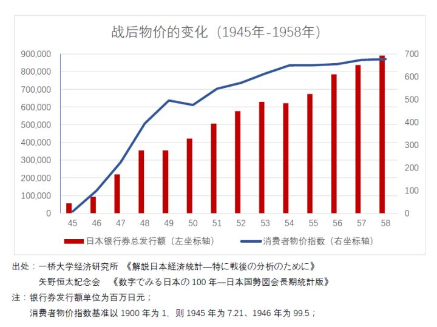

# 國防計劃第十三

## 重要性

《春秋左传·成公十三年》中讲“国之大事，在祀与戎。”祭祀可以凝聚人心，而国防可以保卫群体利益。

《孫子兵法·始計第一》中孫子曰：兵者，國之大事，死生之地，存亡之道，不可不察也。

《司馬法 ·仁本》中讲：“故國雖大，好戰必亡；天下雖安，忘戰必危。”

## 审慎性----谋定而后动

战争属于最后的选择，务必要谋定而后动。正如《孫子兵法 謀攻第三》中孫子曰：

> 凡用兵之法，全國為上，破國次之；全軍為上，破軍次之；全旅為上，破旅次之；全卒為上，破卒次之；全伍為上，破伍次之。是故百戰百勝，非善之善者也；不戰而屈人之兵，善之善者也。故上兵伐謀，其次伐交，其次伐兵，其下攻城。攻城之法，為不得已。修櫓轒轀，具器械，三月而後成；距闉，又三月而後已。將不勝其忿，而蟻附之，殺士三分之一，而城不拔者，此攻之災也。故善用兵者，屈人之兵而非戰也，拔人之城而非攻也，毀人之國而非久也，必以全爭於天下，故兵不頓而利可全，此謀攻之法也。

曹植在其《汉二祖优劣论》一文中赞扬光复大汉的汉光武帝“尔乃庙胜而后动众，计定而后行师，故攻无不陷之垒，战无奔北之卒”。这和美国里根政府时期卡斯珀·温伯格（Caspar Weinberger）提出的“在使用武力来保证美国的核心国家利益时需要国内民众的支持并且作为一种最后的手段”的主张相同。

和商战一样，战争应该在开始时就胜负已明，一旦开战就得必胜，否则根本没必要主动开战！正如《孫子兵法 始計第一》中孫子曰：

> 夫未戰而廟算勝者，得算多也；未戰而廟算不勝者，得算少也。多算勝，少算不勝，而況於無算乎？吾以此觀之，勝負見矣。

军事胜利有助于民选政府领导人保住权位，而军事失败则几乎肯定会导致民选政府领导人下台。与之相比，民选政府领导人就算打了胜仗，只要阵亡士兵稍多，他们就可能因此下台。想来这就是为什么民选政府领导人在保护士兵方面比独裁者下的功夫多得多。所以如果不能必胜就不该开战。这和美国著名政治学家布鲁斯·布尔诺·德·梅斯奎塔（Bruce Bueno de Mesquita）和阿拉斯泰尔·史密斯（Alastair Smith）合著的《独裁者手册：为什么坏的行为几乎总是好的政治》（The Dictator's Handbook: Why Bad Behavior is Almost Always Good Politics）第九章中提到的“依赖大量核心支持者的领导人只有在相信胜利基本在望的前提下才会开战。否则他们将寻找和平解决国际争端的其他方法。对照之下，依赖少数核心支持者的领导人即使胜算不大也准备打仗。如果战争过程不顺利，民选政府领导人会想尽办法取胜；独裁领导人一开始打得风生水起，一旦发现资源不足就放弃。”一致。我们知道大联盟国家的领导人必须让多数人民满意。这就意味着民选政府领导人在战争中必须为人民着想，当然，士兵也是人民。军事冲突将士兵置于危险之中，民主领导人想尽办法要减少这样的危险。在独裁国家，步兵不具有政治上的重要性。独裁领导人不会浪费资源保护他们。更好的训练和更先进的装备使民主国家能发挥出每个士兵的最大作用，在取得相同军事结果的同时让尽可能少的士兵承受风险。

同时卡斯珀·威拉德·温伯格在其演讲《军事力量的使用》中认为：

> 首先，美国不应当派遣军队到海外作战，除非这一特别的军事行动或时机对我们或盟国的国家利益至关重要……
>
> 其次，如果我们决定了确实有必要在既定情况下派出作战部队，我们就应该带着获胜这一清晰目标全心全意去做。如果我们不情愿用武力或必要资源达到我们的目的，我们就根本不应该派兵……
>
> 第三，如果我们确实决定派兵到海外作战，我们必须先明确确立政治和经济目标。我们应该清晰了解我们的部队将如何达成这些明确确立的目标。我们应该具有并派出为完成这些目标所需的部队……
>
> 第四，我们的目标和我们所派部队的关系——他们的规模、构成和战略部署——必须持续接受评估和调整，如果有必要的话。在军事冲突过程中，条件和目标总在发生变化。当它们发生变化，我们的作战要求也必须变化……
>
> 第五，在美国派遣部队到海外之前，我们必须得到一些合理的保证，即我们会获得美国人民及其在国会的代表们的支持……
>
> 最后，美国派兵作战应该做为不得已才采取的最后手段。

温伯格则强调保卫国家核心利益这一公共物品。温伯格的理念不强调快速取胜，而是强调不惜花掉多少资源也要取胜的意愿，这一点在鲍威尔的理论中甚至更突出。温伯格和鲍威尔都认为，如果美国没有准备好为了取胜而动用足够的资源的话，那么就不应该介入任何战争。他们以及马德琳·奥尔布赖特都认为对于战争冒险应该非常谨慎。然而一旦决定了要冒这个险，如温伯格（以及鲍威尔）认同的，美国必须准备举大军作战，并在战争进行过程中根据形势发展的需要增加开支。必须先有了必胜的信心以及胜利有利于美国人民的利益，才可以开战。对民主领导人而言，战争不过是达到对外援助想要达到的目标的另一种方式。对外援助收买受援国的政策让步，战争则强加政策让步。无论哪种方式，这同时意味着，热切希望推行国内民众喜欢的政策的民主领导人，更喜欢在战败国扶持一位顺从的独裁者（当然，扶持过程会伴随虚假的民主，比如举行一场结果令民主领导人满意的选举），而不喜欢在战败国民主领导人的政策上下赌注，因为此人必须对其本国选民负责。

民主国家之间很少发生战争（有些人甚至会说从来没有）。这并不是说它们爱好和平。它们并不羞于与别国开战。但民主国家之间心照不宣的和平背后的逻辑有助于我们理解如何才能让世界变得更和平，以及要达成这一目标有多困难。民主国家领导人需要推行成功的政策，否则会被人民赶下台。由于这个原因，他们只在认为胜券在握的前提下才发动战争。当然他们有可能估计错误，一旦出现这种情况，如我们先前所说的，他们会加倍努力去赢得战争。如果我们是正确的，我们应该很难看到两个大联盟国家之间发生战争。根据我们的逻辑，民主领导人只在认为几乎肯定会赢的情况下才会开战。但两个对手怎么可能同时这么确信？而对于独裁者来说，如我们先前看到的，不用考虑赢不赢的问题。他们愿意承受更大的风险，因为他们有很好的理由认为战败的个人后果不如无法收买核心支持者那么糟。紧紧遵循政治生存的逻辑，我们必须认识到，两个民主国家不大可能互相开战并不意味着彼此之间绝对不会武力相向。大联盟国家之间当然有可能产生争端，其中某国甚至会动用武力对付他国。这又是怎么回事？

只要一位大联盟国家的领导人相信争端不可能真的升级为战争，他可以做出不惜争端升级的姿态逼迫对手让步；或者如果他觉得对方有开战的准备而自己的胜算太小，就自己让步，与对方进行谈判。想象一下争端双方都是依赖大联盟的民主国家。大联盟政治的逻辑告诉我们，一个大联盟国家进攻另一个大联盟国家的唯一前提是对方确实足够弱小，宁愿谈判而不是反击。由于目标国一旦反击的话同样会倾尽全力，挑起战争的这个民主国家就必须要么具有巨大的军事优势，要么确信对方没有足够的资源会认为有胜算。也就是说，发起进攻的民主国家必须很肯定对方对于胜利没有把握。在两个民主国家针尖对麦芒的军事对峙中，这是至关重要的。 与其说民主国家之间不会互相开战，还不如说民主大国专挑弱小的国家下手，不管对手是民主国家还是独裁国家；大国的期望就是对手不会反击或反击力量不足。实际上这直接解释了历史上民主国家进行的帝国主义和殖民扩张行为，对手都是无力保卫自己的弱小国家。

## 目的性----知止而有得

战争应该有目的性，如果损失要超过收益时就得及时止损。这和在美国乔治·W·布什政府中担任参谋长联席会议主席的科林·鲍威尔（Collin Powell）的“美国应该谨慎使用武力，特别是在其收益小于损失的领域，应该约束使用武力”的主张相同。

汉武帝时期数度征伐，如《资治通鉴·汉纪》中讲：“上觉之，谓大将军青曰：“汉家庶事草创，加四夷侵陵中国，朕不变更制度，后世无法；不出师征伐，天下不安；为此者不得不劳民。若后世又如朕所为，是袭亡秦之迹也。”汉武帝好大喜功，不知及时止损，穷兵黩武，最终造成《漢書 卷七 昭帝紀》中提到的“承孝武奢侈餘敝師旅之後，海內虛耗，戶口減半”的境地。如果汉武帝在漠北之战即霍去病封狼居胥之後停止继续进攻匈奴就能避免很多人间悲剧，同时能使国家利益最大化。

因为战争明显乃不祥之事如李華所写的《弔古戰場文》：

> 浩浩乎平沙無垠，敻不見人。河水縈帶，羣山糾紛。黯兮慘悴，風悲日曛。蓬斷草枯，凜若霜晨。鳥飛不下，獸鋌亡羣。亭長告余曰：「此古戰場也。嘗覆三軍，往往鬼哭，天陰則聞。」傷心哉！秦歟？漢歟？將近代歟？
>
> 吾聞夫齊、魏徭戍，荊、韓召募。萬里奔走，連年暴露。沙草晨牧，河冰夜渡。地闊天長，不知歸路。寄身鋒刃，腷臆誰訴？秦、漢而還，多事四夷；中州耗斁，無世無之。古稱戎、夏，不抗王師。文教失宣，武臣用奇。奇兵有異於仁義，王道迂闊而莫為。嗚呼！噫嘻！
>
> 吾想夫北風振漠，胡兵伺便。主將驕敵，期門受戰。野豎旄旗，川迴組練。法重心駭，威尊命賤。利鏃穿骨，驚沙入面。主客相搏，山川震眩。聲析江河，勢崩雷電。至若窮陰凝閉，凜冽海隅；積雪沒脛，堅冰在鬚。鷙鳥休巢，征馬踟躕，繒纊無溫，墮指裂膚。當此苦寒，天假強胡，憑陵殺氣，以相剪屠。徑截輜重，橫攻士卒；都尉新降，將軍覆沒。屍填巨港之岸，血滿長城之窟。無貴無賤，同為枯骨，可勝言哉！鼓衰兮力竭，矢盡兮絃絕。白刃交兮寶刀折，兩軍蹙兮生死決。降矣哉，終身夷狄！戰矣哉，骨暴沙礫！鳥無聲兮山寂寂，夜正長兮風淅淅。魂魄結兮天沈沈，鬼神聚兮雲冪冪。日光寒兮草短，月色苦兮霜白。傷心慘目，有如是耶！
>
> 吾聞之：牧用趙卒，大破林胡，開地千里，遁逃匈奴。漢傾天下，財殫力痡。任人而已，其在多乎？周逐玁狁，北至太原，既城朔方，全師而還。飲至策勳，和樂且閑。穆穆棣棣，君臣之間。秦起長城，竟海為關；荼毒生靈，萬里朱殷。漢擊匈奴，雖得陰山，枕骸遍野，功不補患。
>
> 蒼蒼蒸民，誰無父母？提攜捧負，畏其不壽。誰無兄弟？如足如手。誰無夫婦？如賓如友。生也何恩？殺之何咎？其存其歿，家莫聞知。人或有言，將信將疑。悁悁心目，寢寐見之。布奠傾觴，哭望天涯。天地為愁，草木淒悲。弔祭不至，精魂何依？必有凶年，人其流離。嗚呼噫嘻！時耶命耶？從古如斯。為之奈何？守在四夷。

## 海防重点----臺灣及新加坡（马六甲海峡）

### 臺灣与228事件真相

太平洋锁链是美国目前在亚洲战略部署的重点，而它所要围困的主要目标就是中国，这条锁链是以太平洋上的第一岛链为基础，东起靠近北极的阿留申群岛，日本四岛，韩国是这条锁链的中心，而台湾和关岛则是中轴，其一直延伸至东南亚中南半岛的新加坡、菲律宾群岛以及印度尼西亚等。

而在第一岛链中的关键是台湾，由于其在第一岛链的中枢，具有重要的战略地位，掌握台湾能有效遏止东海与南海咽喉的战略通道，亦与第二岛链内海域形成有利航道，同时是前往远洋的便捷之路。

虽然现在台湾地方政府自己作死，但只要中华民国名号还在，法统还在，对共匪而言就永远是个大威胁，所以共匪绝对不可能放过台湾。大陆光复之後应该将海軍總部设置在陪都台北市或者称之为介石市便於打擊台獨勢力加强对台灣的控制。

共匪和美帝、倭寇都希望台湾独立从而牵制中国崛起，就像它们在大陆沦陷前夕合作时一样。如下图所示：

西元1950年1月美國國務院駐台代辦師樞安論台獨：

> As new arrival Taipei I am being given the "treatment" by Formosan Independence "Movement"（台灣獨立運動）. Conversations with Peter Huang and Philip Ng and perusal of their propaganda have served only to establish their utter lack of realism, absence of any militant and armed popular foundation, and complete reliance on US to achieve their aims and assure their livelihood forever. \(味其言觀其文，可知其昧於現實，無可戰之兵，復將自身理想及其生存全然寄望於美國的援助之上。\)
>
> It seemed desirable to attempt to straighten out their thinking in relation to China scene as to US, and to prevent misconception as to nature of any personal relations with me.
>
> In brief, they were told in friendly manner, as my personal opinion, that Formosans themselves, unarmed, could not get rid of Chinese now on Island（他們被委婉地告知：根據我個人的意見，福爾摩沙人在沒有自己的武裝基礎的狀況下，無法擺脫中國政權掌控）; US would require several divisions of troops plus supporting naval and air forces to take and keep control over Island, a responsibility which we are not prepared to assume（美國得生出幾個師的軍隊跟海空支援資源來掌控這個島，而美國不打算負這個責任）; for time being any hope for independence lay with Nationalists not with Communists, and thus measures designed weaken Nationalists merely served increase chances Communist control, so Formosans must recognize facts, not avoid them（所以福爾摩沙人必須面對現實而不是逃避現實）, and they should not forget that Formosa fits into large pattern from which it cannot be separated arbitrarily（而且福爾摩沙人也不該忘記，福爾摩沙不能自以為可以獨自於世界之外運作）; and although US sympathetic to Formosan aspirations, there were very few grounds for optimism now and foreseeable future. ......\(以下略\)

李筱峰《中共以前是贊成台獨的》一文中提到共匪支持台独的如下事实：

> 西元1928年在中共的建議下，謝雪紅、林木順等台籍左翼人士籌組台灣共產黨，4月15日台灣共產黨在上海法國租界成立。揭櫫的政治大綱第二、三條就表明「台灣人民獨立萬歲」、「建立台灣共和國」。當時的中共不但沒有反對，還派代表彭榮參加台共的成立大會。
>
> 西元1936年7月16日，美國學者埃德加·斯诺（Edgar Snow）到延安訪問毛澤東。斯諾問：「中國人民是否要從日本帝國主義者手中收復所有失地？」毛回答：「不僅要保衛長城以南的主權，也要收復我國全部的失地。這就是說滿洲必須收復。但我們並不把中國以前的殖民地朝鮮包括在內。當我們收回中國的失地，達成獨立以後，如果朝鮮人民希望掙脫日本帝國主義者的枷 鎖，我們將熱烈支援他們爭取獨立的戰鬥。這一點同樣適用於台灣。」（詳見埃德加·斯诺（Edgar Snow）的代表作《紅星照耀中國》（Red Star over China））
>
> 西元1938年10月，毛澤東在中共中央政治局擴大會議上提出《抗日民族戰爭與抗日民族統一戰線發展的新階段》報告， 鼓勵「朝鮮、台灣等被壓迫民族」爭取獨立。他呼籲「中、日兩大民族的人民大眾及朝鮮、台灣等被壓迫民族……共同努力，建立共同的反侵略統一戰線」。很明 顯，毛澤東認為中國人和台灣人應該以平等的國際友誼來合作。
>
> 西元1941年6月，周恩來在《民族至上與國家至上》一文中，明白表示中國除了要追求自己的獨立自主，也要支持其他民族國家的獨立解放運動。這些運動包括：朝鮮、台灣的反日運動，巴爾幹與非洲民族國家的反德、義侵略，以及印度、南洋等地的民族獨立運動。二戰即將結束前，中共召開第7次全國代表大會（西元1945年4月23日∼6月12日），曾刊載一份有台灣名號的文件《台灣等國留延黨員致中共七大大會祝賀詞》，簽發賀詞的「台灣等國」包括台灣、菲律賓、越南、泰國、馬來亞、荷印、緬甸；賀詞中明確提到中共長期支持東方各民族（包括台灣）的獨立運動。 （詳見《解放日報》，西元1945．5．1）
>
> 更有意思的是，戰後國民政府接管台灣，西元1947年台灣爆發二二八事件，中共的《解放日報》還在3月8日發表「支持台灣獨立」的言論。毛澤東在延安的廣播講話就說：「我們中國共產黨所領導的武裝部隊，完全支援台灣人民反對蔣介石和國民黨的鬥爭。我們贊成台灣獨立，我們贊成台灣自己成立一個自己所要求 的國家。」

資深媒體人徐宗懋编的《228事变第一女主角谢雪红珍贵照片》一书也记录有如下的关于西元1951年在北京举行的228四周年纪念大会的图片：

大会堂上写着：“抗美援朝发扬爱国主义精神为二二八烈士报仇雪恨”

共匪喉舌新华社在其述评《该是澄清“二·二八”历史真相的时候了！》也提到如下的事实：

> 西元1947年3月8日，中共中央通过在延安的新华广播电台发表声援台湾人民“二·二八”起义的文告《台湾自治运动》，其中强调指出，“你们的斗争就是我们的斗争”，“中国共产党人热烈赞扬台胞的英勇奋斗”。

务必牢记：

支持台独就是共匪！！！

支持台独就是共匪！！！

支持台独就是共匪！！！

对于臺灣要公布228事件的真相即语言不通產生糾紛导致共匪和倭奴联手屠杀中國國民，正如聯合報《林江邁之女 原爆人物談228衝突》【記者蔡惠萍／專訪】一文中记载：

> 林江邁，這個無意間引爆二二八事件轟天巨火的寡婦菸販，成為後來研究二二八文獻中必 然被反覆提及的名字，但卻少人追查林江邁的下落。對於自己在某一個程度上成了改寫台 灣戰後史的關鍵人物，她的感受是什麼？她又是如何看待二二八事件？
>
> 一九四七年二月廿七日，那個影響台灣往後一甲子的關鍵夜晚，跟著林江邁一起賣菸的十 歲小女兒林明珠，如今已是七旬老嫗。
>
> 幾乎未曾在媒體前曝光的林明珠接受本報專訪，回溯當晚在「天馬茶房」走廊下所發生的 事；身為二二八事件「原爆點」的林明珠，顛覆了許多二二八文獻上的記載，她指二二八 根本不是從查緝私菸而起，更非「外省人欺壓本省人」，純粹是出自語言溝通不良所產生 的糾紛。
>
> 「我媽媽是一個歹命的查某！」林明珠如此總結林江邁的一生。林明珠是在父親過世後七 個月才出生，林江邁身懷六甲時還不到卅歲，在大家族的妯娌間飽受欺凌。因此，林江邁 隻身從桃園龜山來到台北市，為在延平北路開茶行的公婆煮飯，後來茶行結束經營，林江 邁就近在延平北路當時台北市最繁華的大稻埕賣菸。
>
> 當時，剛光復的國府並沒有發放賣菸執照，因此並沒所謂的公私菸之分。林江邁只是當時 在天馬茶房「亭仔腳」為數眾多的菸販之一。
>
> 一九四七年二月廿七日，一如往昔的黃昏時刻，放了學的林明珠跑到天馬茶房，「太平町 」繁華的夜晚正要開始。當時雖是冬夜，但天還沒全暗，林明珠照例捧著菸盒四處兜售， 林江邁則是在離她十幾公尺外。
>
> 這時，一個配槍的阿兵哥身影靠近了她，拿起菸盒裡的菸，右手夾著點燃的菸，左手放進 口袋準備掏錢，以國語問她「多少錢？」受日本教育只會講日、台語的林明珠一時沒有反 應過來，沒想到，一旁的地痞混混見狀立刻在旁鼓譟、叫囂「有人呷免錢的菸！」並且大 聲呼喚附近的林江邁，「阿桑，有人欺負妳女兒喔！」
>
> 一群人立刻擁上，與阿兵哥拉扯，林明珠手上的菸跟著散落一地，就在語言不通及旁人起 鬨下，衝突愈演愈烈。這時阿兵哥掏槍想要嚇退圍堵他的人，一舉起槍，尖銳的槍管剛好 頂到了急著衝上前找女兒的林江邁的頭頂，一注鮮血立即順著她的臉流下，圍觀者情緒更 加沸騰、激動。這時，被大人拉到一旁的林明珠聽到有人呼喊「阿桑，妳流血啦，還不快 倒下！」「阿山仔，打人喔！」
>
> 事發後，林明珠立刻被送回龜山鄉下躲藏，從此失學，受傷的林江邁則是被送進附近徐外 科診治。林江邁在醫院住了沒幾天就倉皇出院，當時她並不知道，全台灣已經陷入了遍地 烽火、風聲鶴唳之中，更沒想到的是，她就是那個點燃引信的導火線。從二二八那天起， 國府才開始查緝私菸。
>
> 二二八風暴漸次平息後，林江邁從耳語得知賣菸糾紛演變成一場空前災難，但為了生計， 仍繼續賣菸，此時她也拿到政府發放的菸牌，林明珠也回到她的身邊。不過，自從二二八 受傷後，林江邁就飽受氣喘纏身，身體狀況愈來愈差。
>
> 對林江邁折磨更深的不是身體的病痛，而是深鎖在心底、日夜啃噬的巨大秘密。很長一段 時間，二二八是台灣社會的禁忌，林明珠不只一次追問她，「那一暝到底發生了什麼事？ 」也曾把在人們竊語中聽聞的「二二八事件」，好奇地拿來詢問母親。
>
> 林江邁總是把她拉到屋隅，驚懼發抖地說：「妳嘜講二二八啦！傻瓜，林江邁就是我啦！ 」唯恐因此招致牢獄之災；林明珠暗夜時偶爾也曾聽聞林江邁悠悠感嘆：「唉，為了一支 菸，惹了這麼大的事。」自責自己成了歷史「罪人」。
>
> 等不及可以公開談論二二八，以及更後來「二二八受難者」可以要求道歉、賠償，成為某 一種「彰顯」的印記時，民國五十八年，六十三歲的林江邁因肝硬化逝世，帶著這道深埋 心底的血痕離開了人世。

此外以採訪政治消息迅速、準確見長的南京《大剛報》記者唐賢龍所著《台灣事變內幕記》记载了國軍出兵前十天台灣的慘狀：

> 「…在台北新公園中…打死十幾個外省人，毆傷二十幾個公務員…」 「…他們對她盡情的調戲後，便一刀將她的嘴巴剖開，一直裂到耳朵邊，後將她的衣服剝得精光，橫加毆打，打得半死半活時，便將她的手腳捆起來，拋到陰溼的水溝中，該婦人慘叫良久後即身死…」 「…當小孩正在旁邊哭喊媽媽時，另一殘暴的台灣人，便用手抓住小孩之頭，用力一扭，即將小孩之頭倒轉背後，登時氣絕…」 「…一小孩被民眾將雙腳綑起，將頭倒置地上，用力猛擊，直至腦漿流出時方將其拋於路旁…」 「…民眾一手執一學生，將他們兩人的頭猛力互撞，等到該兩小學生撞得腦血橫流時，旁觀之民眾尤拍手叫好…」 「…有ㄧ開旅館之孕婦，被民眾將其衣服剝光，迫令其赤裸裸的遊街示眾，該孕婦羞憤無已，堅不答允，便被一手持日本軍刀之台灣人，從頭部ㄧ刀下去…」 「…當他從辦公室裡走出來，即被ㄧ個台灣人當頭一棒，打得他腦漿迸流…」 「…ㄧ對青年夫婦路過此地，又被群眾圍住，吆喝喊打，嚇得他們跪地求饒，時有很多台灣的小學生擠進人叢中，一看原來是『阿山』，便連忙你ㄧ腳、他ㄧ腳，將他們兩踢在地上滾成一團，這時民眾更拳腳交加，棍棒齊揮，不一會，他們便被打得血肉模糊…」 「…五個女眷被台灣ㄧ群流氓浪人強行姦污後…均憤極自縊殉難…」
>
> 他們因民眾無辜被打死而請願，今因請願不成而又有民眾被打死，故新仇舊恨，一併爆發，這時，有些平日遊手好閒的流氓們，亦乘機加入，於是呼嘯一聲，他們頓時糾合了幾千人，與請願的一萬餘民眾嘰哩咕嚕的用日語講了一會後，便即四面散開，分別把守各交通要道，各公共場所，各旅館商店，看到外省人，不分男女老幼，無論軍警官商，一律予以毆打。而看到汽車卡車，亦不問係何人所乘，均迫令下車，除將乘車之人毒打外，更將各汽車推至台北火車站圓環夜市的附近，用汽油火焚。下午三時許，情況格外嚴重，全台北市各學校的學生均全部罷課，各機關台籍員工，亦有大部份開始罷工，於是，全市秩序大亂，台北頓成了一個恐怖的世界，到處看到火光，隨時均聞打聲，本町正華大旅社（係官僚資本所開）與表町虎標永安堂首先遭殃，不僅裏面的門窗玻璃悉被搗碎，即所堆置之貨物，亦均被一部份的民眾搬出來焚燬。這時，各機關外省籍的公務員，都像喪家之犬一樣，跑的跑，躲的躲，到處被台灣人追逐，到處被台灣人毆打，而由各地乘汽車火車到台北的旅客，凡是外省人，祇要一下車，即被瘋狂的民眾予以毒打，故在台北火車站和萬華車站上被打死的外省人至夥，有的外省人，甚至被打死了，還不知究竟是為什麼而死，真是可憐可嘆！（引自第358页）
>
> 於是，在打不到貪官汙吏之後，他們便轉換目標，一變而為盲目的排外，更進而演成到處仇殺外省人的暴動。致使很多機關內可憐的小公務員，和這些小公務人員的家屬，以及若干旅行或經商的外省人，都變成他們到處獵取的對象。 在一片毆打「阿山」聲中，因為若干大員們，甚至於連大員們太太們所蓄養的小洋狗，都有機關鎗和衛兵們保護，民眾雖久想一親芳澤，飽以鐵拳，然終因戒備森嚴，無法可施，祇好望高樓而興嘆！而那些失掉了政府保護的外省人，便只好聽天由命，一任民眾的蹂躪。在許多冤死的外省人當中，我更聽到不少恐怖的慘極人寰的故事，如二十八日早上十一時，在台北新公園中，除了打死十幾個外省人，毆傷二十幾個公務員外，更有一個年青的少婦，攙了她底一個三歲的小孩子，正想由偏僻的小道中跑回家時，卻被幾個流氓們攔住了，他們對她盡情的調戲後，便一刀將她的嘴巴剖開，一直割裂到耳朵邊，後將她的衣服剝得精光，橫加毆打，打得半死半活時，便將她的手腳綑起來，拋到陰溼的水溝中，該婦人慘叫良久後即身死。當該小孩正在路邊哭喊媽媽時，另一殘暴的台灣人，便用手抓住該小孩之頭，用力一扭，即將該小孩之頭倒轉背後，登時氣絕。又在萬華附近，一小孩被民眾將雙腳捆起，將頭倒置地上，用力猛擊，直至腦漿流出時方將其拋于路旁。又在台北橋附近有兩個小學生，路遇民眾，因逃避不及，即被民眾捉住，民眾一手執一學生，將他們兩個人的頭猛力互撞，等到該兩小學生撞得腦血橫流時，旁觀之民眾，還拍手叫好。又當天下午，在台北太平町，有一開旅館之孕婦，被民眾將其衣服剝光，迫令其赤裸裸地遊街示眾，該孕婦羞憤無已，堅不答允，便被一手持日本軍刀之台灣人，從頭部一刀下去，將該孕婦暨一即將臨盆之嬰孩，劈為兩段，血流如注，當場身死。又在台灣銀行門前，有一個小職員，當他剛從辦公室裏走出來，即被一個台灣人，當頭一棒，打得他腦漿迸流，隨即殞命。這時，適有一對青年夫婦路過此地，又被羣眾圍住，吆喝喊打，嚇得他們跪在地上求饒，時有很多台灣的小學生擠進人叢中，一看原來是「阿山」，便連忙你一腳，他一腳，將他們兩人踢在地上滾成一團，這時民眾更拳腳交加，棍棒齊揮，不一會，他們便被打得血肉模糊，成了兩具破爛的孤魂。像這一類血琳琳的悲劇，真是令人不忍卒聞，而我還不過是在幾百個例子當中，僅僅舉出幾個最顯著的例子而已。（引自第366页）
>
> 事後據很多被打傷而未身死的外省朋友們告訴我說：台灣人打「阿山」時的方法很多，如問：「你是哪裏人？」時，答曰：「中國人」者，打；「上海人」者，打；「福建廣東人」者，更打！假如你說是「台灣人」，還是要打，當台灣人在盤問你時，如你以台灣話回答時，他隨即改用日本話來問你，你假使答不出來時，那便要打得更兇；如你既會說台灣話，而又會說日本話，倘若你的像貌要不像台灣人或日本人時，依然要挨打！（引自第367页）
>
> 在各地民眾騷動期間，打得最厲害的，當以高雄、嘉義、基隆三地為最慘烈，軍民死傷也最多。至于台中、屏東、高雄、嘉義、新竹等地大部份外省人均被集中。在新竹縣政府的桃園，被羈囚于大廟、警察局官舍與忠烈祠後山三地之外省人，內有五個女眷被台灣一班流氓浪人強行姦污後，那五位女眷于羞辱之餘，均積極自縊殉難。而該縣大溪鎮國民小學女教員林兆熙被流氓呂春松等輪姦後，衣服盡被剝去，裸體澈夜，凍得要死，後被高山族女縣參議員李月嬌救護始脫險。在台中，當外省人被強迫集中于民眾旅社、市參議會、台灣地方法院時，有些流氓，復強迫所有的外省人均須學唱日本國歌。（引自第380页）
>
> 像這一類慘極人倫的事實，在其他各地亦層出不窮。但都是那些流氓浪人或由海外返台的退伍軍人所幹出來的。至于大多數台灣的老百姓，依然是很善良的。並且在重重嚴密的監視當中，還想盡辦法來保護外省人。因為，台灣民眾在事變期中，有些流氓浪人曾警告其他的台灣人，不准隱藏外省人，不准賣東西給外省人，不准替外省人醫病，假如要不遵令的話，便要將幫助外省人的台灣人打死，或將房子燒光。故在台北事變爆發後，有很多台灣公立的醫院，的確有拒收醫治外省人的情事，但很多台灣私人所開辦的醫院，依然偷偷的將受傷者抬到別的台灣人家裏，為之醫治。此外，有很多台灣人更冒著生命危險，來救護外省人。如新竹縣長朱文伯，便曾被台北吳深潭與林剛朗兩先生救護，隱藏在吳家四天，招待宿食，殷勤備至，後吳因為替朱在街面上打聽消息而被流彈傷折兩個手指頭，均毫無怨尤，朱出險後，曾以兩萬元台幣送吳作為醫療費，吳堅拒不收，並謂：「救護同胞為余應盡之責，如以錢財相贈，即為輕視余矣。」俠義之情，令人感動。又如我有一個朋友的妻子，她的丈夫是台灣專賣局長，因其平日廉潔自守，事變時，其夫又適在台北，故專賣局中很多台籍職員，均奮力保護，卒未受害。而在高雄當民眾騷動，到處毆打外省人時，我底一個朋友，當他正在被很多台灣人追逐時，適有另一姓王的台灣人跑來，即將我那個朋友救起，並令其迅即躲到他太太的房裏。及至那些追逐的台灣人趕到時，他們硬要搜他的家，並說王掩護外省人。王即不肯，因言語衝突，遂發生鬥毆，當王被打得遍體麟傷時，渠依然橫臥于家門口，不讓其他的台灣人進去。王之妻子，情急智生，便叫我那個朋友躲于裝被服的壁櫥中，並用很多被服將其重重的裹起來。等到王躺在門口已奄奄一息，無法再攔阻時，其餘的台灣人即一湧而入，衝進王之住宅內，搜尋了半天，終未發現我那個朋友，後來，當他們呼嘯一聲而去時，我那個朋友雖幸免一死，但那個姓王的台灣人，卻早已氣絕身亡矣。我那個朋友目覩慘狀，悲傷無已，即匍匐于死者身旁，號啕慟哭，並誓願負担死者家小十年以上之生活費，然該姓王之妻子于痛不欲生之餘，堅不承受，並拒收我那個朋友分文的酬謝！像這樣俠義救人的史實，也多得不勝枚舉。（引自第384页）
>
> 從上述台灣事變的風雲人物看，足見台灣事變的發動，完全是那些在日本人時代御用的紳士，與由海南島、南洋羣島、新加坡等地遣返台灣的退伍軍人，以及潛伏在台灣下層社會間的流氓浪人、土豪劣紳等，他們利用了台灣省貪汙的弱點，和經濟的動蕩不安，與一般人民不滿現實的情緒，遂乘著緝煙事件的導火線，終于釀成了震驚中外的事變。若將這次事變的責任問題，完全歸咎於□產□，那實在是自欺欺人之談！（引自第501页）

著名历史学者杨天石在其代表作《找寻真实的蒋介石: 蒋介石日记解读》中提到的228事件真相如下：

> 关于事件中外省人被害的情况向无精确统计。3月5日，台北宪兵第四团团长张慕陶报告称：外省人之被袭击而伤亡者，总数在800人以上。《二二八事件资料选辑》（二），第67页。3月6日，陈仪向蒋介石报告称：“遇外省人，不问何人，即肆殴打，不只对公教人员而已。商人亦遭波及，外省人开设之商店亦被捣毁。外省人（台北市）受伤人数约在200人左右，且有致死者。”《二二八事件资料选辑》（二），第72-73页。据事后各单位向台湾警备司令部的汇报，在南京国民政府的军队抵台之前，外省人死亡或失踪470人（公务员72人，军警130人，民众268人），受伤2131人（公务员1351人，军警397人，民众383人）合计为2601人。公家财产损失1.4亿台币，私人财产损失4.7亿台币。朱浤源：《二二八事件真相还原》。除殴击外省人，抢夺公私财产之外，外省妇女也成为侮辱对象。李益中记载：暴徒“见妇女则恣情凌辱，或令裸行以取笑乐”。《二二八事件资料选辑》（二），第375页。赖泽涵等人的《研究报告》则称，强奸事件也“偶有所闻”。
>
> 关于当时外省人被惨杀、侮辱的状况，唐贤龙的《台湾事变内幕记》等书有几则触目惊心的记载，摘录如下：
>
> 1.在台中市，烟酒专卖局科员刘青山从办公室走出，即被推倒、围殴。后入台中医院治疗，第二天晚上，十余人冲入医院，割去刘的耳朵、鼻子，挖出两眼，再加殴击，直至毙命。
>
> 2.在台北新公园附近，除打死十几个外省人，殴伤二十几个公务员外，更有一个外省女教师被轮奸。另外，一个少妇搀小孩回家，被人拦住，先调戏，剥光衣服，横加殴打，后用刀割开嘴巴，再绑起双脚，抛到水沟中。少妇惨叫身死，小孩哭喊妈妈，流氓抓住小孩头，用力向背后扭转，使小孩气绝毙命。在太平町，有一孕妇被剥光衣服，游街示众，该孕妇坚不答允，被一刀从头部劈为两段，当场身死。
>
> 3.在台北桥附近，外省小孩在路上被流氓抓住，一个人抓左腿，一个人抓右腿，将小孩撕开，尸体被丢到水沟里。另有两个小学生，路遇暴民，暴民一手执一学生，将两人的头猛力互撞，直至脑血横流，旁观者拍手叫好。在万华附近，一小孩被捆绑双脚，暴徒将小孩头倒置地上，用力猛击，使脑浆流出，抛于路旁。
>
> 4.在台湾银行门前，有一职员从办公室走出，即被暴民当头一棍，打出脑浆殒命。适逢一对青年夫妇路过，又被暴民围住，吆喝喊打，拳脚交加，棍棒齐飞，二人均被打得血肉模糊而死。
>
> 5.在桃园，外省人被羁囚于大庙、警察官舍与忠烈祠后山三地，内有五个女眷，被流氓奸污后愤极自缢。该县大溪国小女教员林兆煦被流氓吕春松等轮奸后裸体彻夜，被高山族女参议员李月娇救出脱险。转引自《一个外省人亲历二二八的回忆》，转据武之璋：《二二八真相解密》，第113-114页，又121-125页。
>
> 上述暴行，令人发指，应视之为骚乱。它们不具有任何正义性与合理性。

菊仙（黃旺成）在《後藤新平氏的「治臺三策」》（《臺灣民報》第145号，西元1927年2月20日，第14版）节录：

> 後藤新平氏在臺灣做民政長官的時候，從臺灣人的性質上發見了三條的弱點，因為要利用這弱點，所以定了治臺的三策：
>
> （一）臺灣人怕死――要用高壓的手段威嚇的。 （二）臺灣人愛錢――可以用小利誘惑的。 （三）臺灣人重面子――可以用虛名籠絡的。
>
> 歷代的總督雖然都沒有明白地聲明過治臺的政策，而暗地下都是把後藤新平氏治臺三策，當作鐵板不易的金科玉律看的。

日本統治台灣先期的20年內屠殺抗日的台灣人民達65萬人之眾，終成順民。日本利用興建南北縱貫鐵路、基隆港，大舉掠奪台灣的天然資源運往日本、沒收台灣人民大批的土地、大批運走台灣人民的糧食與農產品，剝奪台灣人民的財富及工作升遷的機會，復又剝奪台灣人民平等接受高等教育的權利，並在全台推動"皇民化反華"的奴化教育，毒害台灣人民至今。

日本在統治台灣的後期，成功的奴化「皇民化」台灣的年輕人，二次大戰期間，日本在台募兵，幾乎囊括了當時所有的台灣青年人，高達七十五萬台灣皇民青年，熱烈響應日本帝國的大東亞聖戰，「自願」赴南洋及中國大陸華南戰場，以「膺懲暴支」屠殺中國同胞、效忠日本天皇效為榮。日本戰敗，台灣皇民青年\(今綠營台獨的最高精神標兵 - 台灣皇民阿公、李登輝"們"\) 痛不欲生，仇恨\(至今\)的對象，首當其衝的就是當時代表中國接收台灣的中華民國領袖蔣介石。

因不甘中國支那敵國的光復台灣，台灣皇民青年、台籍日本兵皇軍、愛日本國的皇民化學生、以及因唯恐失去利益的皇民化士紳及皇民奉公會的既得利益者、偕同日本浪人、混雜著台灣當地的地痞流氓，藉私煙糾紛事件的導火線，一呼百應，紛紛頭戴日本軍帽、身著日本軍服，高唱著日本軍歌，揮舞著日本軍刀，趁機在全台發動「二二八」武力奪權回歸日本祖國的「台獨事件」，再度仿效曾在南京大屠殺所使用過的殘暴手段，對在台的大陸人老弱婦孺進行血腥的滅絕大屠殺，姦淫肢解、砍頭、分屍孩童成兩半、削掉鼻子、挖出眼珠、割去耳朵及生殖器官、對孕婦開腸破肚用日本武士刀將嬰兒挑出摔死，慘絕人寰！殘暴狠毒的程度令人髮指！

二二八事變爆發當時，台北軍警憲僅存五百餘兵力鎮守要塞，幾乎完全無力顧及其它；結果造成全台外省人民老弱婦孺被台灣皇民肆意大屠殺，達數以萬計！須知，即令是當時國府的「高層」 - 嚴家淦先生，都無法受到軍警憲的保護，都只能選擇躲藏在台灣士紳林獻堂的家中避難，遑論當時約有五萬餘，「非高層」的國府駐台公教人員及眷屬，以及為數約一、二萬以上，來台經商、工作、及旅遊的大陸平民百姓，合計約七萬人以上，全無安全逃命的避難所。228時，這批在全台肆虐，屠殺外省人民的台灣皇民，除了當街殺害的，還挨家挨戶搜尋藏匿的外省人，「全台足足殺了十天」；可想而知，全台外省人民老弱婦孺，幾被屠戮殆盡！直至國軍在三月十日登陸平亂，稍事抵定後，這批驚恐莫名、碩果僅存的約一萬餘外省人，均紛紛趕赴碼頭，搭船逃離台灣。

參看李敖研究本省人因228事件而死亡的人數，不超過八佰多人，殊為正確，但卻未仔細研究外省人死亡的人數，僅順手拈來陳儀當時為掩飾太平，誤導蔣的外省人死亡數字；不過據當時的國安情治單位\(相當於台灣目前的調查局\)，內部機密文件的精確回報顯示，外省人死亡破萬人。

台灣本省籍的長輩們曾敘述：228時，外省人到處躲藏，被找到的，會被拖到街上，活活打死，被打死的外省人，比228事件死掉的台灣人還多很多。如果不是有愛心的台灣人，提供場所讓這些外省人藏匿，加上軍隊的介入，死傷會更慘重。如果228「號稱」死了數萬人，那也就是說「有數萬的外省人被台灣人打死」！（参考自udn部落格《民進黨除了228外還剩什麼？》一文）

台湾倭寇的行为也和它们在二战期间的所作所为一致，如日本军在西元1941年12月25日清晨攻进圣士提反书院，此时英日两军的战争仍在进行；有指日本军在当天6时左右攻入书院，亦有幸存者忆述日本军是在5时30分左右闯入。攻进书院后，有日本士兵用刺刀杀害15名卧床的伤兵，并把职员和能够行走的伤者以及医院赶进储物室，大量没有任何武器的军人受伤或被杀；一名幸存者在翌日发现有2名伤兵遭到肢解，眼珠被人挖掉，耳朵和舌头则被割去。有些日本士兵把伤兵的尸体当作垫子，在上面轮奸女护士，并在强奸后伤害或杀死她们。一些教职员为了保护学生而留在书院内，最后亦丧生，在赤柱军人坟场安葬；有人尝试在门口放置阻碍日本军进入的杆子，结果遭到枪毙，其尸首更多次被人以刺刀插入。

当年台湾光复之日，就如同将来大陆光复之日，中国人自然欢迎中国政府，失败的倭寇自然还很仇恨中国政府。正如将来大陆光复之後中国政府还都南京，中国老百姓自然高兴，共匪及其走狗当然还时时刻刻想着推翻中国政府。

西元1945年10月15日，中国军队登陆台湾，受到台湾民众的热烈欢迎。台湾人诵著陆游“王师北定中原日，家祭勿忘告乃翁”的诗句，唱着欢迎歌，歌词是“台湾今日庆升平，仰首青天白日清，六百万民同快乐，壶浆箪食表欢迎，哈哈！到处欢迎，哈哈！到处欢迎，六百万民同快乐，壶酱箪食表欢迎。”，热烈欢迎国军进入台湾。（ 悲剧的历史拼图 金山乡二二八事件之探析，页5，中央研究院近代史研究所汇刊第36期，2001-12）

当时的台湾日日新报等媒体上，均有大量商家行号刊登欢庆台湾光复的广告。街上锣鼓喧天，鞭炮声不断，户户张灯结彩，虽然地方上有若干民众报复日本人的小骚动，但整个局势都处于平静而稳定，并等待国民政府的到来。（台湾的历史源流\(下册\) 互联网档案馆的存档，存档日期2007-09-28.）

至于倭奴和共匪喜欢鼓吹的台湾民生凋敝，但这纯粹怪倭寇。倭国本土当年自己被美帝经过东京大轰炸、神户大空袭、大阪大空袭、名古屋大空袭等轰炸成了一片废墟。其中规模最大的是西元1945年3月开始的造成8至10万人死亡，近41平方公里的地方被焚毁，摧毁267,000栋建筑物的东京大轰炸。东京大轰炸是人类历史上最具破坏性的非核武空袭，比第二次世界大战中任何一次军事行动造成的伤亡都还多。倭寇还享受到其他地球人都无福享受到的原子弹爆炸，比如广岛与长崎原子弹爆炸造成数十万日本倭寇死亡。

由于二战中美军的空袭和两颗原子弹所造成的巨大破坏，日本国内满目疮痍，生产能力锐减，工业设备的30%-60%遭到空袭破坏，未遭破坏的设备也急需修理与更新。同时，由于战时大量支出军费，导致国内出现恶性的通货膨胀，许多生活必需品供应奇缺。1946 年日本国民生产总值仅为战前（西元1934-西元1936年平均值）的65%，工矿业生产仅为战前的28%，农林渔业生产仅为战前的78%。全国的失业人口多达1300多万，从海外撤退回国的日本国民多达650万人，大批无家可归的流浪者露宿街头，食品不足导致许多人因营养不良而死亡。（参考自吉灵浩－华创债券在金融界网站上发表的《抓住机遇适时转型 造就日本经济崛起：1946-1984》一文）

二战末期日本就开始爆发粮食危机与恶性通货膨胀。

西元1945年8月，倭国政府估计当年大米的预期收获量为3900万石，仅占正常时期的70%。同时来自台湾、朝鲜和东南亚的粮食来源也被切断，这便加剧了战后的粮食危机。据粗略估计，战后3个月内，仅东京死于营养不良的人数就超过1000人。粮食危机使黑市的粮价大幅度上涨（以大米价格为例，西元1947年黑市米价约为配给米价的12倍，西元1948年为7倍，西元1950年为2倍，西元1951年为9倍）。居民大多通过衣物等实物取代现金购买粮食，这种靠变卖家当以换取粮食的生活被国民揶揄作“如笋剥衣”。美国的援助打开了日本大量进口美国粮食的大门，相对缓和了粮食危机。

在皇居前广场参加“粮食五一节”的学生；图中标语牌上写的是“嘿老头，如果我没吃的就得死，可我不买会死的账”，西元1946年5月19日

另一个非常严重的问题是战后恶性通货膨胀。通货膨胀是因纸币发行过多而引起的货币贬值和物价水平的全面持续上涨。西元1945年8月15日战败当时，日本银行券的发行额为303亿日元，西元1946年2月15日就达到了605亿日元，6个月的时间内膨胀了一倍。同一时期，零售物价上涨了两倍。从批发物价指数上看，国内物价在西元1945年到西元1949年的5年间增长了50倍。在恶劣的经济形势下，各地工厂大量解雇工人。战败后两个月内被解雇的工人总数高达413万人，占工人总数的三分之一。到西元1945年底，全国有1300万人找不到工作。没有遭到解雇的工人，工资水平也被压得极低。西元1946年1月，东京的工人生活费指数是1937年的14.8倍，大阪则达到22倍，但工人的平均实际工资却仅有战前水平的13.1%。

（参考自秋山左京《自立之路：战后十年的日本经济（二） 战后初期的经济》一文）

作为日本的殖民地，台湾的待遇本来和日本本土差不多。但由于中国政府特别是先总统蒋中正的努力，台湾的情况比日本本土要强很多。这也是很多倭寇偷偷留在了台湾的原因。台湾遭受美军空袭，其中规模最大的是台北大空袭。台北大空袭，又称台北大爆击，是发生于西元1945年5月31日第二次世界大战中由美军对倭据台湾所发动的轰炸行动，为台北市历史上所遭受最大规模的空袭攻击行动。根据美军第五航空队《Fifth Air Force-Air War against Japan》记载，美军总共在台北投弹310吨，规模为台湾第六大，次于高雄2559.2吨、基隆1840.1吨、台南1406.8吨、新竹1123.2吨、台中766.5吨。虽然美军事先使用空照标明预定轰炸的政府机关、军事机构等，但仍造成死伤4,055人，伤者及无家可归者更达数万人以上，死伤人数仅次于高雄大空袭的4,093人。依台湾总督府统计西元1944年10月12日至西元1945年8月10日，全台湾空袭死亡5,582人、失踪419人、重伤3.667人、轻伤5,093人，罹灾277,383人，而台北死亡1,678人，失踪170人，重伤891人，轻伤1,316人，共计死伤4,055人。因台北州涵盖范围以及人口较密集，次于高雄州4,093人，高于台南州3,950人。若以房舍受损来看，全坏10,241栋、半坏17,972栋、全烧16,080栋、半烧1,047栋。台南州的状况比较严重、其次为高雄州、台北。当年台湾的通货膨胀，本身也是日本侵华战争导致的。

先总统蒋中正不以日本国民为敌，以德报怨政策让日本有重生机会。如在重庆发表的《抗战胜利告全国军民及全世界人士书》演说中强调，“中国人民在黑暗和绝望的时代，都秉持我们民族一贯的忠勇仁爱、伟大坚韧的传统精神，深知一切为正义和人道而奋斗的牺牲，必能得到应得的报偿。全世界因战争而联合起来的民族，相互之间所发生的尊重与信念，这就是此次战争给我们的最大报偿。中国同胞们须知‘不念旧恶’及‘与人为善’，为我民族传统至高至贵的德性。我们一贯声言，只认日本黩武的军阀为敌，不以日本的人民为敌。”

《抗战胜利告全国军民及全世界人士书》演说后来被日本媒体称为蒋的“以德报怨”演讲，蒋在二战以后的对日政策特别是放弃战争索赔也都统称为“以德报怨”政策。八年抗战后蒋介石的维护君主制，反对列强瓜分日本，迅速遣送战俘等三大对日政策，都为战后的日本复兴奠下良好的基础。

西元1956年8月，蒋中正接见日本各界亲善访问团，团长石井光次郎亲呈首相鸠山一郎手函，并谓日本人莫不感激蒋于日本战败后仍维护日本政体及对日以德报怨之宽大政策。西元1967年11月27日，中华民国国防部部长蒋经国访问日本，日本国王裕仁接见时表示永不忘怀蒋中正宽大德意。（陈布雷等编著. 《蒋介石先生年表》. 台北: 传记文学出版社. 1978-06-01.）

西元1975年4月5日，先总统蒋中正逝世。日本内阁官房长官井出一太郎代表日本政府发表一个“非官方”谈话称赞蒋：“在激动历史的转变中的日本国民之间所熟知而且亲密的人士，他是现代中国历史上的人物……确信必将留住人们的记忆里……蒋总统是再造日本的大恩人，蒋中正以德报怨的对日政策，加速了日本战后重建与复兴。蒋总统的逝世对日本国民有如晴天霹雳，有良知的日本国民莫不悲痛万分。”（李松林. 《蒋介石的台湾时代》. 台北: 风云时代出版社. 1993: 487.）同日，日本前首相佐藤荣作谈话称：“日本将永远难忘蒋总统于第二次世界大战后给予日本的大恩大德。最令日本人难忘的一件事就是，蒋总统于第二次世界大战后对日本以德报怨的恩惠。”（总统蒋公哀思录编纂小组 \(编\). 《总统蒋公哀思录》第二编. 台北: 总统蒋公哀思录编纂小组. 1975-10-31.）

此外日本人为了感谢蒋介石政权“以德报怨”，放弃对日本的战争赔偿，设立了专门纪念蒋中正的神社-----中正神社，位于日本爱知县幸田町。

这和台湾倭奴的丑恶行径形成了鲜明对比。

大陆光复之後，如果不能和台湾地方政府达成一致，则可以通过呼吁唤起驻守台湾的中国军队的爱国情怀镇压臺灣倭奴组成的台独势力，同时清洗國民黨～鏟除民進黨。此外可以用航母舰队运送先总统蒋中正和先总统蒋经国的灵柩回大陆从而完成台湾岛驻军的更换。

图为民國四十七年十一月十四日，先总统蒋中正和蒋经国林立莅临“中途島”號航空母艦參觀美國第七艦隊在台灣海峽舉行的軍事演習

### 新加坡（马六甲海峡）

马六甲海峡是连接太平洋和印度洋的主要通道之一，实际上是中国的能源运输必经之路（85%的石油运输途径此地），也是中国进出口欧洲及非洲货物的交通之路。通过控制新加坡控制马六甲海峡，将来还可以用于控制日本。此外还通过控制泰国修建克拉运河钱牵制新加坡。

## 陆防重点----西域

新疆应設為安西都護府和西域都護府，允許當地漢人持槍並由軍隊提供必要訓練，堅決鎮壓一切形式的恐怖組織，嚴禁稱呼西北為東突厥斯坦，支持“疆獨”或者“東突厥斯坦”就直接当成恐怖分子处理。根據《中華民國憲法》，中華民國固有之疆域非國民大會同意不得變更之！且中華民國所有領土屬於全體國民！堅決鎮壓邊疆叛亂勢力，除非全國人民同意其獨立之訴求！如有必要堅壁清野然後組織移民進入！西域一旦有失，後果将不堪设想！！！勿忘“东突分子”要杀光汉人！！！勿忘陕甘回乱等事件中被屠杀的数千万中国老百姓！！！！勿忘国有难回必乱！！！无论历史还是现实中，穆斯林都是最吃硬不吃软、给脸不要脸的群体之一，因为其宗教本身就是主要靠武力征服和暴力威逼扩张的，这也导致穆斯林有着先天的奴隶基因和投机懦夫本质。对其让步只能换来轻蔑和得寸进尺，反倒是强硬对待和用更大的暴力回击会让他们尊重敬畏，认为这是神的意志，如同他们祖先在暴力前屈服，从而信奉伊斯兰教一样。民族主义和经济水平真没有必然联系，热比亚新疆女首富又如何？古人“ 北狄人面兽心,难以德怀,易以威服 ”，“德以柔中国，刑以威四夷”都不是白说的，是总结了几千年的经验教训，同心同德从不是钱能买来。

通过加强对西域的控制，能更好的控制西藏和安北都护府（外蒙古）地区，十四世達賴喇嘛尊者並非要獨立，十世班禪額爾德尼也不謀求獨立，只需按照慣例允許地方自治且如達賴喇嘛尊者所言保護及弘揚藏文化即可。支持擁護十四世達賴喇嘛的中間道路但應做好十四世達賴喇嘛尊者圓寂之後的西藏暴亂的準備。同时坚决打擊印度帝国主义的走狗藏青會。对长期处于野蛮状态下的游牧种族来说，其核心价值观只认同强者，而强者的标志就要凌驾于他们之上，所以自古才有“畏威而不怀德”的定论。这种只崇拜强者的价值观使游牧民族的奴性普遍很强，以中蒙的实力差距，假如中国让蒙古人的地位比汉族低下，这些蒙古人反倒会对外蒙喀尔喀人有优越感，如果中国再对外蒙表现强硬，让外蒙仰中国鼻息，他们的优越感也会更强。历史上中国境内打出索永布旗号的例子，全是受外蒙鼓动，图谋叛国的分裂组织。

对少数民族不能一概而论，要认清谁是朋友，谁是的敌人，谁是可以争取的，谁是不可救药的。基本来看，就是在文化和种族认同方面与汉族越近，规模越小的民族，越是汉族的朋友，反之则越会视汉族为敌。要注意，判断文化和种族认同度只能以当事民族的主观认同为准，而不是所谓理客中标准。如回族虽然语言和种族上与汉族很接近，但自认为是中东人后裔，信中东的宗教，与安拉为亲与我为疏，这就是文化和种族认同与汉族完全异质，客观事实与否没有意义。再如满族，虽然多数其实出身于三百多年前的汉族奴隶或汉奸，所谓民族语言和文化几近消亡，但出于背叛者效应（或者叫皈依者效应），他们对汉族及中国传统的仇视甚至大于更异质的民族。但也有些特例，如塔吉克族（其实应为帕米尔族），虽然文化和种族上与汉族差异很大，但因为人数少，实力弱，在当地处于被其它异质少数民族包围的边缘地位，所以乐于与汉族合作。

穆斯林自我封闭的仇汉群体意识，是由其仇外宗教构建的认同体的必然产物和既成事实。所以汉族如果视回回为同族，就等于以无心对有心，单方面对伊斯兰教和回回撤除了心理防备，以不切实际的亲近感引狼入室。回回却仍能保持敌意态度，利用汉族放松警惕进行内部渗透。这就陷入与现在西方受现代文明制约而无从约束穆斯林难民，而穆斯林难民却可利用现代文明一切自我限制而占尽先机的被动境地。为避免民族免疫系统失能，不如彻底与回回划清界限，确认其外来异族的身分，暴露回回的异类属性，便于汉族更恰当看待和处理汉回之间的民族和宗教问题。因部分回回与汉族有血统及文化较密切的关系，如果回回个体愿意脱离伊斯兰教和回回群体，可以比较方便融入汉族，但回回作为整体绝非汉族同类。

在回族在线、维吾尔在线、青年哈萨克、中穆论坛、东北满族在线、环球阿里郎、百度各少民吧都逛过的，现实中有过回回同事，街上遇到过切糕小偷，这些民族私下真正的想法如何，是啥德性，一言以蔽之——“非我族类，其心必异”，古人“戎狄人面兽心，畏威而不怀德”绝不是白说的。说汉族出血装孙子，其它民族就会真心对汉族友好，如果不是少民红左反串忽悠，就是还在看童话故事没长大的天真汉。未来会如何？只能说五胡乱华又不是没有过，某些民族就是要当胡羯，汉族也只有奉陪到底。他们作不作死真不是汉族单方面能决定的，汉族能做的只有让他们作死时去死。在长期计汉生育政策的作用下，汉族人口比重在中国和边疆地区出现大规模下降已经是无法改变的现实了。而由此带来的民族矛盾激化，社会不稳定加剧，乃至分裂活动猖獗也都是可预见的。总之，未来必会有一场惨痛的内乱。当然汉族和中国肯定能撑过这场内乱，但将会有多少损失和多大代价则要视情况而定。

华夏--汉族即便忽略传说时代华夏与新疆的联系，仅从汉朝设置西域都护府，正式将新疆大部分纳入中国版图后，通过驻军、屯田、移民，汉族就已是新疆的主要民族，也至少有两千多年历史。而汉族又是世界各民族中文化、血统和历史最完整传承的存在。当时在新疆的民族除了汉族，就是羌系和各印欧语民族。而如今拥有与汉族在新疆资历相当的民族，仅剩塔吉克族一家（准确说应为帕米尔人，他们与中亚的平原塔吉克人有相当大差异），而新疆其它所有民族，与汉族相比都是外来民族。

维吾尔族的历史很难讲，因为国内外为了政治目的对其历史歪曲的一塌糊涂，最滑稽的现象就是：东突分子和共匪官方共同致力于为维吾尔族创造在新疆“自古以来”的历史。

把维吾尔历史追溯到一千四百多年前的突厥汗国？但突厥汗国除了留下个语言的名称，和现代诸突厥语民族很难找到民族继承关系，除非我们承认现代土耳其的意淫。最为讽刺的是，突厥一名被保留下来，不是靠自身的历史文化传承，而是一个他称的泛指转而成为自称的过程。因为伊朗人接触到突厥人，所以把所有内亚游牧种族都称为突厥，这一称呼被阿拉伯人和伊斯兰教延用，成为一种使用混乱的泛称，如蒙古人就曾被其归入突厥人。到奥斯曼帝国灭亡前夕拿泛突当救命稻草前，突厥人甚至被作为一种蔑称被用来称说印欧系伊朗语的库尔德人，可见突厥一词早被玩坏了。

中国也曾把蒙古人乃至所有北方游牧种族都泛称为鞑靼、鞑子，而其实鞑靼一名是来自蒙古人的世仇塔塔儿人，而塔塔儿人更是被蒙古人斩尽杀绝了，结果这名号倒成了对蒙古人的称呼，至于通古斯人更与塔塔儿人扯不上关系，但这种混乱的使用最终反过来又成为这些种族的自称，如满清一面自认鞑子（见奴儿哈赤时期建奴与朝鲜李朝的书信），同时却也特别忌讳汉人提“鞑子”（因为这是中国民族主义觉醒的体现），这正是游牧民族缺乏自身历史和文化传承认同，哪怕民族名称也受外来称呼左右的情况。所以才出现俄罗斯某些民族血统已经斯拉夫化，宗教已经阿拉伯化，语言已经突厥化，自认蒙古汗国后裔却以鞑靼为名的荒诞一幕，现在各种自命所谓突厥人的民族也都与此类似。

追溯到一千二百多年前的回鹘汗国？这是被共匪官方钦定的维吾尔族历史主源，自作聪明以为这能撇开维族与认“突厥”的土耳其的联系，然并卵。现代诸突厥语民族特别是土耳其人与古突厥的继承关系本就是伪命题，而维吾尔族是回鹘后裔同样是伪命题，用伪命题对抗伪命题，实际是承认了两个伪命题，有百害而无一利。

回纥后称回鹘，曾在现蒙古国建立过回鹘汗国，在西元840年被黠戛斯人（柯尔克孜人）打垮后进入西域。从吐蕃人那里夺取了高昌、安西一带，建立了信奉佛教且汉化程度极高的西州回鹘政权，此后被称为畏兀儿人。后成为西辽的附庸，在蒙古兴起后又主动投靠蒙古，从而在蒙古帝国内享有较高地位。但好景不长，因为卷入蒙古内斗，在忽必烈时期的海都之乱中，高昌被海都一派占领。畏兀儿的首领亦都护带领大批畏兀儿人被迫逃亡甘肃永昌，这就是现在裕固族的由来。还留在高昌的畏兀儿人臣属于察合台汗国，仍保留自治状态。但后来察合台汗国改宗伊斯兰教，信奉佛教的高昌汉人和畏兀儿人开始饱受迫害。到西元1392年，东察合台汗国的黑的儿火者汗向高昌地区发动伊斯兰“桀哈得”（宗教战争），千年高昌古城和交河等畏兀儿人重镇，被彻底破坏，当地残留的信奉佛教的汉人、畏兀人被大批屠杀，剩余者或逃亡明朝甘肃境内与永昌畏兀儿人汇合，或逃亡西藏，当然也有少数人被强迫改宗伊斯兰教。而现代维吾尔族群体的形成就是在东察合台汗国时期，所以细究起来，裕固族和维吾尔族应是世仇关系。

同时这也证明了现在信奉伊斯兰教而又自称元末明初畏兀儿人后裔的湖南桃源维吾尔族可以确认是假冒的，因为这两种身份认同根本不可能并存。

不仅从历史上可以证明，从生物学上也可以证明维吾尔族与裕固族无关。

甘肃特有少数民族Y染色体遗传多态性研究及民族渊源关系分析_图文_百度文库中有甘肃汉、裕固、回、保安、东乡五个民族的父系基因比较。结论如下：

也就是说，裕固族与汉族的父系遗传距离要比汉族与回族的距离还近，与维吾尔族的距离就更不用说了。可以看出，维吾尔族与正统回鹘-畏兀儿人后裔裕固族的父系血统差的太远，完全不挨边，可以定性为与回鹘-畏兀儿人完全没有继承关系。

一千年前的喀喇汗王朝被确认为西部维吾尔的最早源头，但除了赵家官方硬将其种族与回鹘扯上关系外，无论是客观史证，或喀喇汗国自我认同都没有这方面依据。事实上在十一世纪的喀喇汗国编写的《喀什噶尔史》中，喀喇汗国对自己的祖先追溯，是源自波斯古代传说中的人物，而与时代相近的回鹘人和突厥人的祖先认同大相径庭。更别说据说由喀喇汗国王室成员编写的《突厥语大词典》中，对回鹘人更是视为死敌。

> “回鹘：是一个国家的名称。……这个国家有五座城市。其人民是最凶残的异教徒，是最熟练的神射手。这些城市是：唆里迷——该城是亚历山大建造的，高昌，昌八里，别失八里，仰吉八里。”“回鹘人的语言是纯粹的突厥语（回鹘人会称自己语言为突厥语？），但他们彼此交谈时还使用一种方言。”“回鹘人还有和秦人（指汉族）文字相似的另一种文字，官方文牍都使用这种文字（说明汉字在高昌回鹘中广泛应用）”。“坐在小船中，我们渡过伊犁河，我们驰向回鹘人那里，劫掠了孟拉克人。”

以上都是《突厥语大词典》的内容。可见喀喇汗国既非回鹘人，甚至也算不上正宗突厥人。这种语言为突厥语，种族和文化受中亚伊朗影响，宗教伊斯兰化的族群，其真正称乎是“突厥蛮”（也即土库曼人），意为：类似突厥人的混血游牧民。

要搞清一点，喀喇汗国兴起于中亚地区，而非新疆本土民族。喀喇汗国最早活动并定都于吉尔吉斯的塔拉斯一带，也就是当年中国唐朝与阿拉伯帝国进行过大战的怛罗斯。他们占领原为塔里木印欧土著城市疏勒，并将其改称喀什噶尔作为双都之一，并以其为进一步侵略的据点，最终将深受中国影响的佛教印欧人塔里木文化彻底突厥化和伊斯兰化，是典型的种族和文化灭绝的宗教殖民战争。

从喀喇汗国伊朗化程度之高看（改宗伊斯兰教也是受河中东伊朗萨曼王朝的影响），应该是长期生活在塔里木以西的突厥蛮人部落不断与中亚东伊朗人、中东移民混血形成的。事实上西部维吾尔之前最广泛的名称是萨尔特人，这是西部维吾尔与乌兹别克人、塔吉克人共用的名称，萨尔特一词源于粟特，专指河中地区的东伊朗人。所以西部维吾尔的主源也就基本明确了，是来自中亚的，突厥化的东伊朗人后裔。至于东部维吾尔族，更多的是察合台汗国时期突厥化的蒙古人，这是东西部维吾尔相貌有明显差异的原因。

维吾尔族不仅与回鹘人无关，与塔里木土著印欧人也没有继承关系。从唐朝玄奘法师的《大唐西域记》就能看出，塔里木印欧人与中亚河中的东伊朗人是两个完全不同的种族和文化圈，塔里木印欧人受中国和印度种族和文化影响极深，如塔里木主要国家龟兹（今库车一带）早在汉朝就已经模仿汉朝的服饰礼乐，到唐宋之际，位于塔里木西部和田，曾经长期抵抗中亚穆斯林入侵塔里木的于阗印欧人形象和文化也已经汉化很深，下图就是宋初于阗国王李圣天（尉迟婆跋）及其妻子的画像，已经完全与中国无异。

而中亚则以波斯文化影响为主，河中的九姓胡粟特人，受汉文化和佛教影响都很小，祆教和景教则大行其道，后来更迅速伊斯兰化。而今天，塔里木盆地的维族文化与中亚乌兹别克人基本无区别，伊斯兰教来自阿拉伯人，文化中非伊斯兰部分也完全来自中亚河中东伊朗文化，而没有塔里木本土印欧人文化的痕迹，如果维吾尔族是塔里木印欧人被突厥化的产物，塔里木本土印欧人文化绝不可能消亡的如此彻底，更不会完全中亚化。对此只能合理推测：塔里木印欧人原住民，至少从文化和历史传承层面已经被来自中西亚的突厥蛮穆斯林彻底种族灭绝了。

维吾尔一名山寨自畏兀儿，用作现代民族名称是西元二十世纪初才创造出来的。西元1921年来自新疆的移民在塔什干召开“六城—准噶利亚工人革命同盟”第一次大会。会上决定将来自南部的六城人和北部的塔兰奇人统一定名为“维吾尔”。在会议上，阿布都拉.肉孜发言“其实自称或被称为塔兰奇人、喀什噶尔人、和田人甚或六城人的我们都是同一个民族，即维吾尔人，从此以后，以上人群应该使用‘维吾尔’作为我们统一的族名。由此以后，被人们遗忘近500年的‘维吾尔’一词正式被当作族名来使用。”就是以“遗忘”为借口 ，直接盗用了本来属于裕固族的回鹘—畏兀儿之名。

可见连这次创造维吾尔族名的会议上，也不得不承认维吾尔一名是“被人们遗忘近500年的“。现实中本没有民间认同这一族名，后来的维吾尔族完全是人造产物。值得关注的是，这次创造的了“维吾尔族”的会议中，所谓维吾尔族仅指南疆地区的六城人和伊犁河地区的塔兰奇人，只有这些与中亚乌兹别克人无异的中亚人后裔才算维族，而新疆东部的吐鲁番和哈密地区以突厥化蒙古为主的维族是被排除在外的。

## 軍隊配置

軍隊國家化，由國防部文官統帥，直接對總統負責。将领的地位和对国家的责任如《孙子兵法·谋攻篇》中讲：

> 孙子曰：将者，国之辅也。辅周则强，辅隙则弱。

将领应该具有的基本素质如《孙子兵法·计篇》中讲：

> 将者，智、信、仁、勇、严也。

将领要克服五种致命的性格弱点，如《孙子兵法·九变篇》中讲：

> 孙子曰：将有五危：必死，可杀；必生，可虏也；忿速，可侮也；廉洁，可辱也；爱民，可烦也。凡此五者，将之过也，用兵之灾也。覆军杀将，必以五危，不可不察也。

将和兵的主要选拔特征如明代著名小说家冯梦龙在其代表作《喻世明言·第二十一卷》提到的“将在谋不在勇，兵贵精不贵多“。

中国军队官等、官階、職務划分如下表所示：

| 官等 | 官階 | 職務 |
| :--- | :--- | :--- |
| 將官 | 天策特級上將 | 總統 |
| 將官 | 一級上將 | 有巨大軍功的參謀總長、國防部長 |
| 將官 | 二級上將 | 參謀總長、陸軍司令、海軍司令、空軍司令、副參謀總長執行官、國防大學校長、國防部副部長（軍政、軍備）（含總統府戰略顧問、國家安全局局長） |
| 將官 | 中將 | 陸軍中將主要擔任國防部次長、參謀次長、陸軍副司令、參謀長，以及軍團（戰區）、防衛指揮部指揮官、軍團副指揮官 |
| 將官 | 少將 | 主要擔任國防部各直屬單位高階主官（主管）、各軍團（戰區）、防衛指揮部副指揮官、陸軍聯兵旅長、海軍艦隊長、空軍正副聯隊長、軍醫院院長和軍校校長等職 |
| 校官 | 上校 | 在陸軍中主要擔任聯兵旅副旅長、參謀主任、政戰主任、步兵旅長或群指揮官等職務；在海軍為壹級艦艦長；在空軍為副聯隊長、大隊長、副大隊長或相等層級的職務。 |
| 校官 | 中校 | 陸軍營長、群部副指揮官、政戰處長、參謀主任或高司單位參謀；海軍二級艦艦長；空軍中隊長 |
| 校官 | 少校 | 陸軍副營長、營參謀主任、營輔導長、本部連（旅部連、群部連、營部連）或專業連隊連長；海軍三級艦艦長；空軍分隊長 |
| 尉官 | 上尉 | 陸軍連長、本部連（旅部連、群部連、營部連）或專業連隊副連長、連輔導長 |
| 尉官 | 中尉 | 陸軍副連長、連輔導長或排（組）長的職務 |
| 尉官 | 少尉 | 連輔導長、排（組）長等 |
| 士官 | 一等士官長 | 旅級士官督導長、群級士官督導長、營級士官督導長、連級士官督導長，或各級參謀 |
| 士官 | 二等士官長 | 營級士官督導長、連級士官督導長，或各級參謀 |
| 士官 | 三等士官長 | 連級士官督導長或各級參謀 |
| 士官 | 上士 | 班長（砲兵為砲長，裝甲兵為車長）、代理士官督導長與副排長 |
| 士官 | 中士 | 班長（砲兵為砲長，裝甲兵為車長） |
| 士官 | 下士 | 班長（砲兵為砲長，裝甲兵為車長）或副班長 |
| 士兵 | 上等兵 | 在部隊之中通常是服役年資最久的士兵，為士兵階級的最高等級 |
| 士兵 | 一等兵 | 中華民國國軍規定二等兵服役滿半年，可晉升為壹等兵 |
| 士兵 | 二等兵 | 軍隊中階級最低的士兵 |

## 国防教育

国民进行国防教育从而实现“民皆兵，官皆将”（颜元）的“寓兵于民”，便于战时紧急扩军，如二战时美国能迅速实现军队数量激增。此外允许通过科举考试的国民合法持枪。

先总统蒋中正在《三民主义·民生主義育樂兩篇補述》提到國民軍訓、童子軍和勞動服務三者，現在分別說明於下：

> 七、國民軍訓 許多人把國民軍訓當做國家的一種徵發和一種強制，卻忽略了他的公民教育的意義。我們要知道，任何集體活動都有其規則，犯規的人便受紀律的制裁。一個網球隊的訓練，和一個國民兵團的訓練，兩者的紀律有輕重之分，但從公民教育上看來，兩者的精神是一樣的。一個網球隊的隊員受了嚴格訓練，做了幾場球賽，便感覺自己是屬於他的隊伍，把隊伍的榮譽當做他自己的榮譽。這種感情是珍貴的。國民軍訓也是一樣。一個國民在軍訓中，自覺其屬於國家，國家的興亡便是自己的榮辱，這纔是國民軍訓 的宗旨之所在。祗有在這個宗旨之下，國民軍訓對於國民身心的健康纔有裨益，負軍訓責任的人必須抱定這個宗旨，纔能在軍訓活動中領導受訓者，養成其合作的精神，鍛鍊其為國服務的信念，習慣於有秩序有紀律的生活，成為健全的公民。
>
> 八、童子軍 成年國民應受軍訓，未成年的國民應受童子軍的訓練。童子軍與國民軍訓，在公民教育上是一條道路上的兩個階段。 童子軍的訓練，包括了智育、德育、體育和群育的四大項目。我們的民生主義社會建設，最要緊的是一般國民能夠協和合作。童子軍訓練在這一點上是特別著有成效的。 舊社會的智識分子，只用頭腦，不勞手足，這樣「四體不勤，五穀不分」的人，對於民生 主義社會是毫無用處。童子軍訓練是手腦並用、文武合一的訓練，足以糾正過去士大夫的積習，引導一般青年走 上科學教育與國防建設的道路。 從前一般人把國民軍訓當做軍事部門的工作，把童子軍當做教育部門的工作。因此國民軍訓與童子軍不相關聯，並且互相輕蔑。我們今後要從公民教育的觀點上把兩者連貫起來，更希望軍事部門與教育部門密切合作，推進這兩階段的教育，以保持和增進國民身心的康樂才好。
>
> 九、勞動服務 如果把國民軍訓當做國家的強制，國民勞動服務便是國家所加於國民的一種負擔。這兩種觀念都是錯誤的，國民勞動服務應該作為體育，尤其是作為公民教育來舉辦。我們必須知道，要一個人為鄉里服務，纔會愛他的鄉里；為他的國家服務，才會愛他的國家。一個人少年時代在家鄉種的樹，到了老年還是愛護的。就是他兩三年前在庭園裏手種的花。到了兩三年後還是紀念著的。今日臺灣省有許多山嶺要補植樹木，有許多荒地要開闢墾植，也有許多園林缺乏修整。將來我們回到大陸之後，更是鄉村裏到處荒涼，城市裏到處殘破。假如我們拘守工資勞動的觀念，那就一舉手，一投足，都要用錢。假如我們從國民的職業生活教育和公民生活教育來看，一個學生青年，或是一個職業青年，每年之中，有一個短時間，集中起來，參加建設工作，鍛鍊自己，服務國家，增進身體的健康，同時也收到體育和群育兩重功效，這種勞作，是最有價值和最有意義的工作。

## 附录《孙子兵法》全文

### 始計第一

孫子曰：兵者，國之大事，死生之地，存亡之道，不可不察也。故經之以五事，校之以計，而索其情：一曰道，二曰天，三曰地，四曰将，五曰法。

道者，令民與上同意，可與之死，可與之生，而不畏危也。天者，陰陽、寒暑、時制也。地者，高下、遠近、險易、廣狹、死生也。將者，智、信、仁、勇、嚴也。法者，曲制、官道、主用也。凡此五者，將莫不聞，知之者勝，不知者不勝。故校之以計而索其情，曰：主孰有道？將孰有能？天地孰得？法令孰行？兵眾孰強？士卒孰練？賞罰孰明？吾以此知勝負矣。

將聽吾計，用之必勝，留之；將不聽吾計，用之必敗，去之。計利以聽，乃為之勢，以佐其外。勢者，因利而制權也。兵者，詭道也。故能而示之不能，用而示之不用，近而示之遠，遠而示之近。利而誘之，亂而取之，實而備之，強而避之，怒而撓之，卑而驕之，佚而勞之，親而離之。攻其無備，出其不意。此兵家之勝，不可先傳也。

夫未戰而廟算勝者，得算多也；未戰而廟算不勝者，得算少也。多算勝，少算不勝，而況於無算乎？吾以此觀之，勝負見矣。

### 作戰第二

孫子曰：凡用兵之法，馳車千駟，革車千乘，帶甲十萬，千里饋糧，則內外之費，賓客之用，膠漆之材，車甲之奉，日費千金，然後十萬之師舉矣。其用戰也貴勝，久則鈍兵挫銳，攻城則力屈，久暴師則國用不足。夫鈍兵挫銳，屈力殫貨，則諸侯乘其弊而起，雖有智者，不能善其後矣。故兵聞拙速，未睹巧之久也。夫兵久而國利者，未之有也。故不盡知用兵之害者，則不能盡知用兵之利也。

善用兵者，役不再籍，糧不三載；取用於國，因糧於敵，故軍食可足也。

國之貧於師者遠輸，遠輸則百姓貧；近於師者貴賣，貴賣則百姓財竭，財竭則急於丘役。力屈財殫，中原內虛於家。百姓之費，十去其七；公家之費，破車罷馬，甲胄矢弩，戟楯蔽櫓，丘牛大車，十去其六。

故智將務食於敵，食敵一鍾，當吾二十鍾；萁稈一石，當吾二十石。

故殺敵者，怒也；取敵之利者，貨也。故車戰，得車十乘以上，賞其先得者，而更其旌旗。車雜而乘之，卒善而養之，是謂勝敵而益強。

故兵貴勝，不貴久。故知兵之將，生民之司命，國家安危之主也。

### 謀攻第三

孫子曰：凡用兵之法，全國為上，破國次之；全軍為上，破軍次之；全旅為上，破旅次之；全卒為上，破卒次之；全伍為上，破伍次之。是故百戰百勝，非善之善者也；不戰而屈人之兵，善之善者也。

故上兵伐謀，其次伐交，其次伐兵，其下攻城。攻城之法，為不得已。修櫓轒轀，具器械，三月而後成；距闉，又三月而後已。將不勝其忿，而蟻附之，殺士三分之一，而城不拔者，此攻之災也。

故善用兵者，屈人之兵而非戰也，拔人之城而非攻也，毀人之國而非久也，必以全爭於天下，故兵不頓而利可全，此謀攻之法也。

故用兵之法，十則圍之，五則攻之，倍則分之，敵則能戰之，少則能守之，不若則能避之。故小敵之堅，大敵之擒也。

夫將者，國之輔也。輔周則國必強，輔隙則國必弱。

故君之所以患於軍者三：不知軍之不可以進，而謂之進，不知軍之不可以退，而謂之退，是為縻軍；不知三軍之事，而同三軍之政，則軍士惑矣；不知三軍之權，而同三軍之任，則軍士疑矣。三軍既惑且疑，則諸侯之難至矣，是謂亂軍引勝。

故知勝有五：知可以戰與不可以戰者勝，識衆寡之用者勝，上下同欲者勝，以虞待不虞者勝，將能而君不御者勝。此五者，知勝之道也。

故曰：知彼知己，百戰不殆；不知彼而知己，一勝一負；不知彼不知己，每戰必殆。

### 軍形第四

孫子曰：昔之善戰者，先為不可勝，以待敵之可勝。不可勝在己，可勝在敵。故善戰者，能為不可勝，不能使敵之必可勝。故曰：勝可知，而不可為。

不可勝者，守也；可勝者，攻也。守則有餘，攻則不足。善守者，藏於九地之下；善攻者，動於九天之上，故能自保而全勝也。

見勝不過衆人之所知，非善之善者也；戰勝而天下曰善，非善之善者也。故舉秋毫不為多力，見日月不為明目，聞雷霆不為聰耳。

古之所謂善戰者，勝於易勝者也。故善戰者之勝也，無智名，無勇功。故其戰勝不忒。不忒者，其所措必勝，勝已敗者也。故善戰者，立於不敗之地，而不失敵之敗也。是故勝兵先勝而後求戰，敗兵先戰而後求勝。善用兵者，修道而保法，故能為勝敗之政。

兵法：一曰度，二曰量，三曰數，四曰稱，五曰勝。地生度，度生量，量生數，數生稱，稱生勝。故勝兵若以鎰稱銖，敗兵若以銖稱鎰。勝者之戰民也，若決積水於千仞之溪者，形也。

### 兵勢第五

孫子曰：凡治衆如治寡，分數是也；鬥衆如鬥寡，形名是也；三軍之衆，可使必受敵而無敗者，奇正是也；兵之所加，如以碫投卵者，虛實是也。

凡戰者，以正合，以奇勝。故善出奇者，無窮如天地，不竭如江海。終而復始，日月是也。死而復生，四時是也。聲不過五，五聲之變，不可勝聽也；色不過五，五色之變，不可勝觀也；味不過五，五味之變，不可勝嘗也；戰勢不過奇正，奇正之變，不可勝窮也。奇正相生，如循環之無端，孰能窮之哉？

激水之疾，至於漂石者，勢也；鷙鳥之疾，至於毀折者，節也。故善戰者，其勢險，其節短。勢如彍弩，節如發機。

紛紛紜紜，鬥亂而不可亂也；渾渾沌沌，形圓而不可敗也。亂生於治，怯生於勇，弱生於強。治亂，數也；勇怯，勢也；強弱，形也。

故善動敵者，形之，敵必從之；予之，敵必取之。以利動之，以實待之。

故善戰者，求之於勢，不責於人，故能擇人而任勢。任勢者，其戰人也，如轉木石。木石之性，安則靜，危則動，方則止，圓則行。故善戰人之勢，如轉圓石於千仞之山者，勢也。

### 虛實第六

孫子曰：凡先處戰地而待敵者佚，後處戰地而趨戰者勞。故善戰者，致人而不致於人。

能使敵自至者，利之也；能使敵不得至者，害之也。故敵佚能勞之，飽能饑之，安能動之。出其所不趨，趨其所不意。

行千里而不勞者，行於無人之地也。攻而必取者，攻其所不守也；守而必固者，守其所不攻也。

進而不可禦者，沖其虛也；退而不可追者，速而不可及也。故我欲戰，敵雖高壘深溝，不得不與我戰者，攻其所必救也；我不欲戰，雖畫地而守之，敵不得與我戰者，乖其所之也。

故形人而我無形，則我專而敵分。我專為一，敵分為十，是以十攻其一也，則我衆而敵寡。能以衆擊寡者，則吾之所與戰者，約矣。吾所與戰之地不可知，不可知，則敵所備者多，敵所備者多，則吾之所與戰者寡矣。故備前則後寡，備後則前寡，備左則右寡，備右則左寡，無所不備，則無所不寡。寡者，備人者也；衆者，使人備己者也。

故知戰之地，知戰之日，則可千里而會戰；不知戰之地，不知戰之日，則左不能救右，右不能救左，前不能救後，後不能救前，而況遠者數十里，近者數里乎！以吾度之，越人之兵雖多，亦奚益於勝敗哉！故曰：勝可擅也。敵雖衆，可使無鬪。

故策之而知得失之計，作之而知動靜之理，形之而知死生之地，角之而知有餘不足之處。故形兵之極，至於無形。無形，則深間不能窺，智者不能謀。因形而措勝於衆，衆不能知。人皆知我所以勝之形，而莫知吾所以制勝之形。故其戰勝不復，而應形於無窮。

夫兵形象水，水之行，避高而趨下；兵之勝，避實而擊虛。水因地而制行，兵因敵而制勝。故兵無成勢，無恒形，能因敵變化而取勝者，謂之神。故五行無常勝，四時無常位，日有短長，月有死生。

### 軍爭第七

孫子曰：凡用兵之法，將受命於君，合軍聚衆，交和而舍，莫難於軍爭。軍爭之難者，以迂為直，以患為利。故迂其途，而誘之以利，後人發，先人至，此知迂直之計者也。

故軍爭為利，軍爭為危。舉軍而爭利，則不及；委軍而爭利，則輜重捐。是故卷甲而趨，日夜不處，倍道兼行，百里而爭利，則擒三軍將，勁者先，疲者後，其法十一而至；五十里而爭利，則蹶上軍將，其法半至；三十里而爭利，則三分之二至。是故軍無輜重則亡，無糧食則亡，無委積則亡。故不知諸侯之謀者，不能豫交；不知山林、險阻、沮澤之形者，不能行軍；不用鄉導者，不能得地利。

故兵以詐立，以利動，以分合為變者也。故其疾如風，其徐如林，侵掠如火，不動如山，難知如陰，動如雷震。掠鄉分衆，廓地分利，懸權而動。先知迂直之計者勝，此軍爭之法也。

《軍政》曰：「言不相聞，故為金鼓；視不相見，故為旌旗。」夫金鼓旌旗者，所以一民之耳目也。民既專一，則勇者不得獨進，怯者不得獨退，此用衆之法也。故夜戰多金鼓，晝戰多旌旗，所以變人之耳目也。

三軍可奪氣，將軍可奪心。是故朝氣銳，晝氣惰，暮氣歸。故善用兵者，避其銳氣，擊其惰歸，此治氣者也；以治待亂，以靜待嘩，此治心者也；以近待遠，以佚待勞，以飽待饑，此治力者也；無邀正正之旗，無擊堂堂之陣，此治變者也。

故用兵之法，高陵勿向，背丘勿逆，佯北勿從，銳卒勿攻，餌兵勿食，歸師勿遏，圍師必闕，窮寇勿迫，此用兵之法也。

### 九變第八

孫子曰：凡用兵之法，將受命於君，合軍聚眾。圮地無舍，衢地合交，絕地無留，圍地則謀，死地則戰。途有所不由，軍有所不擊，城有所不攻，地有所不爭，君命有所不受。故將通於九變之利者，知用兵矣；將不通於九變之利，雖知地形，不能得地之利矣；治兵不知九變之術，雖知地利，不能得人之用矣。

是故智者之慮，必雜於利害，雜於利而務可信也，雜於害而患可解也。是故屈諸侯者以害，役諸侯者以業，趨諸侯者以利。

故用兵之法，無恃其不來，恃吾有以待也；無恃其不攻，恃吾有所不可攻也。

故將有五危︰必死，可殺也﹔必生，可虜也﹔忿速，可侮也﹔廉潔，可辱也﹔愛民，可煩也。凡此五者，將之過也，用兵之災也。覆軍殺將，必以五危，不可不察也。

### 行軍第九

孫子曰：凡處軍相敵，絕山依谷，視生處高，戰隆無登，此處山之軍也。絕水必遠水，客絕水而來，勿迎之于水內，令半渡而擊之，利；欲戰者，無附于水而迎客，視生處高，無迎水流，此處水上之軍也。絕斥澤，惟亟去無留，若交軍於斥澤之中，必依水草，而背衆樹，此處斥澤之軍也。平陸處易，而右背高，前死後生，此處平陸之軍也。凡此四軍之利，黃帝之所以勝四帝也。

凡軍好高而惡下，貴陽而賤陰，養生而處實，軍無百疾，是謂必勝。丘陵堤防，必處其陽，而右背之，此兵之利，地之助也。上雨，水沫至，欲涉者，待其定也。

凡地有絕澗，遇天井、天牢、天羅、天陷、天隙，必亟去之，勿近也。吾遠之，敵近之；吾迎之，敵背之。軍旁有險阻、潢井、葭葦、林木、蘙薈者，必謹覆索之，此伏奸之所處也。

敵近而靜者，恃其險也；遠而挑戰者，欲人之進也；其所居易者，利也；衆樹動者，來也；衆草多障者，疑也；鳥起者，伏也；獸駭者，覆也；塵高而銳者，車來也；卑而廣者，徒來也；散而條達者，樵采也；少而往來者，營軍也；辭卑而益備者，進也；辭強而進驅者，退也；輕車先出，居其側者，陣也；無約而請和者，謀也；奔走而陳兵者，期也；半進半退者，誘也；杖而立者，饑也；汲而先飲者，渴也；見利而不進者，勞也；鳥集者，虛也；夜呼者，恐也；軍擾者，將不重也；旌旗動者，亂也；吏怒者，倦也；粟馬肉食，軍無懸缻，而不返其舍者，窮寇也；諄諄翕翕，徐與人言者，失衆也；數賞者，窘也；數罰者，困也；先暴而後畏其衆者，不精之至也；來委謝者，欲休息也。兵怒而相迎，久而不合，又不相去，必謹察之。

故兵非貴益多也，惟無武進，足以併力、料敵、取人而已。夫惟無慮而易敵者，必擒於人。

卒未親附而罰之，則不服，不服則難用也。卒已親附而罰不行，則不可用也。故合之以文，齊之以武，是謂必取。令素行以教其民，則民服；令素不行以教其民，則民不服。令素行者，與衆相得也。

### 地形第十

孫子曰：凡地形有通者、有掛者、有支者、有隘者、有險者、有遠者。我可以往，彼可以來，曰通。通形者，先居高陽，利糧道，以戰則利。可以往，難以返，曰掛。掛形者，敵無備，出而勝之；敵若有備，出而不勝，難以返，不利。我出而不利，彼出而不利，曰支。支形者，敵雖利我，我無出也，引而去之，令敵半出而擊之，利。隘形者，我先居之，必盈之以待敵。若敵先居之，盈而勿從，不盈而從之。險形者，我先居之，必居高陽以待敵；若敵先居之，引而去之，勿從也。遠形者，勢均，難以挑戰，戰而不利。凡此六者，地之道也，將之至任，不可不察也。

故兵有走者、有弛者、有陷者、有崩者、有亂者、有北者。凡此六者，非天之災，將之過也。夫勢均，以一擊十，曰走；卒强吏弱，曰弛；吏强卒弱，曰陷；大吏怒而不服，遇敵懟而自戰，將不知其能，曰崩；將弱不嚴，教道不明，吏卒無常，陳兵縱橫，曰亂；將不能料敵，以少合衆，以弱擊強，兵無選鋒，曰北。凡此六者，敗之道也，將之至任，不可不察也。

夫地形者，兵之助也。料敵制勝，計險厄遠近，上將之道也。知此而用戰者必勝，不知此而用戰者必敗。故戰道必勝，主曰無戰，必戰可也；戰道不勝，主曰必戰，無戰可也。是故進不求名，退不避罪，唯民是保，而利合於主，國之寶也。

視卒如嬰兒，故可以與之赴深溪；視卒如愛子，故可與之俱死。厚而不能使，愛而不能令，亂而不能治，譬若驕子，不可用也。

知吾卒之可以擊，而不知敵之不可擊，勝之半也；知敵之可擊，而不知吾卒之不可以擊，勝之半也；知敵之可擊，知吾卒之可以擊，而不知地形之不可以戰，勝之半也。故知兵者，動而不迷，舉而不窮。故曰：知彼知己，勝乃不殆；知天知地，勝乃可全。

### 九地第十一

孫子曰：凡用兵之法，有散地，有輕地，有爭地，有交地，有衢地，有重地，有圮地，有圍地，有死地。諸侯自戰其地者，為散地；入人之地而不深者，為輕地；我得則利，彼得亦利者，為爭地；我可以往，彼可以來者，為交地；諸侯之地三屬，先至而得天下之衆者，為衢地；入人之地深，背城邑多者，為重地；山林、險阻、沮澤，凡難行之道者，為圮地；所由入者隘，所從歸者迂，彼寡可以擊吾之衆者，為圍地；疾戰則存，不疾戰則亡者，為死地。是故散地則無戰，輕地則無止，爭地則無攻，交地則無絕，衢地則合交，重地則掠，圮地則行，圍地則謀，死地則戰。

所謂古之善用兵者，能使敵人前後不相及，衆寡不相恃，貴賤不相救，上下不相收，卒離而不集，兵合而不齊。合於利而動，不合於利而止。敢問︰「敵衆整而將來，待之若何？」曰：「先奪其所愛，則聽矣。」故兵之情主速，乘人之不及，由不虞之道，攻其所不戒也。

凡為客之道，深入則專，主人不克。掠于饒野，三軍足食。謹養而勿勞，併氣積力，運兵計謀，為不可測。投之無所往，死且不北。死焉不得，士人盡力。兵士甚陷則不懼，無所往則固，深入則拘，不得已則鬥。是故其兵不修而戒，不求而得，不約而親，不令而信。禁祥去疑，至死無所之。吾士無餘財，非惡貨也；無餘命，非惡壽也。令發之日，士卒坐者涕沾襟，偃臥者淚交頤。投之無所往者，則諸、劌之勇也。

故善用兵者，譬如率然。率然者，常山之蛇也。擊其首則尾至，擊其尾則首至，擊其中則首尾俱至。敢問︰「兵可使如率然乎？」曰︰「可。夫吳人與越人相惡也，當其同舟而濟。遇風，其相救也，如左右手。」是故方馬埋輪，未足恃也；齊勇如一，政之道也；剛柔皆得，地之理也。故善用兵者，攜手若使一人，不得已也。

將軍之事，靜以幽，正以治。能愚士卒之耳目，使之無知；易其事，革其謀，使人無識；易其居，迂其途，使人不得慮。帥與之期，如登高而去其梯；帥與之深入諸侯之地，而發其機，焚舟破釜，若驅群羊。驅而往，驅而來，莫知所之。聚三軍之衆，投之於險，此謂將軍之事也。九地之變，屈伸之利，人情之理，不可不察也。

凡為客之道，深則專，淺則散。去國越境而師者，絕地也；四達者，衢地也；入深者，重地也；入淺者，輕地也；背固前隘者，圍地也；無所往者，死地也。是故散地，吾將一其志；輕地，吾將使之屬；爭地，吾將趨其後；交地，吾將謹其守；衢地，吾將固其結；重地，吾將繼其食；圮地，吾將進其途；圍地，吾將塞其闕；死地，吾將示之以不活。故兵之情：圍則禦，不得已則鬥，過則從。

是故不知諸侯之謀者，不能豫交；不知山林、險阻、沮澤之形者，不能行軍；不用鄉導者，不能得地利。四五者，不知一，非霸王之兵也。夫霸王之兵，伐大國，則其衆不得聚；威加於敵，則其交不得合。是故不爭天下之交，不養天下之權，信己之私，威加於敵，則其城可拔，其國可隳。施無法之賞，懸無政之令。犯三軍之衆，若使一人。犯之以事，勿告以言；犯之以害，勿告以利。投之亡地然後存，陷之死地然後生。夫衆陷於害，然後能為勝敗。故為兵之事，在於佯順敵之意，併敵一向，千里殺將，是謂巧能成事者也。

是故政舉之日，夷關折符，無通其使；厲於廊廟之上，以誅其事。敵人開闔，必亟入之，先其所愛，微與之期，踐墨隨敵，以決戰事。是故始如處女，敵人開戶；後如脫兔，敵不及拒。

### 火攻第十二

孫子曰：凡火攻有五：一曰火人，二曰火積，三曰火輜，四曰火庫，五曰火隊。行火必有因，烟火必素具。發火有時，起火有日。時者，天之燥也。日者，月在箕、壁、翼、軫也。凡此四宿者，風起之日也。

凡火攻，必因五火之變而應之：火發於內，則早應之於外；火發而其兵靜者，待而勿攻，極其火力，可從而從之，不可從則止；火可發於外，無待於內，以時發之；火發上風，無攻下風；晝風久，夜風止。凡軍必知有五火之變，以數守之。故以火佐攻者明，以水佐攻者強。水可以絕，不可以奪。

夫戰勝攻取，而不修其功者凶，命曰「費留」。故曰：明主慮之，良將修之，非利不動，非得不用，非危不戰。主不可以怒而興師，將不可以慍而致戰。合於利而動，不合於利而止。怒可以復喜，慍可以復悅，亡國不可以復存，死者不可以復生。故明主慎之，良將警之，此安國全軍之道也。

### 用間第十三

孫子曰：凡興師十萬，出征千里，百姓之費，公家之奉，日費千金，內外騷動，怠于道路，不得操事者，七十萬家。相守數年，以爭一日之勝，而愛爵祿百金，不知敵之情者，不仁之至也，非人之將也，非主之佐也，非勝之主也。故明君賢將，所以動而勝人，成功出於眾者，先知也。先知者，不可取於鬼神，不可象於事，不可驗於度，必取於人，知敵之情者也。

故用間有五：有鄉間，有內間，有反間，有死間，有生間。五間俱起，莫知其道，是謂「神紀」，人君之寶也。鄉間者，因其鄉人而用之；內間者，因其官人而用之；反間者，因其敵間而用之；死間者，為誑事於外，令吾間知之，而傳於敵間也；生間者，反報也。

故三軍之事，莫親於間，賞莫厚於間，事莫密於間，非聖智不能用間，非仁義不能使間，非微妙不能得間之實。微哉！微哉！無所不用間也。間事未發而先聞者，間與所告者皆死。

凡軍之所欲擊，城之所欲攻，人之所欲殺，必先知其守將、左右、謁者、門者、舍人之姓名，令吾間必索知之。必索敵人之間來間我者，因而利之，導而舍之，故反間可得而用也；因是而知之，故鄉間、內間可得而使也；因是而知之，故死間為誑事，可使告敵；因是而知之，故生間可使如期。五間之事，主必知之，知之必在於反間，故反間不可不厚也。

昔殷之興也，伊摯在夏；周之興也，呂牙在殷。故明君賢將，能以上智為間者，必成大功。此兵之要，三軍之所恃而動也。

## 附录《三十六计》全文

○总说

六六三十六，数中有术，术中有数。阴阳燮理，机在其中。机不可设，设则不中。

○第一套〖胜战计〗

第01计 瞒天过海 备周则意怠，常见则不疑。阴在阳之内，不在阳之对。太阳，太阴。

第02计 围魏救赵 共敌不如分敌，敌阳不如敌阴。

第03计 借刀杀人 敌已明，友未定，引友杀敌。不自出力，以《损》推演。

第04计 以逸待劳 困敌之势，不以战。损刚益柔。

第05计 趁火打劫 敌之害大，就势取利，刚决柔也。

第06计 声东击西 敌志乱萃，不虞。坤下兑上之象，利其不自主而取之。

○第二套〖敌战计〗

第07计 无中生有 诳也，非诳也，实其所诳也。少阴、太阴、太阳。

第08计 暗渡陈仓 示之以动，利其静而有主，“益动而巽”。

第09计 隔岸观火 阳乖序乱，阴以待逆。暴戾恣睢，其势自毙。顺以动豫，豫顺以动。

第10计 笑里藏刀 信而安之，阴以图之。备而后动，勿使有变。刚中柔外也。

第11计 李代桃僵 势必有损，损阴以益阳。

第12计 顺手牵羊 微隙在所必乘，微利在所必得。少阴，少阳。

○第三套〖攻战计〗

第13计 打草惊蛇 疑以叩实，察而后动。复者，阴之媒也。

第14计 借尸还魂 有用者，不可借；不能用者，求借。借不能用者而用之。匪我求童蒙，童蒙求我。

第15计 调虎离山 待天以困之，用人以诱之，往蹇来返。

第16计 欲擒姑纵 逼则反兵，走则减势。紧随勿迫，累其气力，消其斗志，散而后擒，兵不血刃。需，有孚，光。

第17计 抛砖引玉 类以诱之，击蒙也。

第18计 擒贼擒王 摧其坚，夺其魁，以解其体。龙战于野，其道穷也。

○第四套〖混战计〗

第19计 釜底抽薪 不敌其力，而消其势，兑下乾上之象。

第20计 混水摸鱼 乘其阴乱，利其弱而无主。随，以向晦入宴息。

第21计 金蝉脱壳 存其形，完其势；友不疑，敌不动。巽而止蛊。

第22计 关门捉贼 小敌困之。剥，不利有攸往。

第23计 远交近攻 形禁势格，利从近取，害以远隔。上火下泽。

第24计 假道伐虢 两大之间，敌胁以从，我假以势。困，有言不信。

○第五套〖并战计〗

第25计 偷梁换柱 频更其阵，抽其劲旅，待其自败，而后乘之。曳其轮也。

第26计 指桑骂槐 大凌小者，警以诱之。刚中而应，行险而顺。

第27计 假痴不癫 宁伪作不知不为，不伪作假知妄为。静不露机，云雷屯也。

第28计 上屋抽梯 假之以便，唆之使前，断其援应，陷之死地。遇毒，位不当也。

第29计 树上开花 借局布势，力小势大。鸿渐于陆，其羽可以为仪也。

第30计 反客为主 乘隙插足，扼其主机，渐之进也。

○第六套〖败战计〗

第31计 美人计 兵强者，攻其将；将智者，伐其情。将弱兵颓，其势自萎。利用御寇，顺相保也。

第32计 空城计 虚者虚之，疑中生疑。刚柔之际，奇而复奇。

第33计 反间计 疑中之疑。比之自内，不自失也。

第34计 苦肉计 人不自害，受害必真。假真真假，间以得行。童蒙之吉，顺以巽也。

第35计 连环计 将多兵众，不可以敌，使其自累，以杀其势。在师中吉，承天宠也。

第36计 走为上 全师避敌。左次无咎，未失常也。

