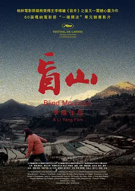
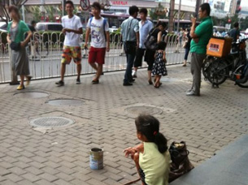
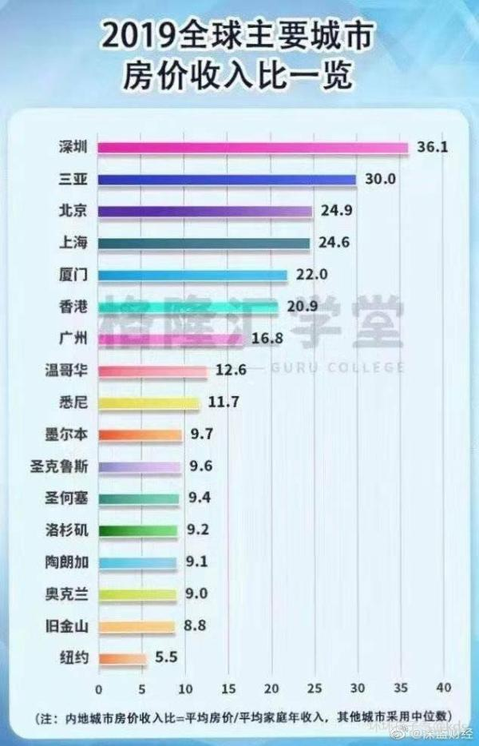
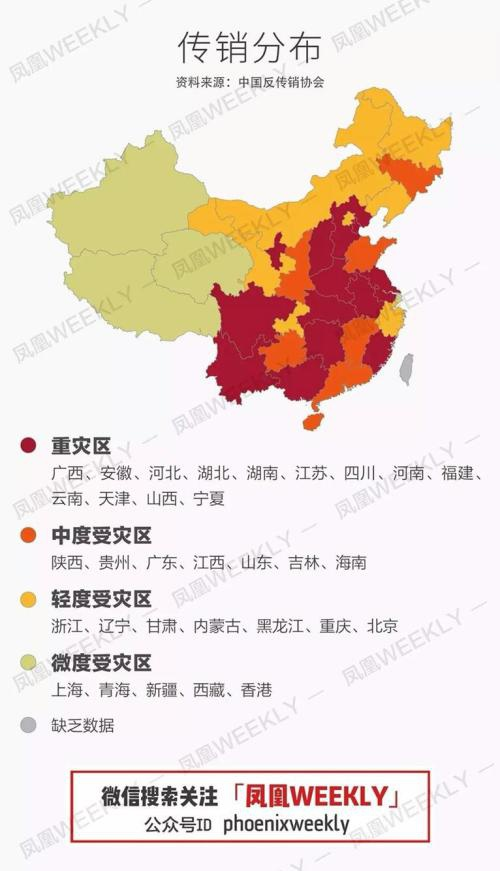
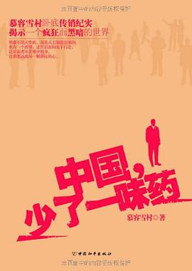

# 重要社会问题解决措施第十六

经济学核心：供给和需求模型

| 供给侧可解决的问题 | 需求侧可解决的问题 |
| :--- | :--- |
| 医疗价格昂贵 | 人口拐卖问题 |
| 教育成本高 | 性侵问题 |
| 高利贷问题 |  |
| 书籍论文获取难度高 |  |
| 儿童色情 |  |

## 醫療：扩大供给

中国政府应有如下作为以提高医疗服务水平：

* 减税特别是不再征收关税以藏富于民，治理环境问题如雾霾、河流污染等降低患病概率
* `帮助`民间培養更多的醫生和護士及建设更多的医院🏥
* 尽力`协助`民间机构生产不再受专利权保障的基本药品和基本医疗器械
* 鼓勵私企研發新藥並嚴格通过法律保障其專利權
* 鼓励民间依托水滴筹等网站互助解决病人负担不起医疗成本的问题，这样即可以剩下政府福利机构的行政开支，也能增强民众之间的友爱互助能力。
* 将台湾或香港的食品药品监管局上升为中国中央政府机构监管食品药品
* 和欧盟、美国、日本、加拿大、澳大利亚、纽西兰等合作共享药品审批信息从而降低药品审批成本
* 对于民间需求量较大的非本国生产药品由卫生福利部出面和相关药企协商议价降低本国国民，必要时由政府出资购买专利权下放给本国民间药企合作生产以救济本国国民
* 对于尚未审批通过的药品允许药企和病人在政府机构监督下自主协商使用，政府不应成为病人可能获救的阻碍，但病人应自行承担後果，治疗效果好的话可以加快审批速度

美国医疗：

美国医疗价格昂贵主要是因为医疗协会对医生数量限制形成垄断和为应对医疗事故的高昂保险、诉讼费用。美国著名经济学家米尔顿·弗里德曼在其代表作《自由选择》第九章提出“各州不得制定或施行剥夺合众国公民从事他所选择的工作或职业的权利的任何法律”的美国宪法修正案就是为了打破医疗行业垄断带来的医疗价格高昂的问题。

台湾健保：

坚决反对台湾的全民健保。全民健康保险作为一个由政府部门推行的强制保险，民众要自行负担健保费，无力缴纳还会被停保跟移送法务部行政执行署进行强制执行，故此政策被强烈批评不符合公平正义的原则。由于台湾经济情况不断恶化，且正在经历人口老龄化，人口出生率低，靠“吃老本”和高负债维持的全民健保崩溃只是个时间问题。如前卫生署长杨志良曾警告所有民众：全民健保因为入不敷出，就快山穷水尽，无以为继，台湾社会即将退回“前健保时代”。早在全民健保制度开始时，杨志良就曾痛批：“（台湾健保）就像每个人发一张信用卡，刷完了却不知道钱在哪里。”全民健保付费过低，已经减少了护理人员及年轻医生的实质薪资、造成医院亏损、恶化医护人员劳动条件，并造成台湾医疗品质下降。台湾的医生短缺越来越严重，医生们抱怨工资太低，工作太辛苦（尽管几乎每个体系的医生都有这样的抱怨）。此外，台湾医疗生态已被健保制度彻底改变，全民都付出了难以衡量的隐形代价。内科、外科、妇产科、儿科、急诊科等专科医生医疗纠纷风险高、负担重，但全民健保的给付明显没有反应这些专科的风险及负担，使得这五科难以招收足够新血及人才，被称为“五大皆空”。台湾朝野政党为了赢得选举，在选前都跟民众承诺“你们看病都不要花钱”。上台后，为了实现承诺的“你们看病都不要花钱”，健保系统就通过各种办法将基金无力支付的矛盾转嫁到医院和医生身上。因为忌惮民意反弹，22年来仅调涨过3次健保费率，加上药价控制不当，以及使用者“不用白不用”心态下造成的浪费，亏损已成常态，“台湾健保何时垮”已成为台湾网民讨论的日常贴。

## 人口拐賣和孤儿問題

大陆沦陷区人口拐賣猖獗，具体解决措施可以参考如下内容：

* 立法讓買賣雙方互不信任，降低人口买卖发生的可能。为降低双方信任程度，買賣雙方应只处理罪行和戴罪立功表现加权较差的一方，最多只殺一個，如果双方都没有戴罪立功的则重點懲治買家，因为没有買方就没有卖方。而且拐賣婦女的目的就是性和生殖，說白了就是綁架/拐騙+非法拘禁+強奸+奴役，其中後三項都是買家完成的。
* 相關懲罰措施應該有上界有下界，根據受害者及其家屬的要求動態調整。必要時出動武警軍隊鎮壓这种愚昧“恐怖分子”。
* 允許代孕合法化，鼓勵并协助“無後需要傳宗接代”的人找代孕作為拐賣人口強制生育的替代品。
* 強制把居住在易发生人口拐卖地方的村民分散異地搬遷扶貧。一方面瓦解原先的相互勾结层层保护，另一方面將他們放入警方更容易發揮作用的地方。更重要的是，他們不得不接受現代社會的遊戲規則，不得不融入現代社會。同時也能有更多的改善自己生活的機會，以及接觸異性的機會。
* 普通国民幫助解救一個被拐卖妇女或儿童由政府獎勵10萬元或更多。
* 建立人口失蹤的應急機制，重點是用網絡發布消息，讓國民踴躍參與，具體措施可以參照美國安珀警報。安珀警報實現了通過無線緊急警報（Wireless Emergency Alerts）自動向手機發送信息。這些警報信息是通過特殊的無線運營商通道Cell Broadcast發送到事發區域信號塔範圍內的所有手機的。
* 以收養為目的的購買兒童在本質上不會對於兒童產生身心上的傷害，尤其是當小孩還在未懂事的年齡。政府应该完善兒童收養渠道和安置制度及兒童保護機制寄養、送養規範，放寬送養和收養家庭的限制，重組兒童送養、收養程序，使得送養、收養程序的重點可以集中到為兒童找到合適的收養家庭上，而不是將兒童集中在福利院。如有必要還可以被美國人收養，但不管國內國外要確保民政部門對收養後兒童生活教育的持續跟蹤、必要時的再次介入更為重要，也更能保護兒童的身心成長。被國外人收養的必須要學中文同時保留中國國籍。就算不能送入福利院，殘疾兒童或是孤兒也應該盡量往大城市孤兒院或是福利院送，在小地方上不好監督，容易變為“性奴”，且小地方刁民多，孤兒和殘疾兒童大概率會受到嘲笑的影響個人成長。
* 對於遺棄嬰兒的父母，應該絕育處理，畢竟被遺棄的嬰兒如果不是及時發現很可能會死亡且需要政府提供嬰兒的所有醫療費用。如有必要，聯網存儲全國居民DNA數據以打擊此种犯罪。

## 人口老龄化和養老金問題

人口老龄化，意味着老年人口在总人口中所占的比例越来越大，而且达到了一定的规模和程度。增加的这部分老年人口，由于机体抵抗力的减弱和城市污染的增加，就会滋生疾病，从而增加城市的医疗消费。而老年人生病一般不敢轻易地自己购药治疗，而会主动求医治疗。由于在当期的医疗体制下，财政对医院的转移支付机制尚不完善，医患之间存在严重的信息不对称现象，医护人员往往利用自身的信息优势，给病人开中高端的药物，以提升自身的收入。这就使得城市的医疗消费往往倾向于中高水平的医疗消费。老龄人口所得的病，很大一部分是慢性疾病，慢性疾病的性质决定了治疗的长期性。而部分慢性疾病的治疗，需要购置昂贵的药物或医疗器械。因此，部分老人的当期收入可能未必足以购置，从而激发了预防性储蓄的动机，诱致当期老年人口跨期进行医疗消费。 还会减少劳动力供给，降低劳动生产率，影响税收政策和政府财政支出，会减少社会储蓄，且影响现代农业发展。

以市场经济为基础的现代社会中人口是宝贵财富。人口越多，意味着更细化的市场分工，更庞大的消费市场，更多可能的技术创新。此外现代社会财富逐年增长而非固定不变，人和人之间是正和博弈而非零合博弈！！股市泡沫和房价泡沫破碎很正常，但这并非因为有人赚有人赔，而是其中“泡沫化”的财富本身就只是账面财富而非真实财富。把账面财富当成真实财富就好像小粉红意淫自己也姓赵一样！

西元2005年--西元2015年中国总抚养比、少儿抚养比、老年抚养比情况

西元2007年--西元2020年中国60岁以上人口数量及比重

中国人口老年抚养比预测

如今，因為共匪亂華，禍國殃民，養老金虧空無數，不可能維系下去。大陆沦陷区西与2015年城鎮職工基本養老保險個人賬戶累計記賬額（空帳）已經達到47,144億元人民幣，而當年的城鎮職工養老保險基金累計結余額只有35,345億元。在養老金缺口金額上，僅共匪的數據就顯示，西元2014年的虧空為1563億元，西元2015年的虧空是3115.33億元，又增加了一倍。路透社西元2015年曾引述分析預計，未來20年大陆沦陷区養老金缺口可能高達11萬億美元。很多省份養老金虧空，主要歸因於管理失當和貪腐，以及養老金制度缺欠。而各地貪汙社保基金的案子也層出不窮，除了震驚世界的上海社保基金貪汙案外，社保基金貪汙案在廣州、深圳、北京、山東、四川、重慶等地也相繼出現，可謂遍及整个大陆沦陷区。

美国著名经济学家米尔顿·弗里德曼在其代表作《自由选择》第4章《从摇篮到坟墓》中介绍值得我们借鉴的社会福利体系内容如下：

> 依我们看，最好的解决办法是把实行负所得税制与逐步减少社会保险结合起来，同时继续履行现有的义务。其方法如下：
>
> １．立即废除工资税。
>
> ２．按现行法律规定的数额，继续付给现在享受社会保险的人以应得的钱。
>
> ３．给予每个已经挣得保险的工人以享受退休、残废或遗属福利津贴的权利。这些福利金是工人根据现行的法律迄今已付的税款和所挣得的收入使他有权获得的，但要减去由于废除工资税而今后少缴纳的税款所折合的福利金数额。工人可以选择他所要的福利津贴的形式，可以是将来的一份年金，也可以是公债，其价值与按照目前规定他有权得到的福利津贴的价值相等。
>
> ４．给予每个尚未挣得保险的工人一笔钱（同样采取公债券的形式），数目等于他或他的雇主为他已缴纳的税款的累计价值。
>
> ５．停止积累保险津贴，让个人按自己的愿望为退休后安排养老。
>
> ６．从总的税收和政府发行的公债中为上述第２、３、４项开支提供资金。这样一个过渡性纲领丝毫不会增加美国政府的实际债务。相反，它会由于不再向未来的福利津贴接受者许诺而减少债务。它只是把现在隐蔽的债务公开化。它为现在未备基金的计划提供资金。这些步骤会导致大多数现存的社会保险管理机构立即解散。逐步减少社会保险，将消除目前社会保险制度给就业带来的不利影响，这意味着国民收入的迅速增长。它将增加个人储蓄，从而导致更高的资本形成率和更快的收入增长率。它将刺激私人养老金计划的发展和扩大，从而使许多工人感到生活更有保障。
>
> 浪费是令人痛心的，但这不过是膨胀到这样大的家长式福利计划的祸害中最轻的一个。福利计划的主要祸害是对我们社会结构的影响。它们削弱家庭，降低人们对工作、储蓄和革新的兴趣，减少资本的积累，限制我们的自由。这些才是应当用来衡量福利计划的基本标准。

养老金这种东西本质是年轻人缴税，老年人拿钱，说白了就是庞氏骗局，必须不停的增加新缴费会员入坑（新出生人口）才能保证资金链不中断。而所謂的政府養老只是社會巨嬰的培養皿，歐盟日本養老條件遠好於美國，而美國非移民人口增長遠高於歐盟日本，歐盟如今只能靠著引入穆斯林過活但將來可能陷入基督徒和穆斯林的內戰，日本社会老龄化特别严重。台灣養老方式值得借鑒，但台灣人口总生育率只有1.05（西元2019年），比實行計劃生育差不多。正常人口增長維持世代更替至少要到2.1，發達國家中主體民族人口增長達到2.1的只有美國。最理性的做法是在低税收前提下教育國民投資方法并提供良好投资渠道，确保民众生活富裕且有足够资金养孩子和为自己养老！養老不能靠政府，應該由家庭养老和企业补助、商業保險共同完成，政府只提供最低生活保障。正常的政府保障老年人基本的生活保障和醫療保障就行了，其余的應該靠他們的子女來解決。为提高人口出生率并提升人口素質，可以将養老金發放和小孩数量及自身和後代受教育情況相關联，比如有一个小孩在世养老金补贴300元，小孩完成義務教育加500元。可以按小孩數量疊加，上不封頂。除此之外将退休年龄和小孩数量挂钩比如生一个孩子延迟退休，生两个孩子按时退休，生三个孩子提前5年退休，生四个孩子提前10年退休。生五个孩子及以上的提前15年退休加政府表彰比如给予英雄母亲称号。

人口危机并不总是现代国家才会面对的，和人们想象中“古人”特别能生孩子的印象相反，至少战国、秦汉时期，原子散沙化的平民们生育率其实并不高，以至于当时政府屡次下达鼓励生育的命令，但效果并不佳。柳诒征先生曾谈到：“专以个人道德而言，为女子者，惧嫁夫生子之为累，为男子者亦惧娶妻生子之为累。其人之思想单简，性情凉薄，为何如？吾国人无此思想者，以为妇之助夫，天职也，夫之助妇，亦天职也，父母之助子女，更天职也。天职所在，不顾一身，虽苦不恤，虽劳不怨。于是此等仁厚之精神充满于社会，流传至数千年，而国家亦日益扩大而悠久”（柳诒征：《明伦》，载《学衡》西元1924年）。柳诒征注意到，如果从原子个体的角度，最划算的是及时行乐，避免承担生养的重负，中国民族能数千年延续，很大程度是家庭成员抱团合作，一起努力的结果。他所说的“天职”，其实可以理解为维持共同体的习俗。从原子个体的角度，人都是会死的，及时行乐最划算，所以秦汉时代除了房中术，还特别流行原子个体的求仙思想，《神仙传》中的成仙者茅君，冲破了父亲父权为代表的家族共同体羁绊，飞升为神仙；河上公干脆飞到天上，脱离了君臣关系的羁绊。以赛亚·伯林\(Isaiah Berlin\)谈到，城邦小共同体衰败的“希腊化时代”，学者不再关注共同体生活，转变为关心“个体幸福、个体兴趣、个体性格”（以赛亚·伯林：《自由论》，译林出版社，西元2011年，第326页）。对只关心“个体幸福”的人来说，多子女的家庭吸引力并不大。雷海宗先生注意到，三代时期是大家族本位，多子多孙的观念和愿望是必须的。而商鞅之后的散沙化社会，家族解体，“小家庭中，儿女太多，的确累赘。人类的私心，总不能免。与个人太不方便时，团体的利益往往就被牺牲”（雷海宗：《中国文化与中国的兵》，北京商务印书馆，西元2001年，第62页）。西周、春秋时代的铜器铭文，最常见就是以“子孙其永宝”、“其万年宝用”、“其万年子子孙孙永宝用”这类句子结尾。个体的生命有限，但宗族、大家族的生命伴随着子孙的蔓延，是无限展开的，祖先的生命通过众多子孙，得到了永恒，因此大家族时代的生命盼望，是以“万年”、“永（远）”为线度和单位的。在家族共同体的生命观、价值观中，个体之死不是真正的死亡，家族“无后”才是真正的死。孔子批评始作俑者“其无后乎”，就是对不仁者的最大诅咒。孟子也指出，不孝有三，无后为大，让生命之河的断绝，是最大不孝。

同时通过重建宗族、乡党践行大家族的互助生活方式，相比起核心小家庭来说，更有利于养育家族子孙。而子孙众多，人口增长，又提升了宗族的竞争力。。周代宗法配合封建，以开枝散叶的方式，在全国各地建立起众多武装殖民据点，对于中国文化的发展和崛起，起到了重大作用。商鞅变法瓦解了大家族，其后果便是战国、秦汉以来日趋严峻的人口危机。如果这种情况进一步持续，中国文明是否能延续下去，都是值得怀疑的。汉儒对人口危机做出的贡献，便是鼓励平民模仿先秦贵族，创造自己的姓氏，模仿先秦贵族组建宗族、大家族等共同体。贾谊描述秦朝社会散沙化平民，哪怕是父母子女之间，也是像乌眼鸡一样互啄（《汉书·贾谊传》）。这种社会环境，并不利于人口增长，生养子女的吸引力也不大。但汉儒对社会重建，开始出现一些模仿先秦贵族的家族，这些家族依靠内部互助，获得了更高生存、发展机会，子女众多的优势逐渐显现。多子多孙的家族（包括乡党），有更高竞争力、更高生存率，因此平民中稍有志向者，都通过学儒，模仿先秦贵族，重建共同体。此起彼伏的过程中，其实开始消解人口危机的根源。虽有汉末、永嘉的大乱，但生育文化不绝如缕，民族的生命力得以延续，只要环境稍好，便得以实现人口的增长。（参考自李竞恒《为什么战国、秦汉时期战国生育率低下？》一文）

## 住房：市场化改革

尽量减少政府对房地产市场的干涉，实现土地市场化改革。通过地价税和主要针对空房征收房产税保证地方政府主要财政收入，对于“炒房”收入应该征收重税比如90%。针对空房征收房产税，房主可以选择交税保留空房，也可将空房出租获取租金以免除交税。合理建设针对外来务工人员的公共租赁住房。

## 重大体育赛事

取消共匪式的举国体制，而学习美国和民间组织合作，重大赛事如奥运会、世界杯等由赛事前的民间选拔赛冠军队代表中国政府参加，在赛前的短期训练以及参赛期间的费用由政府承担。

## 科技發展

减少政府干预，通过法律严格保护专利权，嚴禁政府直接補貼企業，否則有損公平且浪費資金！此外应该防止騙補貼成為企業最主要目標。

## 戶籍問題

全國國民在政府面前一律平等，廢除歧視性戶籍政策，保障國民的自由遷徙權，户口登记名字不准超过四个字以同化野蛮人。此外为了维护世界主要民族之中相对最纯正的汉民族血统纯度，只允许父系血统为中国人的人登记户口，本国女性嫁给黑人後所生後代无法获得中国国籍，黑人女性嫁给中国人後一旦离婚需要被驱逐出境。

## 中醫藥問題

中醫藥管理制度仿照台灣即可，然仍應組織人力仿照李時珍著《本草綱目》一樣驗證目前藥方，而非仍直接使用老药方。同时打擊各種垃圾產品如鴻茅藥酒等。

## 食品藥品安全問題

食品藥品安全問題如甲醇制酒事件、福尔马林浸泡海产品问题、阜阳奶粉问题、苏丹红事件、三聚氰胺事件、地沟油问题、食用明胶问题等等，层出不穷。到现在连缓释药物的胶囊也查出有毒。从儿童奶粉到食用油，整个社会无法保证任何一种食品药品是安全的；从小作坊到国有大企业，整个社会也不能保证任何一个企业不去制造有问题的食品药品。

解决措施：我國台灣和香港地區管理制度可以直接上升為中國食藥監管總局的制度。確保不定期随机抽查，鼓勵內部舉報，否則默认所有從事生產有害產品的都是罪犯，且確保犯錯要重罰。對於管理體制較為完善的地区如美國日本歐盟加拿大澳大利亞紐西蘭香港台灣等售賣的藥品食品可以直接進入整個中國以降低篩查成本。

## 傳銷問題

傳銷分布圖

傳銷到底是什麽？《禁止傳銷條例》第二條明確了定義：組織者或者經營者發展人員，並根據人員數量或銷售業績計給付報酬，或者通過被發展人員交納費用等方式，牟取非法利益、擾亂經濟秩序、影響社會穩定的行為。“不管傳銷打著什麽旗號，穿著什麽馬甲，”李旭說，“只要同時具備三個特征就涉嫌傳銷：繳納入門費取得加入資格、發展下線組成層級關系、層層返利形成多層次計酬。”簡言之，就是入門費、拉人頭、團隊計酬。在人員管理和資金分配上，“五級三階制”在傳銷組織中盛行。五級三階制的“五級”是指獎金制度的五個級別，即E級會員、D級推廣員、C級培訓員、B級代理員和A級代理商；“三階”則指加入者“晉升”的三個階段。入夥時先交69800元會費，此後發展下線，當發展到29人時，你便可晉升為老總，開始每月拿“工資”，直到拿滿1040萬元出局。這就是傳銷領域著名的“1040工程”。“實際上就是拆東墻補西墻，空手套白狼。”有“民間反傳銷第一人”之稱的李旭認為，傳銷的本質是“龐氏騙局”：利用新投資人的錢向老投資者支付利息和短期回報，通過制造賺錢假象騙取更多的投資。

傳統的傳銷有南派、北派之分，均屬於異地傳銷。民間反傳銷協會會長李旭介紹，北派傳銷發源於東北一帶，由“傳銷教父”楊玉勇傳入河北、天津、山東等地，後來逐漸擴散至其他地方；南派傳銷發源於廣西，後來蔓延到雲貴川、湖南、湖北、江西、安徽等地。“有一句稍顯誇張的話，叫‘北派打地鋪，南派住別墅’。”李旭說，北派傳銷屬於低端傳銷，打著“直銷”、“人際網絡”等旗號，上當受騙的以年輕人居多，主要特征是吃大鍋飯、睡地鋪、集中上課，有的組織出現控制手機、非法拘禁等情況。南派傳銷則屬於異地傳銷的升級版，往往打著“連鎖銷售”、“資本運作”、“民間互助理財”等旗號，以考察項目、包工程、旅遊探親為名把新人騙到外地，然後進行一對一洗腦。參與者大多有獨立經濟能力，來去自由，吃住條件較好。李旭介紹，隨著南派傳銷的大舉北上，很多城市的傳銷呈現“南北融合”，比如合肥、武漢、長沙、成都等地。許多北派組織向南派學習改進，秦皇島的“中綠”傳銷就是其中典型。近年來，隨著互聯網運用的普及，傳銷也呈現“互聯網+”的特點。“相比傳統傳銷，網絡傳銷發展速度更快，更能空手套白狼。”中國反傳銷志願者聯盟和反傳銷網的創始人淩雲介紹，網絡傳銷細分為消費返利型、遊戲理財型、互助理財型、微商傳銷、金融傳銷（虛擬貨幣、原始股）等，隱蔽性更強，更難以辨別。

中国传统社会组织即家庭家族组织基本上就已被共匪打散了，传销更是导致无数家庭家破人亡，妻离子散，兄弟反目，负债累累！！传销为中国社会极大之毒瘤，不能尽量铲除传销恢复亲友关系，则不会有社会的安定及中华文明的复兴！！

解决措施：每個窩點，至少当众殺一個传销头目，这样可以确保剩下的人不再参加传销活动，通过对传销头目的处决能降低家庭惨剧发生的数量！最好是最高等級的頭目，如果不是则向下一級擴展，选择相对而言罪惡深重的或者抽取無立功表現的殺一个而且只杀一个。另外有一個下線的判处有期徒刑一年。同时社会应该强调沉没成本的概念和及时止损的重要性确保入坑者能及时脱坑。

## 毒品及吸毒問題

確保對復吸者進行絕育，鼓励毒贩相互举报以减刑，對毒販頭目堅決执行死刑。大陆沦陷区毒品來源一個是北韩，另一個便是緬甸，確保可以很好的打擊毒品来源地。

## 性侵兒童問題

性侵兒童的罪犯默认进行物理閹割，但也允許自費進行化學閹割。此外確保其刑罰由受害者和受害者家屬在一个上限和下限之间決定，確保有彈性，使其盡遭報應，而非產生如鼓吹那種“三年血賺死刑不虧”的醜惡行經。

## 高利貸特別是校園貸問題

加大財商教育，政府立法限制每年合法最高利率比如36%，確保網絡登記貸款合同和交易明細，推廣專業人士的“內幕”分析。非法放貸應當允許借貸人不歸還本金。政府不能保證沒有借高利貸的，但可以通過此舉保證沒有放高利貸的，畢竟人的貪欲無限。

## 環境保護問題

强调可持续发展。嚴格執行環保政策,限制農藥的使用，鼓勵新能源的開發使用，嚴禁在鄱阳湖等地附近圍湖造田，重罰私自排放廢水廢氣廢物的企業，推廣可交易的排污許可證制度则治污成本最低的企业会承担最大的减排份额……

儒家认为天人合一是一种极高的道德境界，而这一道德境界的实现需从尽性开始，所谓尽性就是充分发挥自己的天赋本性。《中庸》说：“能尽其性，则能尽人之性；能尽人之性，则尽物之性；能尽物之性，则可以参天地之化育；可以参天地之化育，则可以与天地参矣。”一旦实现了“参天地之化育”，“与天地参”，人就获取了立足于天地间的独立意义，从而与天地精神相往来，实现与天合一。“尽己之性”就是成己，“尽物之性”也叫成物。成己就是完成自己的品德修养，成物就是使万物得以完成；成己是仁，成物是智；成己是向内用功，成物是向外用力，成己成物是内外的统一。儒家认为：“天地之道，可一言而尽也；其为物不贰，则其生物不测。”（同上）其生物不二，故每一物都有自己独特的价值，都有完成它的必要，其生物不测，故而造成形形色色、千变万化的世界。天地“其为物不贰”是儒家“尽物之性”即“成物”的思想根据，也是儒家爱悯万物、顾惜万物的思想基础。因为天地“其为物不贰”，所以一种事物消失了、毁灭了，就是永久地消失了，毁坏了，就永远无法再现了。正是在这意义上儒家主张人应节制欲望，以便合理地开发和利用自然资源，使自然资源的生产和消费进入良性循环状态。儒家自孔子始，就坚决反对统治者搜刮民财，铺张浪费，孔子的学生冉求帮助富于周公的季氏搜括财富，孔子对冉求大为不满，公开号召其学生对冉求“鸣鼓而攻之”。孔子反对“苛政”，主张“薄赋敛”，明确提出“节用而爱人，使民以时。”（《论语·学而》）只有节用，才不致于无限度地开发自然资源，只有“使民以时”，老百姓才不致于荒费生产，才能造成自然资源的良性循环。孟子继承了孔子的思想，强调“不违农时，谷不可胜食也；数罟不入洿池，鱼鼈不可胜食也；斧斤以时入山林，材木不可胜用也。”（《孟子·梁惠王上》）合理利用资源，注意发展生产。使自然资源生产、开发、利用进入良性循环状态。《礼记·王制》中讲：“木不中伐，不粥于市，禽兽鱼鳖不中杀，不粥于市。”总之儒家认为只有合理而有节制地开发和利用自然生态资源，造成生态资源的良性循环，自然生态资源才会取之不尽，用之不竭。（参考自颜炳罡《儒家思想与当代环境意识》一文）

## 水利工程

整治長江、黃河、珠江、淮河等，特别是治理黄河以复兴北方。同时拆除不必要的水利工程特别是危害巨大的三峡大坝。

## 治理水土流失、土地荒漠化、水灾、旱灾

长安或者称之为关中地区的逐渐落后很大程度上就是因为经济地理学中讲的消聚性衰退。关中平原原始森林被毁灭导致水土流失、水资源的锐减和自然气候的剧变。关中地区水土流失越发严重使得关中地区的自然灾害频率增大：有雨则洪水泛滥，无雨则干旱成灾。

治理水土流失、土地荒漠化、水灾、旱灾的核心方法就是植树造林，如国父在《三民主義 ·民生主義第三講》中所说：

> 至於防水災的治本方法是怎麼樣呢？近來的水災為什麼是一年多過一年呢？古時的水災為什麼是很少呢？這個原因，就是由於古代有很多森林，現在人民採伐木料過多，採伐之後又不行補種，所以森林便很少。許多山嶺都是童山，一遇了大雨，山上沒有森林來吸收雨水和阻止雨水，山上的水便馬上流到河裡去，河水便馬上泛漲起來，即成水災。所以要防水災，種植森林是很有關係的，多種森林便是防水災的治本方法。有了森林，遇到大雨時候，林木的枝葉可以吸收空中的水，林木的根株可以吸收地下的水；如果有極隆密的森林，便可吸收很大量的水；這些大水都是由森林蓄積起來，然後慢慢流到河中，不是馬上直接流到河中，便不至於成災。所以防水災的治本方法，還是森林。所以對於吃飯問題，要能夠防水災，便先要造森林，有了森林便可以免去全國的水禍。我們講到了種植全國森林的問題，歸到結果，還是要靠國家來經營；要國家來經營，這個問題才容易成功。今年中國南北各省都有很大的水災，由於這次大水災，全國的損失總在幾萬萬元。現在已經是民窮財盡，再加以這樣大的損失，眼前的吃飯問題便不容易解決。
>
> 水災之外，還有旱災，旱災問題是用什麼方法解決呢？象俄國在這次大革命之後有兩三年的旱災，因為那次大旱災，人民餓死了甚多，俄國的革命幾乎要失敗，可見旱災也很厲害的。這種旱災，從前以為是天數不能夠挽救，現在科學昌明，無論是什麼天災都有方法可以救。不過，這種防旱災的方法，要用全國大力量通盤計劃來防止。這種方法是什麼呢？治本方法也是種植森林。有了森林，天氣中的水量便可以調和，便可以常常下雨，旱災便可以減少。至於地勢極高和水源很少的地方，我們更要用機器抽水，來救濟高地的水荒。這種防止旱災的方法，好像是築堤防水災，同是一樣的治標方法。有了這種的治標方法，一時候的水旱天災都可以挽救。所以我們研究到防止水災與旱災的根本方法，都是要造森林，要造全國大規模的森林。至於水旱兩災的治標方法，都是要用機器來抽水和建築高堤與浚深河道。這種治標與治本兩個方法能夠完全做到，水災〔旱〕天災可以免，那麼糧食之生產便不致有損失之患了。

匪伪殖民政府的三北防护林体系建设总体规划

## 学术腐败问题

尽量取消政府资助的项目和以论文数量论英雄的评价标准，共匪那样做是为了让所谓“知识分子”奴颜媚骨地求赏饭。严查学术抄袭和学术造假，剥夺学术抄袭者和学术造假者的相关荣誉且取消教授资格、一定期限内被禁止申请项目和获得政府资金支持等惩处，必要时对情形严重者判刑。

除此之外就是大陆沦陷区研究生导师对硕士生、博士生甚至是博士後学生的压榨，由此造成了大量惨案比如武汉理工大学的王攀对陶崇园、华南理工大学秦安军对胡坤等。而在欧美则是导师为学生服务，如著名华人数学家李吟强调：

> 一般都是我导师替我打杂。很多事情我都没时间管，比如我们LSGNT第一年要做mini project，要给报告，而我刚做完手臂骨折的手术，我导师就发邮件给director说这个学生已经做出了很好的结果，完全步入正轨，这种形式主义的事情就免了吧，还有什么选second supervisor啊，什么upgrade viva啊，凡是要走程序的事情我自己都不用去操心，鸡毛蒜皮的事情能挡掉的我导师都替我挡掉了。他主要负责替我处理后勤工作，而我本人只把精力放在数学研究上。
>
> 国内导师大都喜欢基础扎实，踏实肯干，又没什么头脑的学生。导师的任务，也不是给你布置作业，更不是天天指手画脚，而是乖乖在旁边待着，随时准备解答你的具体问题。比如你有一个idea，问问他能不能做，他要说能做，你就放心大胆地去做；他要说不行，你也可以认为他是智障，继续我行我素地去做。导师是要为你服务的，不是你去为导师服务，服务态度不好，或者提供的服务不到位，令你不满意，那就换掉。应该是导师来讨学生的欢心，而不是学生反过来巴结导师。
>
> 想想我导师每次要跟我讨论之前，都要担心没办法有效地帮到我；我做了工作，他逢人就帮我宣传；我跟别人讨论，他担心我会因为对自己的idea毫无保留而吃亏；我的论文被接收，他为我高兴···两年多以来，大家坦诚相待，毫无芥蒂，那种要替导师打工的生活，好像离我太远太远了。这大概就是英国和中国的区别吧。年轻人千万别读土博士。

这种情形还是要压缩导师手里的权力，以及通过学校介入明确导师和学生的职责，而非让学生被迫为导师打杂。

## 校園暴力問題

降低死刑年齡到14周歲，降低刑事犯罪年齡到7周歲。可以參考美國日本等國的做法鼓勵民間組織參與提供心理輔導等，對於暴力性強的一定要用暴力解決畢竟它們只認拳頭，之後再讓它們懂法守法。《未成年人保護法》應該保障未成年人不受成年人危害，同是未成年人的一定要和同是成年人的案件一樣處理，畢竟作為受害者的也是未成年人。

## 高价彩礼问题

不可学共匪强令禁止，因为这根本就无法标准化，首要培育社会良好风气，同时规定离婚须返还男方付出的彩礼，女方之嫁妆即可！

## 家暴问题

治本还需弘扬儒学，培育良好公序良俗。治标需要保护受害者权益，警察及时介入，如到轻伤甚至重伤以故意伤人罪判，并强制双方离婚，将共有财产的大部分如80%判给受害者；轻伤以下一律判离婚，并在财产分配上补偿受害者。

## 乱伦问题

双方都同意的话一律绞死，单方面侵害绞死侵害者

## 虚假广告

虚假广告代言人同样有罪

## 诈骗

处理诈骗犯可参考传销头目

## 建築安全問題

允许各地按照当地情形比如是否处于地震带上决定当地的建筑质量标准，避免中央政府一刀切。同时檢查各地建築，對於“豆腐渣”工程涉事人员該殺就殺改抓就抓，近日無錫高架橋坍塌，以前如汶川大地震因為“豆腐渣”工程多死了好多人。

## 清理外國留學生

取消共匪为外国留学生的高额奖学金，至多按照中外学生比例分配，同时规定除訪問學者或短期交流者外，所有到中國的留學生必須達到一定的中文水平，否則不允許入境！（香港可以例外）

## 農業發展

積極推動轉基因農產品的發展比如之前的食物如“黃金大米"，抗病蟲害的“轉基因抗蟲棉“等，美國FDA通過的中國都可以借鑒。可以仿照美國進行大農場現代化機械化降低人力需求，還可以參考印度阿米爾·汗主持的节目《真相访谈》（Satyamev jayate/Truth Alone Prevails）中《害人的農藥》一集學習印度引入非農藥除蟲方式。有感於綠色革命帶來的種種惡果，被印度吞並的的錫金開始實行全面有機化運動，其首席部長查姆林呼籲人們采用環境友好型的生活方式，並在邦內禁絕化肥農藥和塑料餐具，甚至禁止進口非有機產品。這一舉措在今天取得傲人的成績，不僅為人民提供了健康的食物，土壤、空氣、河流的汙染狀況也都得到大幅改善，曾經脆弱的生態系統得以恢覆。但是農藥的濫用也導致了工業化農業生產地區癌癥發病率的急劇上升。在這些地區，河流受到汙染，土壤日趨貧瘠。錫金領導人表示，基於這些憂慮，他們不得不轉向有機農業，因為農藥殘留（包括在其他國家禁用的某些化學物質）已導致魚類、蔬菜和大米受到汙染。

## 城管、小摊贩

小摊贩只要不妨碍到他人的正常生活比如占用主要交通要道耽误别人行走和随地乱扔垃圾，就不该被城管暴力清理。可以参考北宋张择端的《清明上河图》：

## 高速公路、鐵路管理問題

允許民間自行修建高速公路鐵路自主運營，公共高速公路不再收費通行，管理權力應該下放到縣。

## 槍支管制問題

仿照日本建立起一套完整的槍支管制體系，同時確保作為國家資產的槍支彈藥不像共匪時代隨意被販賣。新疆地區鑒於安全形勢，可以仿照以色列允許匪穆斯林特別是漢族同胞合法持槍並被軍事反恐訓練。其余地区可以允许通过科举考试的人合法持有枪支以维持武德。

## 流浪动物问题

仿照美国制度先在认领的地方放一周，没人认领的话就对流浪动物实行安乐死。在狂犬病毒不能彻底消失的情况下，姑息流浪动物就极有可能危害到无辜者的生命。另外强制要求遛狗要栓绳，否则就是狗遛狗！！！

## 书影音管制问题

废除共匪的对书影音等作品的“限号政策”（这也可以体现共匪建立的匪伪殖民政府是个极权主义组织），但要坚决查禁赞美三次亡天下的内容如辨子戏、共匪抗日剧等严重损害中国人民感情的东西。

可以直接用台灣那個分級法建立分级制度。日本、新加坡有“紅燈區”，如有必要將來也可以學習日本、新加坡的色情管制政策。但坚决重点打击儿童色情内容的供给方比如拍摄、销售相关内容的，加大相关刑罚力度，而立法针对需求方执法成本过高，不符合社会现实需要。

### 色情刊物與跳舞

> 这篇文章是聂云台先生昔日的旧作，曾经刊载于一九四六年八月第一百四十一期的（读书通讯）半月刊上。可以说是字字警惕，言言金玉；不仅是对‘当前’上海的淫爢之风，痛下针砭而已。所以亟应予以刊载，希望能使现代的人，有所觉悟呀！
>
> 近年来，各国的犯罪学专家，从各国的犯罪统计资料中，发现荷兰这个国家的刑事犯最少。报告上说：该国的惟一特点，是在于注重礼教，男女界限非常的严格，例如在海牙附近的宝石城，规定公共场所，男女是不准在六英尺以内并坐的；而该城的监狱，则是长年空虚，没有一个犯人。又犯罪学家说：凡是犯罪，皆是由于犯人意志力的薄弱，也就是心理不健全。以荷国的事实证明，性欲的节制，即能使得人民的脑力多清明健全，而不犯罪。所以我国的礼教，特别严格男女之防，所谓‘男女有别’，实在是有它科学上的根据。
>
> 美国近三十年来，犯罪人数的激增，十年前已跃居世界第一位。而美国男女之间的放纵，实在最为显著，尤其是以跳舞最为普遍。近年来，美国报纸屡屡刊载说：美国某某大学，检查身体时，发现过半数的女生已非处女的消息。根据美国犯罪报告说：在一九三九年一年之间，犯风化罪者，陡然增加了百分之七。在过去六年间，强歼案陡增了百分之五十。联邦侦缉局局长胡佛曾经宣言说：‘青年道德的堕落，犯罪的增加，实在是由于色情刊物的充斥，所造成的结果。’监狱官洛尔士君说：‘我所接触的许多案件，都是受了色情刊物的影响。’美国联邦监狱处主任倍次则宣称说：‘犯罪案件如此的激增，都是由于报纸多刊载风化案，以及电影与色情刊物的影响。’胡佛局长又说：‘美国现在正努力铲除此类的导淫刊物。’可惜他还不知道跳舞之害，更甚于色情刊物啊！
>
> 综合上述的观点来看，色情刊物与跳舞的发达，竟能使社会堕落至如此地步。因为性欲为动物同有之天性，动物则有自然时期的节制，而人类则有思想。然而人类因耳目的接触，感情会随之冲动；所以惟有严定礼法，避免接触的机会，始能减少人们情欲的冲动。老子说：‘不见可欲，使心不乱。’换句话说，见到了可欲，则使心容易乱。欧美人提倡男女解放，社交公开，男女同校，袒露服装；人之大欲，莫过于此。所以我国的新文化家，主张全盘的接受西方文化，反而痛诋我国固有优良传统为吃人的旧礼教，想要全部都打椡。这种性欲解放的主要目的，在使女子易于供男子玩乐蹂躏，以快其意而逞其欲。遂使多数女子，遭受男子的诱陷，等到已经陷落，就草率的委曲成婚。所以离婚的案件，全世界都在激增，而且以美国为最多。一九二五年，美国的离婚案，为二十万件。我在十数年前，曾经写文章讨论过此事。从上述美国女学生堕落的情形来观察，则知离婚案之多，原因在于当初结婚是由于肉体感情的冲动，无理智的选择啊！从优生学的观点而言，这些纯粹是由性欲结合的父母，他们所诞生的子女，必定会缺少健全的意志力，更缺乏深沉的理智和头脑。一国之中，若是多有此等的父母，也就是会多有意志薄弱、理智短缺的人民。美国所以犯罪特别多，荷兰所以犯罪特别少，这就是事实的证明。
>
> 关于风化罪，多数是由于色情刊物之引诱，及跳舞所发生的感情冲动。这些是由于犯人临时丧失了他的意志抉择力，不完全是犯人先天上的缺失。至于普通的刑事犯罪，例如欺诈、斗殴、抢劫、强盗、谋杀等，则是由于犯人先天上意志力的薄弱，缺乏理智和脑力所致。例如荷兰男女的界限很严格，则一切的刑事犯罪极少；而礼防最严的宝石城，则监狱终年无人。此则完全是因为先天上禀赋的脑力清明，思想纯洁所致；人民既然都有充分的谋生技能，自然就不肯做卑劣的犯罪行为了。先天上的遗传既是这样的优良，社会风化的维护又是如此的严格，所以能得到这样良好的结果。
>
> 反观犯罪特别多的国家，其损害之大，实在是不可胜言。美国于一九二五年一年之间，因为杀人罪而损失的人命，共计一万二千人；每年因犯罪所蒙受的损害，约达一百万万美金。然而更值得忧虑的是，青少年犯罪日见增加：一九二五年，纽约州裁判所中所关的囚犯，十六岁至廿五岁的，占百分之四十六；地方裁判所中，则同样年龄层的青少年，占了百分之六十一。这些少年，都是属于充满希望的国民，然而却已是身系囹圄，实在是令人悲哀啊！（此段系录自拙撰的《美国犯罪的增加，司法的黑暗》一文中，是录自《法律周刊》，一九二七年所作的；近年犯罪数目大有增加，但手边无书可查。）我在一九二零年，曾前往纽约疯人院参观，院中办事的人告诉我说：‘神经病近年来逐渐的增加，本院原来只有一所，可以容纳七千人，近年则增加为两所，可容纳一万五千人。’又说：‘院中的精神病患，十分之九是由于花柳病毒进入大脑所引起的。’纽约这一个地方疯人已有如此之多，则全美国所损失的宝贵青年，数目一定是更为庞大了。这是刑犯以外的损失啊！
>
> 疯人以外，则染上花柳病病发的人，也是不在少数。我到德国游历的时候，当时的代办公使张君曾告诉我说：‘政府所派留德的陆军学生中，归国以后能为国服务的很少，多数都是死于花柳病毒了’。我说：‘听说德国注射的六零六，能治梅毒。怎么会治不好呢？’张君说：‘六零六确实能够治愈梅毒，然而六零六的药力非常猛烈，梅毒虽治好，而心脏却受到了损害，所以多数是死于心脏病。’我有几个亲戚，其中一人是在法国染上花柳毒病死了，另一人在美国因为梅毒导致发疯，进了疯人院，也是终身不愈。我一个人所碰到染上花柳病的，就已经有好几个人，那么这类人的总数之多，就可以想见了，这又是一项重大的损失啊！
>
> 然而当前的损失，还属有限。而从此种退化人种所产出的后一代的国民，其道德理智的薄弱，工作效能的低下，实在是难以避免了。这对民族的损失，尤其是不可估量的。这是事实，而不是理想。法国为性欲放纵著称的民族，我游巴黎时，看见巴黎各处公园的出入口，都有人拿著春宫照片在求售，而警察也不加干涉。这种情形在其他国家则未见到。三十年来，法国人口的生产率日见减少，实在是因为性欲的放纵，才有如此钜大的影响啊！
>
> 从美国的现状来讨论，美国男女放纵的情形，大概已经超过法国，其前途也足以令人忧虑。不可以因为暂时物质的繁荣，而忽视了他潜伏已深的病根。我之所以写此文，并不是有空为美国担忧，实在是为我国崇拜美国的青年担忧啊！今日的上海，实在已经成为巴黎、纽约的雏型了。淫秽的刊物、导淫的机关、跳舞的场所、风化罪案、刑事案的激增、监狱的客满，没有一样不是快要成为世界第一位了。凡是法国与美国堕落的因素，我们都全部具足了，那么它悲惨的结果，怎么能够幸免呢？上海今天有跳舞场一百多处，假定平均每处有两百人，则每晚共有两万人，而这些人即将成为上面所说美国各项事实的候补员了。所谓当局者迷，这些迷于其中的人，只有顾著眼前的娱乐，哪里会知道这一个纵乐的念头，已经和监狱、疯人院、花柳科医院、殡仪馆，发生了因缘。而我所叙述的在美国、法国因为花柳病而致疯致死的几位亲友，都是为求学而去的；如此悲惨的结局，这岂是当初所能料到的啊！而其中一位，在前往巴黎的时候，我曾经痛切的先告诫他，并且还危言耸听的告诉他重话，他也深知，然而却终究不能够免于花柳病毒而死。那时他年已三十，也不年轻了；而且他中外学术的造诣都很好，不能说是没知识；然而环境的诱惑，真是不容易把持的住呀！所以我们中国的道德，特别重视礼防，男女有别，就是为了预防避免彼此动心啊！这是从事实际经验中所得到的教训呀！
>
> 孔子说：‘听讼，吾犹人也，必也使无讼乎。’以荷兰的事实来看，则使无讼，的确是有可能了。孔子又说：‘道之以政，齐之以刑，民免而无耻。道之以德，齐之以礼，有耻且格。’欧美政治，只知道有政治和刑罚，而不知道有道德和礼教，所以它的结果是那样的混乱。而荷兰能够重视礼教，所以它的社会秩序会有如此良好的结果。然则负有言论指导社会责任的人，可以觉悟矣。或许有人说：‘礼教重，则令人太拘束了，青年人宜有娱乐，使他精神活泼，则学问与治事才有精神。’我则回答他说：‘科学上研究所得的结论。刚好与此相反。’
>
> 美国发明科学管理方法的泰勒先生，研究了三十多家大工厂公司的职工效率，撰写报告说：‘各工厂、公司的效能，星期一都是最低。详细考察它的原因，得知职工都是因为星期日跳舞纵乐的原故呀！直到星期二的上午，还不能恢复他生产的效能。’足见美国跳舞风气习惯之普遍。工厂的职员工人既然如此，而学校、商店、公务人员也不能例外。综合来说，则为全国效能减低，损失之大，可想而知。由此可知，这类娱乐不但不能使得精神活泼，反而会使精力减退。然而我们人类的身心效能，确实是有增进的方法。大多是在生理方面，必须要加以锻炼；而心理方面，则须加以存养。
>
> 曾文正公尝说：‘精神愈用而愈出，智慧愈苦而愈明。’又说：‘主敬则身强，习劳则神钦。’主敬就是振作精神，一切都不敢懈怠。曾文正公在军中的时候，黎明时就和幕僚们共用早餐，到夜间二鼓以后才就寝；重要的公文，无一不是亲笔写的，政事、军事，虽然极为冗繁，自己读书仍然是有常课。晋朝的陶侃早晨搬运一百片瓦到房子外面，黄昏则又搬回屋内，他说：‘我正致力于收复中原的大事，若是平时生活太过优闲，到时候恐怕不能胜任大事，所以自己必须要求自己吃苦耐劳呀！’汉朝的大学问家董仲舒放下窗帷读书，三年之中，眼睛从不向花园里看。越王勾践，卧薪尝胆，以图发奋自强。自古以来的名人，他们的学问、事业能够有所成就，都是从勤苦奋斗中而来的，哪里会以娱乐为培养精神的方法呢？因为人的意志力必须经由砥砺磨练才会更加的坚强，若是认为娱乐为不可缺少的，那么他的意志力已经先薄弱了；何况娱乐是属于低级情感的，则心思的放纵，将更不可收拾。工厂的职员工人，尚且因此而大大的减少了工作效能，更何况是担当大事的人呢？以上所说的是生理上的锻炼。
>
> 诸葛武侯说：‘非淡泊，无以明志；非宁静，无以致远。’淡泊，是说欲望少；一切欲望，都能使人心志昏昧，而低级的欲望就更为严重了。宁静是指心思的安定；若是心系于情欲，就没有宁静可能；所以要保存青年人聪明敏锐的脑力、活泼的精神，应当避开这些低级的感官接触为最重要的事。孟子说：‘其为人也寡欲，虽有不存焉者，寡矣。其为人也多欲，虽有存焉者，寡矣。’这句话是指清明的心志是否存在。简单的说，一个人的嗜欲深则天机浅，物欲少则心智明。以上是属于心理的存养。
>
> 这两项要点，是中外古今一切圣贤哲人修养的原则，是不能够违反的，也没有例外。以上所举的人证、事证，都是有根据的，并不是空泛的理论啊！
>
> 而所谓的科学眼光，是说以冷静的头脑，来观察客观的事实。今天所谓的物质学者、新文化家，主张全盘接受欧美文化，都是对于客观的事实，没有能够潜心地观察，也是由于自身的嗜好欲望大多，失却了他们冷静的头脑的原故呀！如果主观的态度既强，则科学的眼光就会完全消失了，那么他必然会倒过来骂我是时代的落伍者，这也就不足为奇啦！

## 非物质文化遗产

政府出资录制教程保留记录即可，没有必要直接干涉，但也不能坐看非物质文化遗产完全消失。毕竟，政府拿税款去补贴某些行业，是不经每个个人批准的，这必然要违背某些人的意愿。比如某个就是喜欢民谣的年轻人，他可能更愿意把他的一分钱用于听李志演唱会而不是补贴京剧。可以参考法国著名自由主义经济学家弗雷德里克·巴斯夏 \(Frédéric Bastiat\)在其代表作《看得见的与看不见的：商界、政界及经济生活中的隐形决策思维》（That Which Is Seen and That Which Is Not Seen: The Unintended Consequences of Government Spending）第四章《劇院與高雅藝術：政府該補助藝文活動嗎？》中的观点：

> 反对国家补贴并不是反对文学艺术，经济学家仅仅是想让这些艺术活动成为人们的自愿活动，应该自己去寻找恰当的报酬。换句话说，有些人信任立法者，而经济学家信任的是普通人，尊重的是每个普通人自己的自由意志。
>
> 这里，“存在着一个分配性正义（distributive justice）的问题。立法者的权力是否大到可以使他研究艺术家的工资水平问题，从而对艺术家的利润给予补贴？”我还想补充一下：它有这样的权利吗？它有这样的能力吗？失去了市场价格信号的指导，它凭什么认定谁是“人民艺术家”，谁是“国家精神造就者”，并给与更高额的补贴或奖励？消费者可能更喜欢的“德艺双馨的艺术家”，却得不到补贴呢。
>
> 说直白一些，如果你认为一些国粹或濒危艺术值得保留，应该保留，你就应该自掏腰包，去剧场支持。如果和你有同样意愿的人足够多，那就能够为这种艺术提供足够的利润，支持它生存下去。如果这样的人不够多，那你们凭什么绑架大多数人，来满足你们的意愿？
>
> 何况，大多数这样说的人，其实自己根本也不去剧场看京剧吧。表态很容易，掏钱就是另一回事了。但是他们同样也犯了“没有注意到那些看不见的事物”的错误——毕竟国家补贴也是来自税款，而这税款里，也有他上缴的一份。仅仅因为看不见损失，就觉得没有受到损失，不是很可笑么。
>
> 我们应该相信每一个普通人，而且是他们用钱投出的票，不是他们口头的表态。

## 偷拍问题

偷拍更多的责任应该首先在于酒店。不能因为受害者是个体，就把防偷拍的责任加在个体身上，酒店为个体提供了住宿服务，还应该保障住宿的安全，这是时代变化带给我们的转变，酒店行业应当适应，主动把问题解决掉，而并非是一旦爆出偷拍事件，先撇清关系，赔偿房费了事。这公安部门沟通的主流看法。酒店的排查责任之后，同时考虑防治偷拍不仅仅是一个企业的责任，还需要政府、社会甚至每一个消费者的共同努力，政府应“重典治乱”，改“结果犯”为“行为犯”，提高不法分子的犯罪成本；公安部门、酒店行业管理协会等应利用技术手段、宣传手段齐抓共管；个人消费者在重视自身安全隐私保护的同时，也要杜绝购买、观看偷拍视频。

